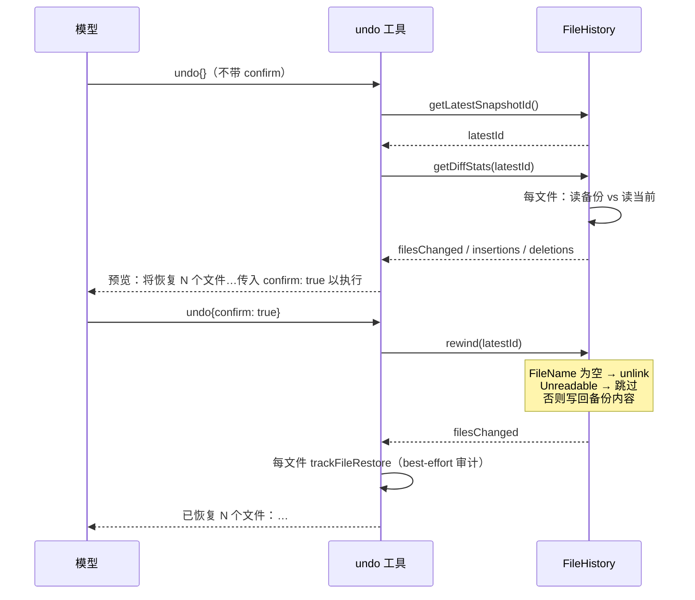

---

**执行状态：** 已闭环。Task 1,1,2,2,3,3 均已完成；验证通过；交付门检查：GREEN。
rivet-options: [{"label":"W1：undo 快照层 + undo 工具（推荐）","description":"新包 go/internal/filehistory（按 tool_use id 分组多快照 + rewind + diff 预览）+ undo 工具 + 先修四处写工具传错 ToolCallID 的既有缺陷。三波，每波独立可验证"},{"label":"先只修数据源缺陷","description":"只修四个写工具的 ToolCallID 错传（改传 p.ToolUseID + 空 id 回退），不做 FileHistory 与 undo——先把地基摆正，undo 待下刀。范围最小、零新代码"},{"label":"改做 delegate 提示词缺口","description":"HANDOFF 第1 条是 undo；若你觉得「提示词引导不存在的工具」更优先，改为只改 go/internal/prompt/modeblocks.go:24 的文案（不建 11744 行派发内核）"}]
---


> **Model: deepseek-v4.1-flash (cheap)**

> **Status: APPROVED** — 2026-09-27T06:47:25.475Z

> **Status: EXECUTED** — 2026-09-27T07:07:31.516Z

# Go undo 快照层 + undo 工具（第一百零二刀）

> 分支 `go-runtime` · 起点 HEAD `ee9f30c6` · 起草 2026-09-28
> 依据：`.rivet/HANDOFF.md`「下一步（第一百零一刀后）」第 1 条

## 需求提炼

**用户原话**：「按 .rivet/HANDOFF.md 计划，排期实现功能」

**目标**（HANDOFF 第 1 条逐字提炼）：

1. 移植 **FileHistory 快照层**（TS `src/agent/file-history.ts` 346 行）——让 Go 侧
   具备「按 tool_use id 分组的多快照 + 精确回滚 + diff 预览」能力。
2. 移植 **`undo` 工具**（TS `src/tools/undo.ts` 96 行）——给模型一个文件撤销安全网。

**非目标**：

- **不移植 `withBackupRoot`**（`/cd` 换工作区后重建备份根）——实测 Go 侧**不存在 `/cd`**
  （`grep '"/cd"'` 在 `internal/` + `cmd/` 零命中），无消费方。
- **不移植 `cleanupOrphans`**（清理未被引用的备份文件）——属管理面，
  且 Go 的 `recovery.EvictOldBackups` 已按时间戳目录做保留上限（100 个）。
- **不改 `recovery.Stack` 的既有语义**——四写工具的「覆写前备份 + 失败回滚」路径
  已被 `applypatch_rollback_test.go` 等测试锚定，动它风险大于收益。
- 不做 UI/TUI 侧的回滚入口（属表面层，未移植）。

## 问题与根因

### 根因：Go 侧的备份栈「只能恢复最近一次」，缺「按调用分组的历史」

| 维度 | Go `recovery.Stack`（已有） | TS `FileHistory`（要移植） |
|---|---|---|
| 键 | `(cwd, relPath)` | **`messageId`（= tool_use id）→ 文件 → 备份** |
| 历史深度 | 每文件**仅最近一次**备份 | **100 个快照**，按 messageId 分组 |
| 回滚粒度 | `RestoreLatestBackup(cwd, relPath)` | `rewind(targetMessageId)` 精确到某次调用 |
| 预览 | 无 | `getDiffStats(id)` → `{filesChanged, insertions, deletions}` |
| 哨兵语义 | 无（不存在就不备份） | `backupFileName === null` = **当时不存在**（rewind 据此 unlink）；`unreadable: true` = 存在但读不到（**跳过**，不删） |

**`unreadable` 哨兵是本刀最易漏的语义**（TS 注释逐字）：

> 旧内容存在但备份读取失败（AV/EDR 锁、EBUSY…）。rewind 必须跳过该文件：
> 此时「没有备份」≠「文件当时不存在」，null-only 语义会把 undo 变成**删除**。

### ★ 落地前发现的既有缺陷（数据源是错的）

Go 侧四个写工具调 `TrackFileChange` 时，**`ToolCallID` 传的是硬编码工具名**：

| 位置 | 传值 |
|---|---|
| `go/internal/tools/file_tools.go:100` | `ToolCallID: "write_file"` |
| `go/internal/tools/file_tools.go:260` | `ToolCallID: "edit_file"` |
| `go/internal/tools/applypatch.go:217` | `ToolCallID: "apply_patch"` |
| `go/internal/tools/hashedit.go:513` | `ToolCallID: "hash_edit"` |

而 `FileHistory` 的快照正是**按 tool_use id 分组**的。若照搬这四处的传值，
**同一轮里两个 `write_file` 会归入同一「快照」**，`rewind(id)` 无法区分
——undo 会「多撤」或「撤错」。

**好消息**：真实 id 是现成的——`go/internal/agent/artifact_intercept.go:191-194`
的 `buildToolCallParams` 已填充 `ToolUseID: tc.id`（真实 tool_use id）。

**故本刀必须先修这个数据源**（否则 undo 建在错的地基上）。

## 架构与数据流

```mermaid
flowchart TD
    subgraph WRITE["写工具（已有）"]
        WF[[write_file / edit_file<br/>hash_edit / apply_patch]]
    end

    subgraph REC["recovery 包（已有，语义不变）"]
        RS[(Stack<br/>覆写前备份 + 失败回滚)]
    end

    subgraph NEW["本刀新增"]
        FH[(FileHistory<br/>按 tool_use id 分组快照)]
        UT[[undo 工具]]
    end

    WF -->|"① TrackFileChange（既有路径）"| RS
    WF -->|"② TrackEdit（新增，带真实 ToolUseID）"| FH
    FH -->|"读旧内容 → 备份文件"| BK[(.rivet/file-history/&lt;sessionId&gt;/&lt;hash&gt;@vN)]
    UT -->|getLatestSnapshotId| FH
    UT -->|"getDiffStats（预览）"| FH
    UT -->|"rewind（确认后）"| FH
    FH -->|"恢复/删除目标文件"| FS[(工作区文件)]
    UT -.->|"trackFileRestore（审计）"| RS

    subgraph GATE["已在等的门链（零接线自动生效）"]
        AA[(agent/approval_assess.go:305<br/>undo/rollback 恒高风险)]
    end
    UT -.工具注册后自动匹配.-> AA
```

**关键数据流（一次 undo）**：



## 方案取舍

### 决策 A：FileHistory 放哪一层

| 方案 | 收益 | 代价 | 判定 |
|---|---|---|---|
| **A1. 新包 `internal/filehistory`** | 与 `recovery` 职责清晰分离（后者是「写时地基」，前者是「历史/撤销」）；各自独立演化 | 两包都碰 `.rivet/` 下的目录（路径不冲突） | ✅ 采纳 |
| A2. 并入 `internal/recovery` | 少一个包 | `recovery` 已被四写工具的横切路径锚定；混入「按调用分组的历史」会让包职责发散（一个是同步写路径的关键路径，另一个是可选的历史查询） | ❌ |
| A3. 并入 `internal/tools` | 少一个包 | 历史层与工具层耦合；`FileHistory` 的消费者不止 undo（TS 侧还有 server/TUI 的回滚流） | ❌ |

**采纳 A1 的理由**：`recovery.Stack` 的文件头明写定位是「**写工具的共享地基**…
与『会话』概念正交」——而 FileHistory **恰恰是会话相关的**（按 messageId 分组）。
把会话相关状态塞进「与会话正交」的包，是职责倒置。

### 决策 B：`ToolCallID` 数据源怎么修

| 方案 | 说明 | 判定 |
|---|---|---|
| **B1. 四处改传 `p.ToolUseID`**（推荐） | 一处一行，语义正确；`p.ToolUseID` 已是真实 id（实测 `artifact_intercept.go:194`） | ✅ 采纳 |
| B2. 保留硬编码，FileHistory 内部另建映射 | 需要另一条通道拿 id，重复且易失配 | ❌ |
| B3. 不改，undo 退化为「按工具名分组」 | 同一轮多个同种工具会合并 → **rewind 撤错范围** | ❌ 这是缺陷，不是降级 |

**B1 的风险已排除**（见「瑶光反证」断言 3）：`ToolCallID` **零读取点**，改值无破坏。

## 文件与提议代码

> **路径约定**：`go/internal/filehistory/**`、`go/internal/tools/undo.go` 为**新增**；
> 四处 `ToolCallID`、`go/internal/tools/registry.go`（+1 字段）、`go/internal/tools/default_registry.go`（+1 注册）、
> 装配层为**修改**。

### Wave 1：修数据源 + FileHistory 快照层

**四处 ToolCallID（修改，各 1 行 + 一个共用兜底辅助）**

```go
// go/internal/tools/file_tools.go:97-101（write_file）
 	if _, err := t.Stack.TrackFileChange(t.Cwd, recovery.FileChangeRecord{
 		FilePath:   relForRecovery(t.Cwd, vr.Path),
 		Action:     "write",
-		ToolCallID: "write_file",
+		// ★ 必须是**真实 tool_use id**（本刀修）：FileHistory 按它分组快照。
+		// 硬编码工具名会让同一轮的多次 write_file 归入同一快照 → undo 撤错范围。
+		ToolCallID: fileChangeToolID(p, "write_file"),
 	}); err != nil {
```

同构改 `file_tools.go:260`（`"edit_file"`）、`applypatch.go:217`（`"apply_patch"`）、
`hashedit.go:513`（`"hash_edit"`）。

```go
// fileChangeToolID 取本次调用的 tool_use id，缺省回退工具名。
//
// **为什么要有兜底**：`p.ToolUseID` 在生产路径由
// `agent.buildToolCallParams`（artifact_intercept.go:194）填充；但测试与
// 少数据径可能直调工具而不设它。回退到工具名**保持既有行为**
// （备份仍可分组，只是粒度退化为「每工具一轮」），不让备份彻底失去分组键。
func fileChangeToolID(p *CallParams, fallback string) string {
	if p != nil && p.ToolUseID != "" {
		return p.ToolUseID
	}
	return fallback
}
```

**`go/internal/filehistory/history.go`（新增，~300 行）**

```go
// Package filehistory 提供按**工具调用**分组的多快照文件历史与精确回滚。
//
// 对账 TS `src/agent/file-history.ts`（346 行）。
//
// # 与 internal/recovery 的分工（为什么是两个包）
//
//   - `recovery.Stack` = **写时地基**：写工具覆写前备份、失败时回滚**最近一次**。
//     其文件头明写定位「与『会话』概念正交」。
//   - `filehistory` = **会话相关的历史**：按 tool_use id 分组保存每个被编辑文件
//     的**历次**版本，支持回滚到任意一次调用 + 变更预览。
//
// 两者都落在 `.rivet/` 下，但**目录不同**（`backups/` vs `file-history/`），
// 且键空间与生命周期不同——合包会造成职责倒置。
package filehistory

const maxSnapshots = 100 // 对账 TS MAX_SNAPSHOTS

// Backup 是某文件在某快照里的备份描述。
//
// **`FileName == ""` 与 `Unreadable` 是两种不同的世界**（对账 TS 的注释）：
//   - `FileName == ""` 且 **不** `Unreadable` → 该次 trackEdit 时**文件不存在**
//     （rewind 据此 unlink——把新建文件撤回去）
//   - `Unreadable == true` → 备份**没拿到**（AV/EDR 锁、EBUSY…），
//     rewind **必须跳过**：此时「没有备份」≠「文件当时不存在」，
//     按前者处理会把 undo 变成**删除**
type Backup struct {
	FileName   string
	Version    int
	Timestamp  int64
	Unreadable bool
}

// Snapshot 是一次工具调用触发的快照（key = tool_use id）。
type Snapshot struct {
	MessageID string
	Files     map[string]Backup // 绝对路径 → 备份
	Timestamp int64
}

// DiffStats 是 rewind 预览的统计。
type DiffStats struct {
	FilesChanged []string
	Insertions   int
	Deletions    int
}

// History 是快照序列。
type History struct {
	mu        sync.Mutex
	backupDir string
	sessionID string
	snapshots []Snapshot
	tracked   map[string]struct{}
	now       func() int64 // 可注入时钟（测试）
}

func New(backupDir, sessionID string) *History
func NewWithClock(backupDir, sessionID string, now func() int64) *History

// TrackEdit 在文件被编辑**后**记录一次快照（读的是**磁盘当前内容**）。
//
// 对账 TS `trackEdit(filePath, messageId)`。
//
// **语义要点**（逐条对账）：
//  1. 同一 messageId + 同文件已有备份 → 直接返回（幂等，不重复备份）
//  2. version 是该文件**历史上出现过的最大 version + 1**（跨快照累加，
//     保证备份文件名不冲突）
//  3. 备份文件名 = `sha256(absPath)[:16]@v<version>`（对账 TS）
//  4. 读不到时**区分** ENOENT（→ `FileName=""`）与其他错误
//     （→ `Unreadable: true`）
//  5. 超过 maxSnapshots → 淘汰最旧，并**删除其备份文件**
func (h *History) TrackEdit(absPath, messageID string) error

// Rewind 回滚到指定快照。
//
// 对账 TS `rewind(targetMessageId)`。返回被改动的文件（绝对路径）。
//
// **三条分支**（顺序不可换）：
//  1. `Unreadable` → **跳过**（不删！）
//  2. `FileName == ""` → unlink（该文件在当时还不存在）
//  3. 否则 → 写回备份内容（`MkdirAll` 建父目录）
//
// 快照不存在 → 返回错误（对账 TS `throw new Error(...)`）。
func (h *History) Rewind(targetMessageID string) ([]string, error)

// GetDiffStats 计算「回滚到该快照」会造成的变化量（预览用）。
//
// 对账 TS `getDiffStats`：逐文件比对**备份内容 vs 磁盘当前内容**，
// 相同则不计入；`Unreadable` 跳过（无备份可比）。
func (h *History) GetDiffStats(targetMessageID string) (*DiffStats, bool)

// LatestSnapshotID 返回最近一次快照的 id（无快照时返回 "", false）。
func (h *History) LatestSnapshotID() (string, bool)

// HasSnapshot 报告是否存在该 id 的快照。
func (h *History) HasSnapshot(messageID string) bool
```

**diff 统计的实现选择**（对账 TS 的两级超时降级）：

```go
// diffStats 计算一次比对的增删行数。
//
// 对账 TS 的降级链（worker pool 4s → inline 1s → 行数估算）。
// **为什么 TS 要 worker**：同步 diff 会阻塞事件循环（大文件重写时无界）。
// Go 侧每次工具调用在独立 goroutine，无此约束——故直接用
// `filediff.BuildFileDiff`（stdlib 无依赖），不引入 worker 池。
//
// 降级判据（对账 TS）：超时/无 hunk 但内容不等 → 用行数估算。
func diffStats(before, after string) (insertions, deletions int)
```

**执行 Wave 1 时必须先验的一条**（见「本计划可被推翻的方式」第 3 条）：
`filediff` 是否可数出增删行——若它的输出格式不便计数，改用
`ComputeChangedLineRanges`（`filediff.go:118`）数区间行数。

### Wave 2：undo 工具 + 注册

**`go/internal/tools/undo.go`（**新增**，~150 行）**

```go
// Undo 创建 `undo` 工具。
//
// 对账 TS `createUndoTool`（`src/tools/undo.ts` 96 行）。
func Undo() Tool
```

**definition 逐字对账**（进请求体，前缀缓存字节稳定）：

```go
Name: "undo"
Description: "撤销最近一次文件改动，将其恢复到之前的备份。恢复前先展示将发生的变化。" +
	"该操作以文件为单位——只回退上一次工具调用中修改过的文件。"
InputSchema: objSchemaOrdered(
	[]string{"confirm"},
	map[string]any{"confirm": boolProp("设为 true 才执行撤销。不带 confirm 时只展示预览。")},
	// **required 为空**（对账 TS：无 required）
)
```

**执行体的七个分支**（逐条对账 TS 文案）：

| 分支 | 文案 | isError |
|---|---|---|
| 无 history | `文件历史不可用。` | ✅ |
| 无快照 | `没有可撤销的文件历史快照。` | |
| 预览且无可撤 | `最近快照中没有可撤销的变更。` | |
| 预览有内容 | `预览：将恢复 N 个文件：\n{列表}\n+N/-M 行{unownedNote}\n\n传入 confirm: true 以执行。` | |
| 确认后无文件 | `没有需要恢复的文件。` | |
| 确认后成功 | `已恢复 N 个文件：\n{列表}{unownedNote}` | |
| 失败 | `撤销失败：{err}` | ✅ |

**`unownedNote`（B1 归属告警，两处文案不同）**：

```go
// 预览时（TS 原文）：
//   `\n\n⚠️  警告：${n} 个文件不属于当前任务，可能属于并行会话：\n${列表}\n确认前请核实归属。`
// 确认后（TS 原文）：
//   `\n⚠️  ${n} 个文件不属于本任务：${逗号连接}`
//
// **注意两处的差异**：预览用「警告」+ 逐行列表 + 尾部提示；确认后用更短的
// 单行 + 逗号连接。不要为了"统一"而合并——那是逐字对账的对象。
//
// 判据：`CallParams.OwnedFiles` **非空时**才做归属检查
// （对账 TS `params.ownedFiles?.length ? ... : []`）——OwnedFiles 为空
// 表示「无归属信息」，此时**不加**告警（否则会对所有文件报"不属于本任务"）。
```

**审计记账（best-effort）**：

```go
// 对账 TS：`try { trackFileRestore(cwd, file, 'undo tool restore', 0, sessionId) } catch { }`
//
// **为什么必须 best-effort**：文件此刻已恢复；审计写失败若冒泡成「撤销失败」
// 会让模型以为没撤成 → 重试 → 把刚恢复的旧内容又盖掉（二次伤害）。
for _, f := range restored {
	_ = recovery.RecordRecovery(p.Cwd, recovery.RecoveryEntry{
		File: f, Action: "undo tool restore", LinesLost: 0,
	}, p.SessionID)
}
```

**工具元数据（逐条对账 TS）**：

```go
RequiresApproval: 恒 true   // 对账 TS —— **撤销是破坏性操作**
ConcurrencySafe:  恒 false  // 对账 TS
Enabled:          恒 true   // 对账 TS
Timeout:          0         // 用默认
```

### Wave 3：装配 + 端到端

**`CallParams` 新增字段**（`go/internal/tools/registry.go`）：

```go
// FileHistory 返回本会话的文件历史（nil = 不可用）。
//
// **为什么是回调**（对账 TS `createUndoTool(getFileHistory)`）：历史实例在
// 会话建立后才存在（late-bound）。与 `EnterPlanMode` / `GrantPath` 同一注入模式。
FileHistory func() UndoHistory
```

**`UndoHistory` 接口**（定义在 `tools` 包，避免 `tools → filehistory` 依赖）：

```go
// UndoHistory 是 undo 工具依赖的历史面。
type UndoHistory interface {
	LatestSnapshotID() (string, bool)
	GetDiffStats(targetMessageID string) (*UndoDiffStats, bool)
	Rewind(targetMessageID string) ([]string, error)
}
```

装配层写薄适配器（同 LSP 的 `lspNavigatorAdapter` 模式：两包类型同形但不同名，
Go 的隐式接口满足要求签名逐字一致）。

**写工具侧接线**：四个写工具在 `TrackFileChange` 之后**追加** `TrackEdit` 调用
（对账 TS：`tool-pipeline` 在写工具成功后调 `trackEdit`）。

## 验证清单

**Wave 1（数据源 + FileHistory）**

- **四处 ToolCallID**：注入 `p.ToolUseID="call_abc"` → `TrackFileChange` 收到的
  `ToolCallID` 是 `"call_abc"`；`p.ToolUseID` 为空 → 回退工具名（既有行为）
- **快照分组**：同 messageId 两次 `TrackEdit` 同文件 → 只 1 个备份；
  不同 messageId → 2 个快照、各自独立备份
- **version 累加**：同文件跨 3 个快照 → version 1/2/3；备份文件名不冲突
- **`Rewind` 三分支条件矩阵**（逐格断言）：

  | 备份状态 | 文件当前 | 期望 |
  |---|---|---|
  | 正常 | 存在（已改） | 写回备份内容 |
  | `FileName==""`（当时不存在） | 存在（新建的） | **unlink** |
  | `Unreadable` | 存在 | **跳过**（文件原样！） |
  | 正常 | 已被删 | 重建（`MkdirAll` + 写回） |

- **★ `Unreadable` 不可退化为删除**：构造「备份读失败」→ rewind 后文件**仍在**
  （这是 TS 注释明写的「数据丢失」防线）
- **`GetDiffStats`**：内容相同 → 不计入 `FilesChanged`；`Unreadable` → 跳过；
  行数统计与实际一致
- **上限淘汰**：101 个快照 → 保留 100，最旧的**备份文件也被删**（不留孤儿）
- **快照不存在** → `Rewind` 返回错误（不静默）

**Wave 2（undo 工具）**

- **definition 逐字**：`name` / `description` / `confirm` 描述 / **无 required**
- **七个分支文案**逐字（含全角冒号与换行位置）
- **`unownedNote` 两处文案**（预览 vs 确认后，措辞不同）；
  `OwnedFiles` 为空 → **无**告警
- **`confirm` 严格 `=== true`**：`confirm: "true"`（字符串）→ 走**预览**分支
- **审计 best-effort**：让 `RecordRecovery` 失败（cwd 不可写）→ 撤销**仍报成功**
- **元数据**：`RequiresApproval=true` / `ConcurrencySafe=false` / `Enabled=true`

**Wave 3（装配 + 门链）**

- **端到端走生产装配**：`NewDefaultRegistry` + 注入 History →
  编辑文件 → `undo{}`（预览）→ `undo{confirm:true}` → 文件回到编辑前
- **★ 门链生效回归**：`go/internal/agent/approval_assess.go:305` 的
  `toolName == "rollback" || toolName == "undo"` → 恒 `RiskHigh`
  （此前 undo 名永不匹配；注册后应生效）
- **工具数 41 → 42**
- 全量 `go test ./...` 0 FAIL；`-race` 干净

## 瑶光反证

**断言 1：`p.ToolUseID` 是真实 tool_use id（整个设计的前提）**

- 证据（首手，我读了原文）：`go/internal/agent/artifact_intercept.go:191-194`
  的 `buildToolCallParams` 返回
  `&tools.CallParams{Input: tc.input, ToolUseID: tc.id, Cwd: ..., ...}`。
- 复现：`grep -n "ToolUseID" go/internal/agent/artifact_intercept.go`

**断言 2：四个写工具的 `ToolCallID` 是硬编码工具名（待修的既有缺陷）**

- 证据（首手）：`file_tools.go:100` = `"write_file"`、`file_tools.go:260` =
  `"edit_file"`、`applypatch.go:217` = `"apply_patch"`、`hashedit.go:513` = `"hash_edit"`。
- 复现：`grep -rn "ToolCallID:" go/internal/tools/*.go | grep -v _test`
- **含义**：FileHistory 按 tool_use id 分组，而 Go 侧传的是工具名——
  同一轮多个同种工具会合并成一个「快照」，`rewind` 撤错范围。**必须先修**。

**断言 3（已核实 ✅）：`FileChangeRecord.ToolCallID` 零读取点**

- 证据（首手）：`grep -rn "ToolCallID" --include="*.go" internal/ | grep -v _test |
  grep -v internal/session/` 的完整输出里，`go/internal/recovery/stack.go:28` 是**定义**，
  `file_tools.go:100,260` / `applypatch.go:217` / `hashedit.go:513` 是**写入**，
  **没有任何一处读取**。其余命中全是 `session.OaiMessage.ToolCallID`（不同物）。
- **结论**：改传真实 tool_use id **零破坏风险**——决策 B 的 B1 可执行。
- 复现：上面那条 grep（须排除 `internal/session/`）。

**断言 4（已核实 ✅）：`ToolCallID` 不进 journal 落盘**

- 证据（首手，读了原文）：`go/internal/recovery/journal.go:15-21` 的
  `RecoveryEntry` 字段只有 `File` / `Action` / `TS` / `LinesLost` / `SessionID`
  ——**不含 `ToolCallID`**。故改它的值不改变任何持久化格式
  （`FileChangeRecord` 是内存态的前置记录，不进 journal）。
- 复现：`sed -n '/type RecoveryEntry struct/,/^}/p' go/internal/recovery/journal.go`

**断言 5（已核实 ✅）：`recovery.Stack` 与 `FileHistory` 是两件事，不是重复**

- 证据（首手）：`go/internal/recovery/stack.go:1-11` 文件头逐字「**写工具的共享地基**…
  与『会话』概念正交」+ `TrackFileChange` 的键是 `backupKey(cwd, relPath)`
  （`stack.go:105`）；而 TS `file-history.ts` 的键是 `messageId` 且注释明写
  「These key the FileHistory snapshots」。
- **含义**：不能把 undo 直接建在 `Stack` 上（它没有按调用的历史），
  但**可以复用**它（审计 journal）。
- 另：`go/internal/agent/checkpoint.go:5` 的 `ReplaceWithCheckpoint` 对账的是
  TS `compaction-controller.ts`（会话历史压缩），**与文件撤销无关**——同名词不同物，
  容易误判为已有实现。

**本计划可被推翻的方式**：

1. ~~若断言 3 发现 `ToolCallID` 有依赖工具名的消费方~~ → **已核实无消费方**，
   决策 B 的 B1（四处改传 `p.ToolUseID` + 空 id 回退）按原样执行。
2. **若 `Unreadable` 在 Go 侧无法产生**（如 `os.ReadFile` 在 EDR 锁下总是成功）
   → 该哨兵成为死代码。**反驳判据**：测试里用「目录占位该备份路径」
   或「权限 000」构造读失败，验证分支可达。**若确实不可达**，仍保留该分支
   （对账 TS），但在文件头注明「Go 侧暂不可达」。
3. **若 `filediff` 不便数增删行** → `GetDiffStats` 改用行数估算
   （对账 TS 的降级路径）。**反驳判据**：`filediff.BuildFileDiff` 返回统一 diff
   文本（`filediff.go:47`），可直接数 `+`/`-` 行；若格式含 `+++`/`---` 头
   需排除——执行 Wave 1 时先写 3 行探针验证。

## 回归清单（本刀改动既有代码：四处 ToolCallID + registry 1 字段 + 装配）

| # | 功能锚点 | 验证方式 |
|---|---|---|
| 1 | **四写工具的既有回滚路径不变** | `go test ./internal/tools/ -run 'TestApplyPatchRollback\|TestWriteFile\|TestEditFile\|TestHashEdit'` 全绿（那些测试直调 `TrackFileChange`，不依赖 `ToolCallID`） |
| 2 | `recovery.Stack` 语义不变（覆写前备份 + `RestoreLatestBackup`） | `go test ./internal/recovery/` 全绿 |
| 3 | **既有 41 个工具全部保持注册** | `grep -c 'r.Register(' default_registry.go` 从 41 递增到 **42** |
| 4 | 既有工具 definition 字节不变 | `undo` 按名升序插入（`sort.Slice`），不改既有条目 |
| 5 | 全量测试基线 | `go test ./... -count=1` 29 包 0 FAIL |
| 6 | `go.mod` 依赖不增 | `git diff go/go.mod` 为空（`sha256` 用 stdlib `crypto/sha256`） |
| 7 | `approval_assess.go` 的 undo 风险定级 | 该文件**不改**；仅验证 undo 注册后命中恒高风险 |
| 8 | CLI 会话可正常启动 | 用户级验收：走生产装配，工具数 42，`undo` 在 `Definitions()` 里 |

## 分波实施

### Wave 1 — 修数据源 + FileHistory（`internal/filehistory/` + 四处 ToolCallID）

**验证命令**：
- `cd go && go test ./internal/filehistory/ -count=1`
- `cd go && go test ./internal/tools/ -count=1 -run 'TestTrackFileChange|TestWriteFile|TestEditFile|TestApplyPatchRollback|TestHashEdit'`
- `cd go && go test ./internal/recovery/ -count=1`
- 变异反证：① `Unreadable` 分支改成 unlink → 必须红；② version 不累加（恒 1）
  → 备份文件名冲突，必须红；③ 淘汰不删备份文件 → 孤儿检测用例红

### Wave 2 — undo 工具（`internal/tools/undo.go` + 注册）

**验证命令**：
- `cd go && go test ./internal/tools/ -count=1 -run 'TestUndo'`
- 变异反证：① `confirm` 用宽松判断（truthy）→ `"true"` 字符串用例红；
  ② 审计错误冒泡 → 「撤销仍报成功」用例红；③ `RequiresApproval` 改 false →
  元数据用例红

### Wave 3 — 装配 + 端到端 + 门链

**验证命令**：
- `cd go && go test ./internal/tools/ -count=1 -run 'TestUndoEndToEnd'`
- `cd go && go test ./internal/agent/ -count=1 -run 'TestApprovalAssess'`
- `cd go && go test ./... -count=1`（全量）
- `cd go && gofmt -l . && go vet ./...`

## 7. Execution closure

已闭环：Task 1,1,2,2,3,3 均已完成并通过验证。

最终验证记录：

```bash
cd go && go test ./internal/filehistory/ -count=1
cd go && go test ./internal/tools/ -count=1 -run TestUndo
cd go && go test ./internal/filehistory/ -race -count=1
cd go && go test ./... -count=1
cd go && gofmt -l .
cd go && go vet ./...
```

交付门检查：GREEN。

备注：W1-W3 全部完成。新建 filehistory 快照层（19 用例）+ undo 工具（24 用例含 4 端到端）+ 装配接线。顺带修既有缺陷：四处写工具 ToolCallID 传的是工具名而非真实 tool_use id。工具数 41→42，全量 0 FAIL / 30 包，-race 干净。计划里的非目标（withBackupRoot / cleanupOrphans）按计划未做。
