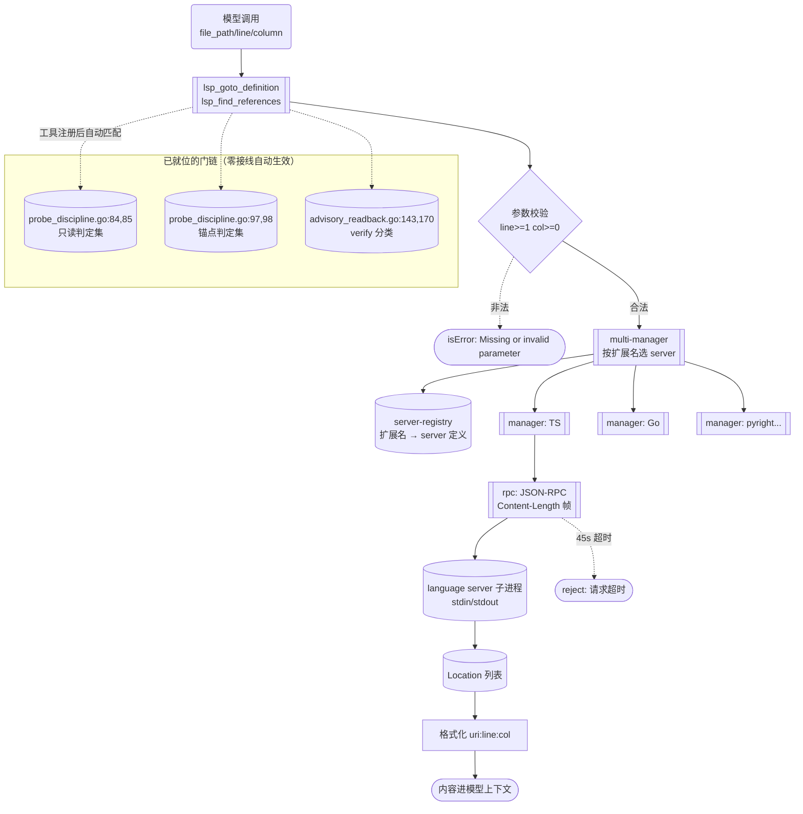
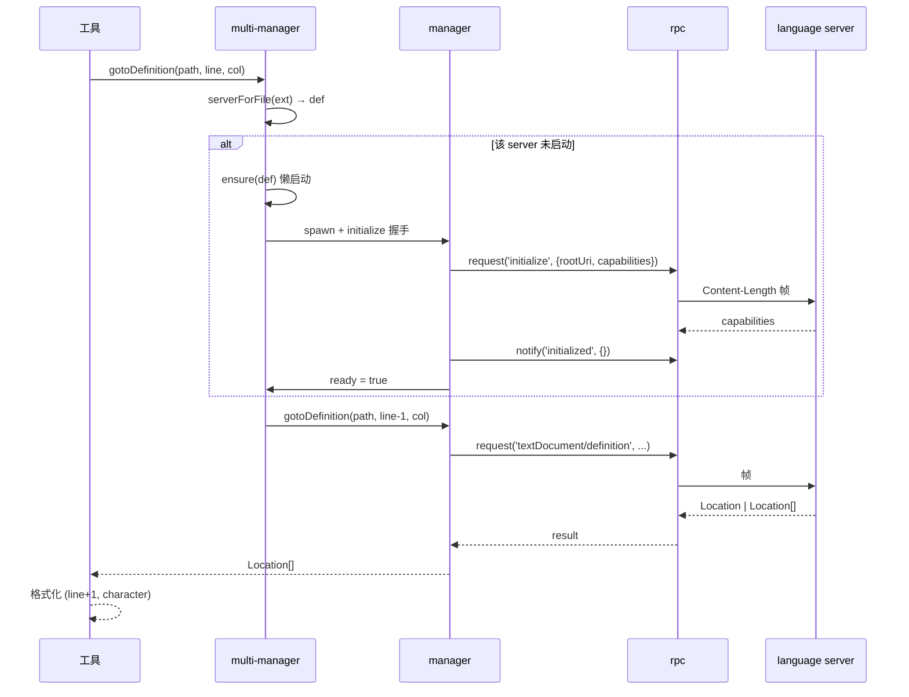

---

**执行状态：** 已闭环。Task 1,1,2,2,3,3,4 均已完成；验证通过；交付门检查：GREEN。
rivet-options: [{"label":"W1 = LSP 导航（推荐）","description":"1111 行新代码，stdlib 自包含（不增依赖）；填 5 个门链消费点（最多）且零接线自动生效；导航能力支撑本项目最高频动作（改导出符号前查全部消费方）。含 3 条成本订正 + 1 处上游缺陷修正（rpc.ts 的 server→client 请求静默丢弃）"},{"label":"改做 undo 快照","description":"次优备选：成本可能更低——go/internal/recovery/stack.go（333 行）已就位，缺的只是 FileHistory 快照层（TS 346 行）；但消费点仅 1 处，且 approval_assess.go:305 已按名预置风险定级。给模型文件撤销安全网"},{"label":"先只修 delegate 的提示词缺口","description":"本计划已把「为什么不是 delegate 族」写清：11744 行派发内核 + Go 侧无子代理调 executeTool 的路径。若你要先修那处提示词缺口，我另写一份小刀计划（只改 modeblocks.go:24 的文案，不建内核）"}]
---


> **Model: deepseek-v4.1-flash (cheap)**

> **Status: APPROVED** — 2026-09-27T05:52:34.210Z

> **Status: EXECUTED** — 2026-09-27T06:37:56.138Z

# Go 子系统移植排期 — W1：LSP 导航（goto/refs 最小闭环）

> 分支 `go-runtime` · 起点 HEAD `bb052e0c` · 起草 2026-09-28
> 依据：`.rivet/HANDOFF.md`「下一步（第一百刀后）」+ 本轮四路只读调研

## 需求提炼

**用户原话**：「按 .rivet/HANDOFF.md 计划，排期实现子系统」

**任务锚点自我澄清**（逐字引自 task-anchor 的 remaining 字段）：HANDOFF「下一步」里那批**需先建子系统**的项——`LSP / 仓库索引 / 委派编排 / monitor / undo 快照等`。

**目标**（两条，均可验证）：

1. 在那批候选中**判定唯一该先做的一个**，并给出可复算的判据——不是罗列选项。
2. 把它拆成**分波可执行**的实施路径，每波有独立可验证出口。

**非目标**（防范围蔓延）：

- **不在同一刀里并联做多个子系统**——它们彼此独立、互不阻塞；并联会让每波的验证出口变模糊（本仓库历史教训：一次只押一个可验证单元）。
- 不改 TS 版（`src/` 一行不动，仅作 oracle 对照）。
- 不引入 `go.mod` 之外的依赖——LSP 的 JSON-RPC 用 stdlib 自实现（现有仅 `compress` + `x/net` + `x/text`）。
- 不做 `lsp_diagnostics` 工具——**TS 侧不存在该工具**（见「成本订正」第 3 条），Go 侧现状是对齐的幻影条目，不是缺口。

## 问题与根因

### 根因：前两份排期计划的判据在本轮已失效

| 既有计划 | 判据 | 为何在本轮失效 |
|---|---|---|
| `.rivet/plans/go-重写天枢运行时-分波移植计划.md`（APPROVED） | 六层分波（Wave 0..5） | 粒度太粗——其 Wave 4 把 `agent` + `hooks` + `tools` + `context` 打包成一层，**无法回答「先做哪个子系统」** |
| `.rivet/plans/go-工具移植排期-按依赖面分-w1-w4.md`（APPROVED） | **依赖面**：读 TS 的真实 import，分「平台能力 / 子系统已有 / 子系统缺失」三类 | **判据已耗尽**——该计划的 W1/W2/W3 已落地（工具数 27→39）。剩余工具**全部**落入第三类「需造子系统」，该判据对它们**不再有区分能力** |

所以需要**第三条判据**。

### 新判据：门链消费点的**数量 + 形态**

「已移植的 Go 治理层有多少处**按名引用**这个工具」——这是**已有的、活的消费者**，比「TS 侧规模多大」硬：它是仓库自己写下的需求，不是我推测的需求。

全量扫描结果（grep 证据见「瑶光反证」）：

| 候选子系统 | Go 侧已在等的消费点（`file:line`） | 数量 | 形态 |
|---|---|---|---|
| **LSP**（goto/refs） | `go/internal/agent/probe_discipline.go:84,85`（`probeReadonlyTools`）+ `:97,98`（`probeAnchoredReadonlyTools`）+ `go/internal/agent/advisory_readback.go:143`（`verifyToolNames`）+ `:170`（`toolFamily`） | **5** | 判定集 / 分类映射 |
| delegate 族 | `go/internal/agent/planmode.go:69,76` + `go/internal/compact/context_collapse.go:98` + `go/internal/tools/registry.go:423,424` + `go/internal/prompt/modeblocks.go:24` + `go/internal/tools/plan.go:209` | 6 | 允许集 / 别名表 / **提示词** |
| 仓库索引 · 语义搜索 | `go/internal/agent/probe_discipline.go:80,81` | 2 | 判定集 |
| monitor | `go/internal/agent/advisory.go:44`（`CategoryMonitor` 常量） | 1 | **常量，零消费方** |
| undo | `go/internal/agent/approval_assess.go:305`（风险定级） | 1 | 风险表 |

**但数量不是唯一维度——形态决定「不做会不会坏」**。三类形态的后果完全不同：

| 形态 | 不做时的行为 | 例 |
|---|---|---|
| **判定集条目** | **永不匹配**（无害） | LSP 的 5 处 |
| **允许集 / 别名表** | **永不匹配**（无害）——`CheckPlanMode` 是纯字符串 map 成员判断，**不校验工具是否注册**（实测 `go/internal/agent/planmode.go:236`） | delegate 族的 4 处 |
| **提示词引导** | **真实缺口**——模型被引导去调一个不存在的工具 | `go/internal/prompt/modeblocks.go:24` |

由此得三个结论：

- **LSP**：5 个消费点全是判定集 → **做了零接线自动生效，不做也不坏**。它缺的是「能力」而非「修复」。
- **delegate 族**：4 处无害 + **1 处真实缺口**（提示词）——但修那个缺口的正解是**建整个 worker 派发内核**（`coordinator` 3587 + `worker-session` 1251 + `plan-executor` 741 + `team-orchestrator` 776 + `starflow-orchestrator` 1077 + `orchestration-outcome` 254 ≈ **7686 行**，加上五个工具本体 4058 行 ≈ **11744 行**），是数量级更大的工程。
- **monitor**：唯一消费方是常量 → **建了也是休眠**（`SessionJobs.OnEvent` 在 Go 侧零生产订阅者）。

### 为什么仍推荐 LSP（三维称量，不只报收益）

| 维度 | LSP | 说明 |
|---|---|---|
| **消费者** | 5 处，最多 | 且**零接线成本**——工具一注册，5 处自动从「永不匹配」变为「生效」 |
| **自包含度** | 最高 | stdlib 即可（`os/exec` + 自实现 JSON-RPC），**不新增依赖**；对比 delegate 族需整个派发内核 |
| **能力性质** | 导航 | 直接支撑本项目最高频动作：**改导出符号前用 `lsp_find_references` 查全部消费方**——这正是 HANDOFF 反复出现的场景（「全量消费方枚举」纪律） |

**代价也要放上秤**：1111 行新代码 + 测试；JSON-RPC 帧解析与进程生命周期是**易出微妙 bug 的地方**（帧边界、超时未清理、僵尸进程）；测试**不能依赖真实 language server**，须造假 server 或注入 spawn 缝；`multi-manager` 的 45s 初始化超时会让测试变慢。

## 成本订正（推翻两份文档的数字）

`wc -l src/lsp/*.ts` 合计 **2064**（`.rivet/plans/go-重写天枢运行时-分波移植计划.md:53` 写 1891，差 173；`.rivet/plans/go-工具移植排期...md` 未列）。

**但真正需要的不是 2064**——逐文件归属核实后：

| 文件 | 行数 | 属于 LSP 导航？ | 依据 |
|---|---|---|---|
| `src/lsp/tools.ts` | 133 | ✅ 两工具本体 | `name: 'lsp_goto_definition'` at `:17`、`'lsp_find_references'` at `:77` |
| `src/lsp/rpc.ts` | 195 | ✅ JSON-RPC 帧 + 待决表 | `encodeMessage` / `decodeMessages` / `DEFAULT_LSP_REQUEST_TIMEOUT_MS = 45_000`（`:39`） |
| `src/lsp/manager.ts` | 375 | ✅ 单 server 生命周期 + goto/refs | `supportsDefinition` 读 `capabilities.definitionProvider`（`:243`） |
| `src/lsp/multi-manager.ts` | 223 | ✅ 按语言路由 + 懒启动 | `defaultLspSpawn`（`:65-80`）；`DEFAULT_LSP_INITIALIZE_TIMEOUT_MS = 45_000`（`:46`） |
| `src/lsp/server-registry.ts` | 185 | ✅ 25+ server 条目（**纯数据**） | `LSP_SERVERS`（`:42-105`）+ `serverForFile`（`:167`） |
| `src/lsp/client.ts` | 363 | ❌ **tsc 类型检查执行器** | 见下「纠偏 1」 |
| `src/lsp/typecheck-cache.ts` | 556 | ❌ tsc 跨进程缓存门 | 文件头 `:1-23`：缓存的是 **tsc 原始输出**；唯一入口是 `client.ts::runTscShared` |
| `src/lsp/diagnostics.ts` | 34 | ❌ tsc 输出解析 | `TSC_PATTERN` 匹配 `file(line,col): error TSxxxx` 格式，**不解析 LSP 协议诊断** |
| **真实缺口** | **1111** | | |

### 三条纠偏（用工具核实，非采信文档）

1. **`src/lsp/client.ts` 不是 LSP 协议客户端**。它 import 的是 `formatDiagnostics`/`parseDiagnosticOutput`（`diagnostics.ts`）、`node:child_process`、`node:fs`，导出 `runTypeCheck`（`:58`）/ `runTscSubprocess`（`:107`）/ `shouldRunDiagnostics`/`filterDiagnosticsForEdit`。**真实 LSP 进程 spawn 在 `multi-manager.ts:65-80` 的 `defaultLspSpawn`**。先前 scouting 把 client.ts 当 LSP 客户端，会高估成本约 400~900 行。

2. **Go 侧已移植 tsc 部分的等价物**。`go/internal/tools/testspawn.go:139` 注释逐字：「对账 lsp/client.ts::runTscSubprocess + theta-check.ts::resolveTscCommand」。故 `client.ts` 的 tsc 侧不必重做。

3. **`lsp_diagnostics` 是幻影条目**。`grep "name: 'lsp_" src/` 只命中 `lsp_goto_definition`（`tools.ts:17`）与 `lsp_find_references`（`:77`）。`lsp_diagnostics` 字面量**只在** `src/agent/advisory-readback.ts:102,114` 的工具名清单里出现——TS 从未定义该工具。Go 侧 `advisory_readback.go:143,170` 是**忠实对齐的幻影**：不做它才是 parity。

## 架构与数据流



**关键数据流（一次 goto）**：



## 方案取舍

### 决策 A：先做哪个子系统

| 方案 | 收益 | 代价 | 判定 |
|---|---|---|---|
| **A1. LSP 导航**（推荐） | 填 5 个门链消费点（最多）；**零接线**；stdlib 自包含；导航能力支撑最高频动作 | 1111 行；JSON-RPC + 进程生命周期的微妙之处；测试须造假 server | ✅ 采纳 |
| A2. delegate 族 | 修 1 处**真实缺口**（提示词引导不存在的工具） | **11744 行**（派发内核 + 五工具）；需先建 worker 会话执行路径（Go 侧无子代理调 `executeTool` 的路径，`go/internal/agent/loop.go:940` 注释自证） | ❌ 数量级不对，应另立计划 |
| A3. undo 快照 | 给模型文件撤销能力（安全网） | 需新建 FileHistory 层（346 行 TS）；但 **recovery 地基已就位**（`internal/recovery/stack.go` 333 行，对账 `recovery-stack.ts` + `recovery-journal.ts`），成本比 LSP 小 | ⚠️ 次优——消费点仅 1 处，且 `approval_assess.go:305` 已按名预置风险定级 |
| A4. monitor | — | 唯一消费方是常量，**建了休眠** | ❌ 不做 |
| A5. 仓库索引 / 语义搜索 | — | 需 Meridian 图 + embedding（Go 侧零基础） | ❌ 规模不可控 |

**A3（undo）是真正的次优备选**，已在 submit 的 `options` 中列出供你取舍。

### 决策 B：是否复制 TS 的「server→client 请求静默丢弃」

`src/lsp/rpc.ts` 的分派只有三分支（`id+result` / `id+error` / `method` 无 id）。**server→client 请求**（同时含 `method` 与 `id`，如 `client/registerCapability`、`workspace/configuration`）**没有任何分支处理，被静默丢弃**。

| 方案 | 说明 | 判定 |
|---|---|---|
| B1. 忠实复制（丢弃） | 与 TS 字节级同构 | ❌ 真实 server（`typescript-language-server`）启动后会发 `client/registerCapability`，丢弃可能让 server 行为异常——这是**会咬人的缺陷** |
| **B2. 回 `MethodNotFound` 错误响应**（推荐） | 协议正确（JSON-RPC 规定必须响应）；server 得到明确答复而非挂等 | ✅ 采纳，**记为显式偏离** |
| B3. 完整实现 client 能力 | 最正确 | ❌ 超出「goto/refs 最小闭环」，且 TS 没有的语义没有 oracle 可对账 |

**采纳 B2 的理由**：这是**移植时发现的上游缺陷**——与本仓库既有纪律一致（第九十七刀「移植死代码 = 搬运缺陷」、第一百刀 `import_resource` 的 symlink 缺陷：**当上游行为会让功能自身失效或违反协议时，Go 侧修正并记录差异**）。

### 决策 C：测试怎么打 red（不能依赖真实 language server）

| 方案 | 问题 |
|---|---|
| 装真 server 打真项目 | ❌ 依赖网络/机器状态，CI 不可重复 |
| mock `manager` 接口测工具 | ⚠️ 只覆盖工具层，**rpc/manager 全裸** |
| **注入 spawn 缝 + 假 server**（推荐） | ✅ `multi-manager.defaultLspSpawn` 在 TS 里就是注入点（`lspSpawn` 参数）；Go 侧同构设计，测试注入一个**讲 JSON-RPC 的假 server**（`go test` 内的进程内实现，不走网络） |

## 文件与提议代码

> **路径约定**：`go/internal/lsp/**` 全部**新增**（绿地）。不修改任何既有 Go 文件，**除** Wave 3 在 `go/internal/tools/default_registry.go` 增两行注册。

### Wave 1：JSON-RPC 层（纯逻辑，可独立单测）

**`go/internal/lsp/rpc.go`（新增，~230 行）**

```go
// 对账 src/lsp/rpc.ts（195 行）。
//
// 帧格式（实测 rpc.ts:41-44）：`Content-Length: <bytes>\r\n\r\n<body>`，
// 非行分隔。解码用字节缓冲累积，不足整帧时保留 rest 待下次拼接。
package lsp

const DefaultRequestTimeoutMS = 45_000 // 对账 rpc.ts:39

// frame 是编码后的 JSON-RPC 报文。
func EncodeMessage(body []byte) []byte {
	return append([]byte(fmt.Sprintf("Content-Length: %d\r\n\r\n", len(body))), body...)
}

// DecodeMessages 从累积缓冲中切出完整帧，返回（报文列表, 剩余缓冲）。
//
// **对账要点**：TS 用 `buf.indexOf('\r\n\r\n')` 找头尾，用正则取 Content-Length；
// 头必须逐字节匹配（大小写敏感），长度按 **字节** 而非字符计。
func DecodeMessages(buf []byte) ([][]byte, []byte)

type Pending struct {
	Resolve func(json.RawMessage)
	Reject  func(error)
	timer   *time.Timer
}

type RPC struct {
	nextID   int             // 对账：let nextId = 1，单调递增
	pending  map[int]*Pending
	handlers map[string][]func(json.RawMessage) // 通知处理器
	dead     bool
}

func (r *RPC) Request(ctx context.Context, method string, params any, timeoutMS int) (json.RawMessage, error)
func (r *RPC) Notify(method string, params any) error
func (r *RPC) OnNotification(method string, fn func(json.RawMessage))
func (r *RPC) AbortAllPending(reason string) // 对账 abortAllPending：transport 断开时全量 reject
func (r *RPC) Dispose()
```

**Dispatch 的四分支（含决策 B 的修正）**：

```go
// dispatch 分派一条入站报文。
//
// **与 TS 的差异（显式偏离，见计划「决策 B」）**：TS 只处理三分支，
// server→client 请求（method + id 同现）被**静默丢弃**（rpc.ts:105-112）。
// Go 侧改为回 `MethodNotFound` 错误响应——协议正确，且真实 server
// （typescript-language-server 的 client/registerCapability）不会挂等。
func (r *RPC) dispatch(msg inbound) {
	switch {
	case msg.Result != nil && msg.ID != nil:
		r.settle(*msg.ID, nil, msg.Result)
	case msg.Error != nil && msg.ID != nil:
		// 对账：TS 只取 message，丢弃 code/data
		r.settle(*msg.ID, fmt.Errorf("%s", msg.Error.Message), nil)
	case msg.Method != nil && msg.ID == nil:
		r.emitNotification(*msg.Method, msg.Params) // 如 textDocument/publishDiagnostics
	case msg.Method != nil && msg.ID != nil:
		r.replyMethodNotFound(*msg.ID, *msg.Method) // ← 决策 B 的修正点
	}
}
```

### Wave 2：server 注册表 + manager + multi-manager（进程生命周期）

**`go/internal/lsp/server_registry.go`（新增，~200 行，纯数据 + 选择逻辑）**

```go
// 对账 src/lsp/server-registry.ts（185 行）。
// LSP_SERVERS 是 **25+ 条纯数据**——逐字平移（含 extensions / languageIdByExt）。
type ServerDef struct {
	ID              string
	Extensions      []string
	LanguageID      string
	LanguageIDByExt map[string]string
	Command         string
	Args            []string
	AlwaysAvailable bool // 仅 typescript（npx 兜底）
}

// ServerForFile 对账 serverForFile：遍历候选，取**第一个已安装**的。
// which 可注入（对账 TS 的 `which` 参数）——测试不打真实 PATH。
func ServerForFile(path string, which WhichFunc) *ServerDef

// HasServerForFile 对账 hasServerForFile：**只看是否注册过，不探安装**。
func HasServerForFile(path string) bool

// LanguageIDForFile 对账 languageIdForFile：先查 languageIdByExt，回落 def.LanguageID。
func LanguageIDForFile(path string, def *ServerDef) string
```

**移植陷阱**：`typescript` 条目用 `npx -y typescript-language-server --stdio`。Go 侧 `exec.Command("npx", ...)` 在 **Windows 上是 `npx.cmd`**，直接 exec 会失败。对账 TS 的 `resolveNpmCliCommand`（把 npx 重写为 `node <cli.js>`）——这是**必须处理的分支**，否则 Windows 完全不可用。

**`go/internal/lsp/manager.go`（新增，~380 行）**

```go
// 对账 src/lsp/manager.ts（375 行）。
type Manager struct {
	ready        bool
	capabilities *ServerCapabilities
	openedDocs   map[string]int // uri → version
	rpc          *RPC
	proc         *exec.Cmd
}

// IsReady 对账 isReady()：返回 ready 布尔。
func (m *Manager) IsReady() bool { return m.ready }

// SupportsDefinition 对账 supportsDefinition()：
// **靠 server 自报的 capabilities**（definitionProvider === true），不是本地猜测。
func (m *Manager) SupportsDefinition() bool {
	return m.capabilities != nil && m.capabilities.DefinitionProvider
}

// GotoDefinition 对账 gotoDefinition：
//   - 行号 **1-based → 0-based**（line-1）
//   - 结果**非数组时包裹成数组**（对账 `Array.isArray(result) ? result : [result]`）
func (m *Manager) GotoDefinition(file string, line, column int) ([]Location, error)

// FindReferences 对账 findReferences：额外带
// `context: {includeDeclaration: false}`，且**只接受数组**（不对非数组包裹）。
func (m *Manager) FindReferences(file string, line, column int) ([]Location, error)
```

**initialize 握手**（逐字对账 `manager.ts:168-231`）：

```go
// 对账 manager.ts:168-173 的参数构造。
params := map[string]any{
	"processId": os.Getpid(),
	"rootUri":   fileURI(cwd), // pathToFileURL(cwd).href
	"capabilities": map[string]any{
		"textDocument": map[string]any{
			"definition": map[string]any{"linkSupport": false},
			"references": map[string]any{},
		},
	},
}
// 握手后：capabilities = initResult.capabilities
//        Notify("initialized", {})
//        sleep(200ms)  ← 对账 manager.ts 的固定等待
//        ready = true
// 且 initialize 开头清空 openedDocs 与 diagnosticCache
```

**生命周期三态**（对账 `manager.ts:190-196, 232-240, 366-372`）：

```go
// proc.on('error') 与 proc.on('exit') 都置 ready=false 并 AbortAllPending
// initialize 抛错时：dispose rpc + kill proc + 置空
// Dispose(): ready=false → rpc.Dispose() → proc.kill()
// **manager 内无自动重启**（重启在 multi-manager 层）
```

**`go/internal/lsp/multi_manager.go`（新增，~240 行）**

```go
// 对账 src/lsp/multi-manager.ts（223 行）。
//
// 存在理由：多语言项目按扩展名路由到不同 server，懒启动藏在同一接口后。
const (
	DefaultInitializeTimeoutMS = 45_000 // 硬上限
	DiagnosticReadyWaitMS      = 2_000  // 编辑后冷启动最短等待
	MaxLSPRestarts             = 2
)

// **关键语义**：multi-manager 层的 IsReady / SupportsDefinition / SupportsReferences
// 都返回 `getAvailable().length > 0`——**只校验有 server 装，不校验 capability**
// （对账 multi-manager.ts:190-201）。这与单 manager 层的语义**不同**，必须保留。
func (m *MultiManager) IsReady() bool { return len(m.available()) > 0 }
```

### Wave 3：两个工具 + 注册 + 端到端

**`go/internal/lsp/tools.go`（新增，~150 行）**

```go
// 对账 src/lsp/tools.ts（133 行）。

// resolveParams 对账 resolveParams（tools.ts:4-12）——**三处校验文案逐字**：
//   缺 file_path      → "Missing required parameter: file_path"
//   line 非数或 <1    → "Missing or invalid parameter: line (must be >= 1)"
//   column 非数或 <0  → "Missing or invalid parameter: column (must be >= 0)"
func resolveParams(input map[string]any) (params, string)

// 输出格式化（对账 tools.ts:52-60 / :112-120）：
//   零结果 → "No definition found for symbol at {path}:{line}:{col}"   ← line/col 用**入参原值**
//   有结果 → "{n} definition(s) found:\n{uri}:{l}:{c}\n..."
//            其中 l = loc.range.start.line + 1，c = loc.range.start.character（**不加 1**）
```

**IsEnabled 是条件注册的关键**（对账 `tools.ts:64` / `:124`）：

```go
// 工具在 server 不可用时**不出现在模型可见的工具列表**——
// 这与 Go 侧现状（工具不存在）在可观测行为上等价，
// 故「先不移植」在上游是有先例的：TS 自己也用 isEnabled 做过同样的门控。
func (t *gotoTool) IsEnabled() bool {
	return t.mgr.IsReady() && t.mgr.SupportsDefinition()
}
```

**注册**（`go/internal/tools/default_registry.go`，唯一改动点，+2 行）：

```go
r.Register(lsp.GotoDefinitionTool(lspMgr))
r.Register(lsp.FindReferencesTool(lspMgr))
```

**三个门链消费点零接线自动生效**——`probe_discipline.go:65-68` 的注释逐字预告了这件事：「判定集里的未知名字**行为等价于不存在**（永不匹配）——**保留无害且将来移植时自动生效**」。

## 验证清单

**Wave 1（rpc）**

- `EncodeMessage` 帧字节精确（`Content-Length: N\r\n\r\n` + body，N 按**字节**）——含多字节 UTF-8 正文（中文），防止按字符计长度
- `DecodeMessages` 的**半帧保留**：一次喂 `"Content-Length: 10\r\n\r\n{" a":"1"`（不完整）→ 返回 0 条 + 完整 rest；再补后半 → 返回 1 条
- **粘包**：一次喂两帧 → 返回 2 条
- 请求 id 单调递增；**超时后从待决表删除**（防泄漏）；超时 reject 文案
- `AbortAllPending`（transport 断开）全量 reject
- **决策 B 的分支**：server→client 请求（`method` + `id` 同现）→ 收到 `MethodNotFound` 错误响应（这是新增行为，TS 无——测试名须含 `ServerToClientRequest`）
- 通知（`method` 无 `id`）不产生任何出站报文

**Wave 2（registry / manager / multi-manager）**

- `ServerForFile` 取**第一个已安装**（注入 which 让第 2 个可用 → 必须返回第 2 个，不是第 1 个）
- `HasServerForFile` **不探安装**（未装 server 的扩展名也返回 true）
- `LanguageIDForFile` 的 `languageIdByExt` 优先 + 回落
- **Windows 的 npx 重写**：`resolveNpmCliCommand` 等价物（`npx` → `node <cli.js>`）——纯函数测三平台
- `Initialize` 握手参数逐字段对账（`processId` / `rootUri` / `capabilities.textDocument.definition.linkSupport`）
- `SupportsDefinition` 靠 server 自报（注入 `capabilities` 为 `definitionProvider: false` → 必须 false）
- **行号转换**：入参 `line=5` → 出站 `position.line=4`（1-based → 0-based）
- **非数组结果包裹**：server 返回单个 `Location` 对象 → `GotoDefinition` 必须返回长度 1 的切片；`FindReferences` 对非数组**返回空**（两者语义不同，勿统一）
- 进程退出 → `IsReady()` 变 false 且待决请求全部 reject
- 重启计数：`MaxLSPRestarts=2` 边界（第 2 次可重启，第 3 次不再）
- `MultiManager.IsReady()` 是 `available().length > 0`（**不校验 capability**）——与单 manager 层对比测试

**Wave 3（工具 + 端到端）**

- `resolveParams` 三处错误文案**逐字**（含 `(must be >= 1)` / `(must be >= 0)` 的括号与空格）
- 零结果文案用**入参原值**（`line=5` 时显示 `:5:`，不是 `:4:`）
- 结果文案的 `s` 单复数：`1 definition(s) found`（TS 用字面 `(s)`，不变化）
- `IsEnabled` 两态（`IsReady` false → 不进工具表；`SupportsDefinition` false → 同上）
- **端到端走生产装配**：`NewDefaultRegistry` + 注入假 LSP server → `lsp_goto_definition` 返回真实 `Location` 格式化结果
- **门链生效验证**：`probe_discipline` 的只读计数在调用 `lsp_goto_definition` 后递增（此前该名字永不匹配）
- 定义逐字对账（`name` / `description` / `properties` / `required` 顺序）——前缀缓存字节稳定

**全波通用**

- `gofmt -l` 干净、`go vet ./...` 干净
- `go test ./... -count=1` 全量 0 FAIL
- `go test ./internal/lsp/... -race`（进程 + goroutine 读取，`-race` 必跑）
- **无探针残留**（`.rivet/scratch/` 与临时假 server 文件清理）
- **变异反证**：每个 Wave 至少 1 个（见下）

## 瑶光反证

**断言 1：`src/lsp/client.ts` 是 tsc 执行器，不是 LSP 协议客户端**

- 证据（首手）：`client.ts:1-5` 的 import 只有 `formatDiagnostics`/`parseDiagnosticOutput`（本地 `diagnostics.ts`）、`node:path`、`node:child_process`、`node:fs`；导出 `runTypeCheck`（`:58`）/ `runTscSubprocess`（`:107`）/ `TSC_GATE_ARGS = ['--noEmit','--pretty','false']`（`:82-83`）；消费端是 `src/agent/typecheck-gate.ts:35,44` 与 `src/bootstrap.ts:628`。而真实 LSP spawn 在 `multi-manager.ts:65-80`。
- 复现：`grep -n 'child_process\|runTscSubprocess\|spawn' src/lsp/client.ts src/lsp/multi-manager.ts`
- **推翻的既有判断**：本轮首路 scout 将 `client.ts` 列为「LSP 客户端 363 行」，据此得「LSP 缺口 2064 行」。核实后订正为 1111 行。

**断言 2：`lsp_diagnostics` 在 TS 侧不存在（幻影条目）**

- 证据（首手）：`grep "name: 'lsp_" src/` 只命中 `src/lsp/tools.ts:17` 与 `:77`；`lsp_diagnostics` 字面量仅在 `src/agent/advisory-readback.ts:102,114` 的工具名清单出现；`src/bootstrap.ts:1294-1295` 只注册两个工具。
- 复现：`grep -rn "lsp_diagnostics" src/ go/ --include='*.ts' --include='*.go'`
- **含义**：Go 侧 `advisory_readback.go:143,170` 是**忠实对齐的幻影**——不做 `lsp_diagnostics` 才是 parity。**故三处 LSP 消费点（`advisory_readback` 那两处）里有 1 处是幻影**，真实待填的是 `probe_discipline` 的 4 处 + `toolFamily` 映射 1 处。

**断言 3：门链已在等且「做了自动生效」**

- 证据（首手，我亲自读了原文件）：`go/internal/agent/probe_discipline.go:65-68` 注释逐字：「前瞻项（Go 侧尚无对应工具，保留以对齐 TS）：ast_grep / repo_graph / semantic_search / recall / memory / **lsp_goto_definition / lsp_find_references** / web_fetch / web_search。判定集里的未知名字**行为等价于不存在**（永不匹配）——保留无害且**将来移植时自动生效**。」`probe_discipline.go:84,85` 与 `:97,98` 是该判定集的实体条目。
- 复现：`sed -n '60,100p' go/internal/agent/probe_discipline.go`

**断言 4：`CheckPlanMode` 对未注册工具返回「放行」**

- 证据：`go/internal/agent/planmode.go:236-238` 第 4 段是 `if _, ok := PlanModeAllowedTools[toolName]; ok { return Allowed: true }`——**纯字符串 map 成员判断，无 registry 校验**。失败在更下游的 `go/internal/tools/registry.go:461` `ErrUnknownTool`。
- 复现：`sed -n '200,270p' go/internal/agent/planmode.go`
- **含义**：delegate 族的 6 个消费点里，4 个属「不做也不会坏」。这**削弱**了「按消费点数量排序」的朴素结论——故我引入「形态」维度（见「问题与根因」的形态表）。

**断言 5（待验证假设，未实测）：Go 侧 `SessionJobs.OnEvent` 零生产订阅者**

- 证据：`go/internal/tools/jobstore.go:685-686` 定义 `OnEvent`，注释「对账 TS 的 on('event', ...)」；`grep 'Jobs.OnEvent' go/ --include='*.go'` 的生产代码零命中，唯一订阅在 `jobstore_test.go:655`。
- **状态**：来自 worker 报告的推断（`evidenceStatus=unverified`），我**未独立复跑该 grep**。标为待验证——它只影响「monitor 建了会不会休眠」的结论（本计划不据此决策，因为推荐的是 LSP）。

**本计划可被推翻的方式**：

1. **若 `multi-manager` 的最小闭环其实需要 `typecheck-cache`** → 成本从 1111 变 1667，Wave 3 需重排。**反驳判据**：`tools.ts` 的 import 列表不含 `typecheck-cache`；跑 `grep -n 'typecheck-cache\|runTscShared' src/lsp/tools.ts src/lsp/manager.ts` 应零命中（**执行 Wave 1 时先验此条**）。
2. **若你能接受不做 LSP 而做 undo** → 见 submit 的 `options`。undo 的独立判据：`internal/recovery/stack.go` 已就位（333 行，四写工具都持 `recovery.DefaultStack()`），缺的只是 FileHistory 快照层（TS `file-history.ts` 346 行）——**成本可能低于 LSP，但消费点仅 1 处**。
3. **若真实 server 的 `client/registerCapability` 不构成问题** → 决策 B 可退回 B1（忠实复制）。**反驳判据**：用真 `typescript-language-server` 起一次，抓 stdout 看是否含 `"method":"client/registerCapability"` 且有 `id`。

## 回归清单（本波以新增为主，既有行为必须不变）

| # | 功能锚点 | 验证方式 |
|---|---|---|
| 1 | Go 侧 **39 个既有工具全部保持注册**（只增不减） | `grep -c 'r.Register(' go/internal/tools/default_registry.go` 应为 **41**（39 + 2 个 LSP 工具） |
| 2 | 全量测试基线 **28 包 ok / 0 FAIL** 保持 | `go test ./... -count=1` |
| 3 | 既有工具的 **definition 字节不变**（前缀缓存字节稳定） | 生成 defs 快照前后对比；新增两个 LSP 工具**追加在末尾**，不打乱既有顺序 |
| 4 | `probe_discipline` 的**既有判定语义不变**（只从「永不匹配」变「可匹配」） | `probe_discipline_test.go` 全绿；`TestProbeDisciplineAnchoredByLSPTools`（`:161`）现有用例保持 |
| 5 | `advisory_readback` 的 `verifyToolNames` / `toolFamily` 行为不变 | `advisory_readback_oracle_test.go` 全绿 |
| 6 | `CheckPlanMode` 语义不变（LSP 工具不在允许集内，走默认分支） | `planmode_test.go` + `planmode_wiring_test.go` 全绿 |
| 7 | `go.mod` **依赖不增** | `git diff go/go.mod` 应为空 |
| 8 | 四写工具（`write_file`/`edit_file`/`hash_edit`/`apply_patch`）的 recovery 行为不变 | `internal/recovery/*_test.go` + `internal/tools/*_test.go` 全绿 |

## 分波实施

> 每波独立可交付、可验证；任一波失败不阻塞前序已交付部分。

### Wave 1 — JSON-RPC 层（`go/internal/lsp/rpc.go` + 测试）

纯逻辑，不碰进程、不碰工具注册，可完全单测。

**验证命令**：
- `cd go && go test ./internal/lsp/ -count=1 -run 'TestRPC|TestFrame|TestDecode'`
- `cd go && go vet ./internal/lsp/`
- 变异反证：① 把 `Content-Length` 按 `len(string)` 计（字符而非字节）→ 中文正文用例必红；② 把 `dispatch` 的第 4 分支删掉（回到 TS 的静默丢弃）→ `TestServerToClientRequest` 必红；③ 超时后不 `delete(pending)` → 泄漏检测用例必红

### Wave 2 — server 注册表 + manager + multi-manager

**验证命令**：
- `cd go && go test ./internal/lsp/ -count=1 -run 'TestServerForFile|TestLanguageID|TestManager|TestMultiManager'`
- `cd go && go test ./internal/lsp/ -race -count=1`（进程 + goroutine）
- 变异反证：① `GotoDefinition` 的 `line-1` 改成 `line`（不转换）→ 行号断言必红；② 非数组结果不包裹 → 单 `Location` 用例必红；③ `MultiManager.IsReady` 改成校验 capability → 与单 manager 的对比用例必红

### Wave 3 — 两个工具 + 注册 + 端到端

**验证命令**：
- `cd go && go test ./internal/lsp/ -count=1 -run 'TestGoto|TestFindReferences|TestToolDefinition'`
- `cd go && go test ./internal/tools/ -count=1 -run 'TestLSP'`（端到端走 `NewDefaultRegistry`）
- `cd go && go test ./internal/agent/ -count=1 -run 'TestProbeDiscipline'`（门链生效回归）
- `cd go && go test ./... -count=1`（全量）
- 变异反证：① 错误文案改一个标点（如去掉 `(must be >= 1)` 的括号）→ 文案断言必红；② `IsEnabled` 恒 `true` → 「server 不可用时工具不可见」用例必红；③ 注册时插到列表**中间**而非末尾 → 回归清单 #3 的 defs 快照对比必红

### Wave 4（可选，本计划不含）— 诊断回流

`tool-pipeline.ts:1581-1607` 的 `[LSP Diagnostics]` 注入（编辑后把诊断拼进工具结果，`modelText` / `uiText` 分离，`MODEL_INREGION_CAP=10` / `UI_DIAGNOSTIC_CAP=20`）。**独立于 goto/refs**，且触达 `tool-pipeline`（Go 侧对应物在 `go/internal/agent/loop.go`）——风险面更大，**待 Wave 1-3 交付后另立计划**。

## 排期与提交节奏

| 波 | 内容 | 提交粒度 | 预估 |
|---|---|---|---|
| W1 | rpc.go + 测试 | 1 提交 | ~230 + ~250 行 |
| W2 | server_registry.go + manager.go + multi_manager.go + 测试 | 1~2 提交（registry 可独提） | ~820 + ~700 行 |
| W3 | tools.go + 注册 + 端到端 | 1 提交 | ~150 + ~250 行 |

**每提交前**：`gofmt -w` → `go vet` → 相关测试 → `-race`（W2/W3）→ 全量 → `deliver_task`。

## 7. Execution closure

已闭环：Task 1,1,2,2,3,3,4 均已完成并通过验证。

最终验证记录：

```bash
cd go && go test ./internal/lsp/ -count=1
cd go && go test ./internal/tools/ -count=1 -run TestLsp
cd go && go test ./internal/lsp/ -race -count=1
cd go && go test ./... -count=1
cd go && gofmt -l .
cd go && go vet ./...
```

交付门检查：GREEN。

备注：W1-W3 全部完成 + 装配接线 + 移植中发现并修 4 处上游缺陷。工具数 39→41，lsp 包 78 用例 + tools 17 用例全绿，-race 干净，全量 0 FAIL / 29 包。W4（诊断回流）有意搁置——独立于 goto/refs 且触达 agent/loop.go，风险面更大，待需要时另立计划。
