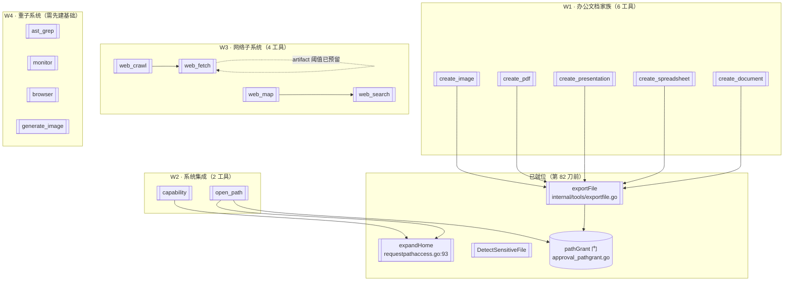

> **Model: deepseek-v4.1-flash (cheap)**

> **Status: APPROVED** — 2026-09-27T01:52:55.722Z

# Go 工具移植排期 — 按「依赖面」重排的 W1–W4

> 起草时间：2026-09-27 · 分支 `go-runtime` · 起点 HEAD `022122fd`（第八十二刀）
> 依据：`.rivet/HANDOFF.md`「下一步」+ **对第 82 刀称量方法的纠正**
> 活动计划文件：`.rivet/plans/draft-1790473178503.md`

## 需求提炼

**用户原话**：「按 .rivet/HANDOFF.md 计划，排期实现」；上一轮追问「你不觉得矛盾吗，工具需要子系统，子系统又不能做，那还能做什么」。

**目标（用户意图提炼）**：
1. 按 HANDOFF 的规划**排出可执行的实施顺序**（不是再写一份调研报告）。
2. **解决上一轮暴露的矛盾**——工具需要子系统、子系统又不做，那到底能做什么。答案是：**重排优先级**，先做「子系统已就位」的那批。

**非目标**：
- 不重写 TS 版（`src/` 一行不动）。
- 不追求工具数量对齐 48——只追求**与 TS 行为等价**。
- 不引入 `go.mod` 之外的重依赖（当前仅 `compress` + `x/text`）。

## 问题与根因

### 根因：第 82 刀前的称量方法有缺陷（循环论证）

`.rivet/HANDOFF.md`「下一步」第 6 条（L786-792）判定：

> 剩余的候选工具（`update_goal` / `session_vitals` / `semantic_search`）经第七十五刀的判据（「Go 侧有无该状态的**维护者**」）**全部是造子系统**，不适合推进。

**该判据对那 3 个工具成立**，但它被错误地推广成了「工具缺口普遍不可做」。上一轮我更进一步用 `grep 工具名` 在 Go 侧找命中——**工具本身还没移植，必然零命中**，用「工具不存在」证明「依赖不存在」是循环论证。

**正确判据（第 82 刀确立）**：读 TS 实现的**真实 import**，区分：

| 依赖类型 | 例 | 判定 |
|---|---|---|
| **平台能力** | `node:fs` / `path` / `child_process` | Go 标准库有 → **可实现** |
| **项目内子系统（已有）** | `exportFile` / `expandHome` / `DetectSensitiveFile` | Go 侧已移植 → **接线** |
| **项目内子系统（缺失）** | `visionAsk` 回调 / Playwright / tree-sitter | 实现体不存在 → **造子系统** |

### 关键发现：门链与基础设施**已在等工具**（新证据）

调研中发现三处「**休眠接线**」——门/基础设施已就位，只缺工具本体：

| 位置 | 内容 | 含义 |
|---|---|---|
| `go/internal/agent/approval_pathgrant.go:101-129` | 已有 `export_file` / `create_document` / `open_path` **三个授权分支** | 门链为未移植工具预留了位置 |
| `go/internal/artifact/threshold.go:80` | 已有 `"web_fetch": 1.0` 阈值条目 | artifact 包装层为 web_fetch 预留 |
| `go/internal/agent/planmode.go:68`、`probe_discipline.go:86-87`、`approval_assess.go:275` | 按名引用 `web_fetch` / `web_search` | 治理层空接 |

**关键**：`probe_discipline.go:66-68` 的注释明写这些预留是**有意设计**——

> `web_fetch` / `web_search`。判定集里的未知名字 **行为等价于不存在**（永不匹配）——**保留无害且将来移植时自动生效**。

即：**门链与治理层不是「遗留垃圾」，是为移植预留的钩子**。`export_file` 第 82 刀落地后，`approval_pathgrant.go:101` 的分支首次有了真实消费者——这正是「休眠接线被激活」的实证，也验证了「先做依赖就位的工具」这条路。

### 另一个被推翻的判断：办公文档家族「依赖 npm 库」是错的

调研 scout 初判 5 个办公工具依赖 `docx`/`exceljs`/`pdf-lib` 等第三方库。**逐文件核实后推翻**：

| 工具 | 真实实现 | 依赖 |
|---|---|---|
| `create_document.ts` | 纯字符串 + `escapeHtml` | `exportFile` |
| `create_spreadsheet.ts` | CSV/TSV/HTML 转义拼接 | `exportFile` |
| `create_presentation.ts` | **纯 HTML 字符串**（`.ppt` 是 HTML 伪装） | `exportFile` |
| `create_pdf.ts` | **纯 HTML + CSS `@page`**（浏览器打印） | `exportFile` |
| `create_image.ts` | SVG 包裹 + markdown fence 剥离 | `exportFile` |
| `generate_image.ts` | 调生图 API（`resolveApiKey`） | **需 API 层** |

**前 5 个零第三方库**，全是 `exportFile` 的下游——而 `exportFile` 已落地。**这是本排期最高价值的一波**。

## 架构与数据流



**数据流（W1 办公文档，以 `create_spreadsheet` 为例）**：


## 方案取舍

| 方案 | 做法 | 收益 | 代价 | 判定 |
|---|---|---|---|---|
| **A. 按依赖面分波**（推荐） | 先做「依赖已就位」的 W1/W2，W3/W4 待基础 | 每波都能独立验证、立即可用；激活休眠接线 | 工具数暂时落后 TS | ✅ 采纳 |
| B. 按 TS 注册顺序移植 | 照 `default-registry.ts` 顺序逐个做 | 表面进度快 | W3/W4 会卡在无基础设施，做成空壳 | ❌ 会重蹈「造子系统」 |
| C. 先建全部基础设施再移植工具 | 先做 HTTP/HTML/树解析子系统 | 一步到位 | 基础设施无消费者，无法验证是否正确 | ❌ 无消费者的机制 |

**采纳 A 的理由**：`export_file`（第 82 刀）已证明这条路可行——依赖就位时，一个工具从 RED 到全绿只需一轮，且**门链的休眠接线立即被激活**（`approval_pathgrant.go:101` 首次有消费者）。

## 分波实施

### Wave 1：办公文档家族（5 工具，依赖 `exportFile` 已就位）

**共同模式**：`input 校验 → 纯函数 render（字符串拼接/转义）→ exportFile → 文案`。

| 工具 | 文件（**新增**） | 核心纯函数 | 关键校验 |
|---|---|---|---|
| `create_document` | `go/internal/tools/createdocument.go`（**新增**） | `renderDocument`（txt/md/html/doc） | `destination_path` 必填、`content` 必填 |
| `create_spreadsheet` | `go/internal/tools/createspreadsheet.go`（**新增**） | `renderSpreadsheet`（csv/tsv/html/xls） | `rows` 必填且为数组、`headers` 若给须为数组 |
| `create_presentation` | `go/internal/tools/createpresentation.go`（**新增**） | `renderPresentation`（HTML 幻灯片） | `slides` 须非空数组 |
| `create_pdf` | `go/internal/tools/createpdf.go`（**新增**） | `renderPdf`（HTML + `@page`） | `content` 必填 |
| `create_image` | `go/internal/tools/createimage.go`（**新增**） | `extractSvgInner` + `wrapSvg` | `svg` 必填 |

**每个工具的 definition 必须逐字对账 TS**（前缀缓存字节稳定）。**嵌套对象 schema**（`slides` 的 items 是 object）需核对 Go 侧 wire 序列化的键序。

**Wave 1 验证**：
- `cd go && go test ./internal/tools/ -count=1 -run 'TestCreate'`（全部新测试）
- 逐工具 definition 逐字对账（`TestCreate*DefinitionParity`）
- 变异反证：每个工具至少 1 个（移除必填校验 / 移除格式推断）
- `cd go && go test ./... -count=1`（全量不回归）

### Wave 2：系统集成（2 工具，门链已预留）

| 工具 | 文件（**新增**） | 依赖 | 特殊点 |
|---|---|---|---|
| `open_path` | `go/internal/tools/openpath.go`（**新增**） | `os/exec` + `expandHome` + `pathGrant` 门 | **Windows 注册表探测**（`windowsFileHasHandler`）+ reveal 降级；macOS/Linux 路径简单 |
| `capability` | `go/internal/tools/capability.go`（**新增**） | `os/exec`(`which`) + `os.Getenv` + 读 `.rivet/capabilities.json` | 内置 6 条种子 registry（ffmpeg/imagemagick/pandoc/jq/gh/rg） |

**`open_path` 的移植策略**：Go 侧 `runtime.GOOS` 分支。macOS（本机）走 `open`，Linux 走 `xdg-open`，Windows 走 PowerShell `Start-Process` + 注册表探测。**Windows 分支需在 macOS 上做纯函数测试**（`decideOpenAction` / `buildRevealCommand` 可注入 platform 参数）。

**`capability` 的移植策略**：`createRequire.resolve` 是 Node 特有的包解析——Go 侧无对应。**判据**：`package` 检查器在 Go 侧应返回「不适用」而非「缺失」（否则种子 registry 的 `package` 项永远显示 missing）。需读 TS 的种子 registry 确认哪些 capability 用 `package` 检查。

**Wave 2 验证**：
- `cd go && go test ./internal/tools/ -count=1 -run 'TestOpenPath|TestCapability'`
- `open_path` 的 platform 分支纯函数测试（三平台各一组）
- **端到端**：`TestAccOpenPathViaProductionRegistry`（走 `NewDefaultRegistry`）
- `cd go && go test ./... -count=1`

### Wave 3：网络子系统（4 工具，需先建基础设施）

**前置**：Go 侧**无任何 HTTP 抓取能力**（实测 `net/http` 生产代码仅 `client.go:23` 的 LLM 客户端；`go/internal/net/` 零文件）。需新建：

| 组件 | 落点（**全部新增**） | 说明 |
|---|---|---|
| HTTP 抓取封装 | `go/internal/net/fetch.go`（**新增**） | 含超时/重定向/UA |
| SSRF 防护 | `go/internal/net/ssrf.go`（**新增**） | 对账 TS `net-ssrf.ts`（私网 IP 拒绝） |
| HTML→Markdown | `go/internal/net/htmltomd.go`（**新增**） | 需引入 `golang.org/x/net/html`（**新依赖**） |
| 搜索后端链 | `go/internal/net/search/`（**新增目录**） | DDG/Brave/Tavily |

**工具本体**：`web_fetch`（含 actions/Playwright 分支——**Playwright 部分不做**，降级报错）、`web_search`、`web_crawl`、`web_map`。

**Wave 3 验证**：
- 基础设施单测（SSRF 拒绝表、HTML→MD 用例）
- `web_fetch` 对本地 `httptest` 服务器抓取（**不打真实外网**——测试不得依赖网络）
- `cd go && go test ./... -count=1`

### Wave 4：重子系统（4 工具，暂缓）

| 工具 | 阻塞点 | 何时做 |
|---|---|---|
| `ast_grep` / `ast_edit` | 需 tree-sitter（cgo 或 `smacker/go-tree-sitter`） | 需先决策 cgo 可接受性 |
| `monitor` | 需 `getResolvedEnv`（437+ 行，仓库注释明示有意不移植）+ `Monitors` 注册表 | 需先有 env 解析子系统 |
| `browser` | 需 Playwright/CDP | 桌面端场景，CLI 无 |
| `generate_image` | 需生图 API 配置层（`resolveApiKey`） | 待 API 层 |

**判据**：这些是**真·造子系统**，与本排期的 W1/W2 性质不同。**不排期**，待各自前置就绪。

## 文件与提议代码

### W1 示例：`create_document`（`go/internal/tools/createdocument.go`）

```go
// createDocument 创建 `create_document` 工具。
// 对账 TS `src/tools/create-document.ts`（112 行）——依赖 `exportFile`（第八十二刀）
// + 纯字符串处理，**零第三方库**。
func CreateDocument(cwd string) Tool { return &createDocumentTool{cwd: cwd} }

// DocumentFormat 对账 TS 的 `DocumentFormat`。
const (
	DocFormatTxt  = "txt"
	DocFormatMd   = "md"
	DocFormatHTML = "html"
	DocFormatDoc  = "doc"
)

// inferDocumentFormat 对账 TS `inferDocumentFormat`——扩展名推断，显式优先。
func inferDocumentFormat(destinationPath string, explicit string) string {
	if explicit != "" {
		return explicit
	}
	switch strings.ToLower(filepath.Ext(destinationPath)) {
	case ".md", ".markdown":
		return DocFormatMd
	case ".html", ".htm":
		return DocFormatHTML
	case ".doc":
		return DocFormatDoc
	}
	return DocFormatTxt
}

// renderDocument 对账 TS `renderDocument`——按格式选渲染器。
func renderDocument(title, content, format string) string { /* txt/md/html 分支 */ }
```

**执行体**复用 `exportFileRun`（第 82 刀已提取为可测函数）：

```go
func (t *createDocumentTool) Execute(_ context.Context, p *CallParams) (contract.Result, error) {
	content, _ := p.Input["content"].(string)
	if strings.TrimSpace(content) == "" {
		return contract.Result{Content: "错误：content 为必填项", IsError: true}, nil
	}
	dest, _ := p.Input["destination_path"].(string)
	rendered := renderDocument(title, content, inferDocumentFormat(dest, explicitFormat))
	// 复用 exportFileRun——同一敏感门 + 50MB 上限，不重复实现。
	res, err := exportFileRun(map[string]any{
		"destination_path": dest,
		"content":          rendered,
	})
	if err != nil {
		return contract.Result{Content: "错误：" + err.Error(), IsError: true}, nil
	}
	return contract.Result{Content: fmt.Sprintf("已创建 %s 文档（%d 字节）：%s", format, res.bytes, res.path)}, nil
}
```

### W2 示例：`open_path` 的 platform 纯函数（`go/internal/tools/openpath.go`）

```go
// openDecision 对账 TS `OpenDecision`。
type openDecision struct {
	Platform    string
	IsDirectory bool
	// HasHandler：true=有处理程序；false=确认没有；nil=判断不了。
	HasHandler *bool
}

// decideOpenAction 对账 TS `decideOpenAction`（纯判定，可注入 platform 测试）。
//
// Windows 上对**文件**且确认无关联处理程序时退化为定位（`explorer /select,`）
// ——定位必定成功且绝不弹框；其余情况一律「打开」。
func decideOpenAction(in openDecision) string {
	if in.Platform != "windows" {
		return "open"
	}
	if in.IsDirectory {
		return "open"
	}
	if in.HasHandler != nil && !*in.HasHandler {
		return "reveal"
	}
	return "open"
}
```

## 验证清单

**W1（办公文档 5 工具）**
- [ ] 每工具 `TestCreate*DefinitionParity`——name / description / PropOrder / required / 嵌套键序逐字对账
- [ ] 每工具必填校验分支（缺 `destination_path` / 缺 `content` 或 `rows` 或 `slides`）
- [ ] 格式推断（扩展名 → 格式；显式 format 优先）
- [ ] 渲染纯函数单测（CSV 引号转义、HTML 实体转义、SVG fence 剥离）
- [ ] **端到端**：走 `NewDefaultRegistry` 执行，确认文件真的落盘且内容正确
- [ ] 敏感门复用验证（`create_*` 不应绕过 `exportFile` 的门）
- [ ] 变异反证：每工具 ≥1（移除必填校验 / 改格式推断默认值）
- [ ] `go test ./... -count=1` 全量不回归

**W2（open_path / capability）**
- [ ] `decideOpenAction` 三平台 × 目录/文件 × hasHandler 三态的条件矩阵
- [ ] `buildRevealCommand` / `buildOpenPathCommand` 三平台命令构造
- [ ] `capability` 的 preflight 三检查器（binary/env/package）各自 missing/available
- [ ] 种子 registry 6 条完整（ffmpeg/imagemagick/pandoc/jq/gh/rg）
- [ ] 项目级 `.rivet/capabilities.json` 覆盖/新增（不删种子）
- [ ] 端到端走生产注册表

**W3/W4**：待前置就绪后另立计划。

## 瑶光反证

**断言 1**：`export_file` 的门链分支在 Go 侧**已存在**（不只是我新写的）。
- 证据：`go/internal/agent/approval_pathgrant.go:101` 的 `if toolName == "export_file" || toolName == "create_document"` —— **该文件在第八十二刀前就存在**（`create_document` 至今未移植，分支却是既有的）。
- 复现：`grep -n 'export_file\|create_document\|open_path' go/internal/agent/approval_pathgrant.go`

**断言 2**：办公文档家族**不依赖第三方库**（推翻 scout 初判）。
- 证据：`src/tools/create-document.ts:3` / `create-spreadsheet.ts:3` / `create-presentation.ts:3` / `create-pdf.ts:3` / `create-image.ts:3` **全部只有 `import { exportFile } from './export-file.js'`**，加上 `node:path` 的 `extname`。渲染逻辑全是字符串拼接。
- 复现：`grep -n '^import' src/tools/create-{document,spreadsheet,presentation,pdf,image}.ts`

**断言 3**：Go 侧**无通用 HTTP 抓取能力**。
- 证据：`net/http` 在生产代码仅 `go/internal/client/client.go:23`（LLM 客户端，端点 `{base}/chat/completions`）；`go/internal/net/` 零文件。
- 复现：`grep -rn 'net/http' go/internal go/cmd --include='*.go' | grep -v _test`

**断言 4**：`web_fetch` 的 artifact 阈值**已预留**。
- 证据：`go/internal/artifact/threshold.go:80` 的 `"web_fetch": 1.0`。
- 复现：`grep -n 'web_fetch' go/internal/artifact/threshold.go`

**待验证假设（未实测，执行时须先验证）**：
- `capability` 的 `package` 检查器在 Go 侧无 `createRequire` 对应物——**假设**应返回「不适用」，需读 TS 种子 registry 确认哪些条目用 `package` 检查后再定。
- `create_presentation` 的 `slides` 是**嵌套 object 数组**——Go 侧 wire 序列化的嵌套键序**未实测**（第 82 刀只验了顶层与单层 enum）。执行 W1 时必须先写探针验证。

## 回归清单（本排期为纯新增，无既有行为改动）

- [ ] Go 侧 27 个既有工具**全部保持注册**（`grep -c 'r.Register(' go/internal/tools/default_registry.go` 应从 28 递增，不减少）
- [ ] `go test ./... -count=1` 基线 26 包 ok / 0 FAIL 保持
- [ ] 既有工具的 definition 字节不变（`TestToolDefinitionsByteStable` 若有）
- [ ] `exportFileRun` 的签名与语义不被 W1 修改（只被复用）

## 排期与提交节奏

| 波次 | 内容 | 提交粒度 |
|---|---|---|
| W1 | 5 个办公工具 | 每工具 1 提交（共 5），或 2+2+1 分组 |
| W2 | open_path + capability | 每工具 1 提交（共 2） |
| W3 | 网络基础设施 + 4 工具 | 基础设施 1 + 每工具 1 |
| W4 | 待定 | — |

**每提交前**：`gofmt -w` → `go vet` → 相关测试 → 全量 → `deliver_task`。
