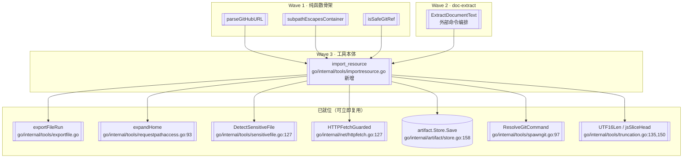

> **Model: deepseek-v4.1-flash (cheap)**

**执行状态：** 已闭环。Task 1-4 均已完成；验证通过；交付门检查：GREEN。

> **Status: APPROVED** — 2026-09-27T04:51:33.695Z

> **Status: EXECUTED** — 2026-09-27T05:28:58.609Z

# Go 工具移植排期（第二轮）—— 按「依赖面就位度」重排的候选清单

> 起草：2026-09-28 · 分支 `go-runtime` · 起点 HEAD `337223f7`
> 依据：`.rivet/HANDOFF.md`「下一步（第九十九刀后）」+ 本轮三路并行调研（工具差集 / 零消费扫描 / 重子系统前置核实）
> 方法论：沿用第八十二刀确立的**依赖面判据**（读 TS 真实 import，分「平台能力 / 项目内已移植 / 项目内缺失」三类），**不再用 `grep 工具名`** 做循环论证。

## 需求提炼

**用户原话**：「按 .rivet/HANDOFF.md 计划，排期实现」（第九十六刀、第九十九刀后各一次，同一诉求）。

**目标（提炼）**：
1. 读 HANDOFF 的「下一步（第九十九刀后）」5 条候选，**逐条核实其前置到底缺什么**，排出可执行顺序。
2. 延续既有排期风格：**先做「依赖已就位」的**，把「需先建子系统」的显式推后并说明理由——避免造无消费者的机制。

**非目标**：
- 不重写 TS 版（`src/` 一行不动）。
- 不追求工具数对齐 70——只追求**与 TS 行为等价**。
- 不引入 `go.mod` 之外的重依赖（当前仅 `compress` + `x/net` + `x/text`，见 `go/go.mod`）。
- **不清理**本轮扫出的「零消费」符号——核查后确认其中 **(b) 忘接线 = 0 项**（详见下节），无需动作。

## 问题与根因

### 本轮的核心问题：HANDOFF 的「下一步」是**清单**，不是**排期**

`.rivet/HANDOFF.md` 的「下一步（第九十九刀后）」列了 5 条，但**没有依赖面判定**——
读者无法判断哪条现在能做、哪条要先建子系统。这正是第八十二刀之前的同型问题。

### 三路调研的结论（与本轮开始时的预期**不同**）

| 调研路径 | 方法 | 结论 |
|---|---|---|
| ① 工具差集 | TS 70 个工具名 vs Go 38 个（`go/internal/tools/default_registry.go` 实测 38） | 差集 29 + bootstrap 层 3 = **32 项** |
| ② 零消费扫描 | 枚举 `go/internal/` 导出符号，grep 生产调用点（排除 `_test.go`） | 9 项零消费，但 **归因后 (b) 忘接线 = 0** |
| ③ 重子系统前置 | 逐项 grep 前置在 Go 侧的存在性 | 4 项**全部**需先建子系统 |

### ★ 路径 ② 的归因（本轮最重要的「不做事」结论）

「零消费」≠「缺口」。九个符号逐一定因：

| 符号 | 定义位置 | 归因 | 证据 |
|---|---|---|---|
| `artifact.AddFallbackSession` | `go/internal/artifact/store.go:135` | **(c) 消费方未移植** | 唯一消费者 `src/agent/coordinator.ts:960`；Go 无 coordinator 层 |
| `artifact.ListByTarget` | `go/internal/artifact/store.go:252` | **(c)** | 唯一消费者 `src/tools/browser-debug/tool.ts:924` |
| `artifact.ReadLines` | `go/internal/artifact/store.go:299` | **(a) 有意收窄** | TS 侧 `readLines` 同样仅测试消费，生产走 `readLineRange`（`src/tools/read-section.ts:221`）；与已接线的 `ReadLineRange` 语义不同（前者校验 sha256，后者流式） |
| `recovery.RenderRecoveryStack` | `go/internal/recovery/journal.go:207` | **(c)** | 唯一消费者 `src/tui/slash-commands.ts:2883`；Go 无 TUI/slash 层 |
| `recovery.AcknowledgeAll` | `go/internal/recovery/journal.go:160` | **(c)** | 唯一消费者 `src/agent/deliver-task.ts:1190`；Go 未移植 `deliver_task` |
| `recovery.HandoffRecoveries` | `go/internal/recovery/journal.go:184` | **(c)** | 唯一消费者 `src/server/session-manager.ts:2728`；Go 无 server 层 |
| `recovery.EstimateLinesLost` | `go/internal/recovery/stack.go:303` | **(a)** | TS 侧同样零生产消费（`src/agent/recovery-stack.ts:223` 仅定义） |
| `recovery.ResetEvictWindow` | `go/internal/recovery/stack.go:260` | **(a) 已被更优设计取代** | 注释自称「测试钩子」，但 `go/internal/recovery/stack.go:47-48` 已明示 Go 改用实例化隔离；全仓零调用 |
| `context.TopGeneralFamilies` | `go/internal/context/generalledger.go:207` | **(c)** | 唯一消费者 `src/agent/worker-prompts.ts:345`；Go 无 worker-prompts |

**行动**：不清理、不接线。**唯一值得做的**是给 (a) 三项的注释补一句「本符号无生产消费者（TS 亦然）」，
避免下次审计重复勘探——但这属文档微调，**不进本计划的范围**（见「非目标」）。

## 架构与数据流



```mermaid
flowchart LR
    SRC(模型传入 source) --> K{source 类型}
    K -->|本地路径| L[[handleLocalImport<br/>敏感门 + symlink/cp]]
    K -->|GitHub URL| G[[handleGitHubImport<br/>clone + 容器校验]]
    K -->|http(s) URL| U[[handleUrlImport<br/>HTTPFetchGuarded]]
    L --> RES[[buildResult<br/>预览 + 抽取]]
    G --> RES
    U --> RES
    RES --> OUT([content + uiContent<br/>.rivet/external/ 路径])
    RES -.大文本.-> ART[(artifact.Store.Save)]
```

## 方案取舍

| 方案 | 做法 | 收益 | 代价 | 判定 |
|---|---|---|---|---|
| **A. 只做 `import_resource`，其余显式推后**（推荐） | 集中完成唯一「依赖已就位」的工具；32 项差集里明确标注各自阻塞点 | 单体可控、可立即验证、复用已有 7 个组件 | 工具数 38→39，进度看起来慢 | ✅ 采纳 |
| B. 同时开工 LSP 子系统（解锁 2 工具） | 新建 `go/internal/lsp/`（client/rpc/manager/server-registry） | 一次解锁 2 工具 + 类型检查能力 | LSP 是**完整子系统**（TS 侧 client+rpc+manager+multi-manager+server-registry+diagnostics+typecheck-cache），远超一刀；且 Go 侧当前无 LSP 消费者 | ❌ 造子系统 |
| C. 做「零消费」清理 | 删 `ResetEvictWindow` 等 3 项 (a) 类 | 代码更干净 | **删 3 个符号换不来行为等价**，且属本计划非目标 | ❌ 不值 |

**采纳 A 的理由**：`import_resource` 是本轮**唯一**「依赖已就位」项——7 个依赖组件全部实测在位（见下方锚点表），
且 `go/internal/net/fetchcore_test.go:253` 已断言错误文案含 `import_resource`（**门链已在等这个工具**）。
这与第八十二刀 `export_file` 的形态完全同型，是本仓库已验证可行的路径。

## 分波实施

### Wave 1：纯函数骨架（无 IO，可独立测）

**目标**：三个纯函数 + 完整单测。**不含**任何文件系统/网络调用。

| 函数 | 对账 TS（`src/tools/import-resource.ts`） | 关键语义 |
|---|---|---|
| `parseGitHubURL(raw string) (*githubRef, bool)` | `parseGitHubUrl:54` | 解析 `github.com/{owner}/{repo}[/tree\|blob/{ref}/{subpath}]`，含 `.git` 后缀与 https 全形 |
| `subpathEscapesContainer(container, subpath string) bool` | `subpathEscapesContainer:67` | **issue #119**：词法层拦 `..` 穿越；真实层 `realpath` 拦容器内符号链接外指 |
| `isSafeGitRef(ref string) bool` | `isSafeGitRef:92` | **防 git 选项注入**：拒 `-` 开头、空白/控制字符、`~^:?*[\`、超 255 |

**`subpathEscapesContainer` 为什么不能复用 `pathsafe.Validate`**（本轮实测结论）：
`go/internal/pathsafe/pathsafe.go:65` 的 `Validate(cwd, inputPath string, mode Mode, opts *Options) Result`
语义是「在工作区内**或被显式授权**」，带 cwd 基准/授权/敏感检查三重语义；
而本函数只需**纯包含性判定**（不涉及 cwd 概念）。**语义不同，强行复用会引入额外行为**。

**Wave 1 验证**：
- `cd go && go test ./internal/tools/ -run 'TestParseGitHubURL|TestSubpathEscapes|TestIsSafeGitRef' -count=1`
- 边界用例：`../` 穿越、容器内符号链接外指、空子路径、`-` 开头 ref、含控制字符 ref
- 变异反证：每个函数至少 1 个（去掉 `..` 检查 / 去掉 `-` 前缀检查 / 去掉 realpath 层）

### Wave 2：`doc-extract`（外部命令编排）

**TS 对账**：`src/tools/doc-extract.ts`（**271 行**）。引擎链：
`pdftotext`（L67，60s）→ `textutil`（L72，60s，macOS）→ `pandoc`（L77，60s）→ `soffice|libreoffice`（L123，90s）。

**Go 侧参照**（本轮核实）：
- `go/internal/tools/capability.go:246` 的 `exec.Command("which", name)` —— 二进制探测
- `go/internal/tools/openpath.go:99` —— detached 进程模式
- `go/internal/tools/spawngit.go:97` —— 可注入的命令解析

**语义要点**：
- **fail-open**：无引擎可用时**不阻断导入**，返回 `suggestion`（安装指引）——对账 TS 注释
- `EXTRACTION_CAVEAT` 标记**随文本走**（「layout may be lossy，勿据此下否定结论」）
- 引擎链顺序：按扩展名分派（`.pdf` / `.docx` / `.doc` / `.pptx` / `.xlsx` 各不相同）
- **纯 JS 兜底引擎不做**（`pdfjs` L89 / `exceljs` L143）——那是 npm 包，Go 侧无对应；**显式披露**

**Wave 2 验证**：
- `cd go && go test ./internal/tools/ -run 'TestDocExtract' -count=1`
- `runner` 可注入：用桩 runner 断言引擎链顺序与 fallthrough
- fail-open：全部引擎 ENOENT 时返回 `ok=false` + `suggestion`（**不返回 error**）
- `.txt`（不可抽取）→ 引擎链为空 → 返回对应 suggestion

### Wave 3：`import_resource` 工具本体 + 注册

**TS 对账**：`src/tools/import-resource.ts`（**418 行**，导出 5 项：
`setHttpFetchForTests:16`、`parseGitHubUrl:54`、`subpathEscapesContainer:67`、`isSafeGitRef:92`、`IMPORT_RESOURCE_TOOL:178`）。

**依赖面核实**（每条都是本轮实测，不是推断）：

| TS 依赖 | Go 侧对应物 | 状态 |
|---|---|---|
| `exportFile` | `exportFileRun`（`go/internal/tools/exportfile.go`） | ✅ 已有（第八十二刀） |
| `expandHome` | `go/internal/tools/requestpathaccess.go:93` | ✅ 已有（同包可直接用） |
| `relativePosix` | `relPosix`（`go/internal/tools/repomap.go:443`） | ✅ 已有（小写未导出，同包可用） |
| `httpFetchGuarded` | `HTTPFetchGuarded`（`go/internal/net/httpfetch.go:127`） | ✅ 已有 |
| `detectSensitiveFile` | `DetectSensitiveFile`（`go/internal/tools/sensitivefile.go:127`） | ✅ 已有（纯函数，返回 `{Sensitive, PatternName, Path}`） |
| `artifactStore.save` | `Store.Save(SaveInput)`（`go/internal/artifact/store.go:158`） | ✅ 已有 |
| `child_process.execFile` | `ResolveGitCommand(deps)`（`go/internal/tools/spawngit.go:97`） | ✅ 已有（可注入 `GOOS/Env/Exists`） |
| `content.length` 截断口径 | `UTF16Len`（`go/internal/tools/truncation.go:135`）+ `jsSliceHead`（:150） | ✅ 已有（第八十八刀建的） |
| `doc-extract` | — | ⚠️ Wave 2 新建 |
| `github-mirror-fallback` | — | ⚠️ **有意降级**（见下） |
| `loadConfig` | — | ⚠️ 随上项一并降级 |
| `.rivet/external` 常量 | — | ⚠️ 需新增（6 pattern 证无） |

**三分支**（对账 TS `execute`）：
1. `parseGitHubUrl` 命中 → `handleGitHubImport`（clone + ref 校验 + 子路径容器校验）
2. `^https?://` → `handleUrlImport`（`HTTPFetchGuarded` + 落盘 + 空文件检查）
3. 否则 → `handleLocalImport`（**敏感门硬拒** + 目录走 symlink/junction、文件走 symlink 回退 cp）

**`github-mirror-fallback` 的降级决策**：
**不移植镜像表**（`src/tools/mirror-env.ts` 156 行，3 个镜像 `gitcode`/`kkgithub`/`fastgit`）。
理由：Go 侧**整个 mirrors 子系统未移植**（`go/internal/tools/bash.go:159-160` 已披露
「mirror 环境叠加——Go 侧无这两套子系统」）。单独为 `import_resource` 建镜像表 = 造一个只被一个工具用的子系统。
**降级行为**：直连 `github.com` clone 失败时返回失败（**不尝试镜像**），文件头**显式披露**——
错误文案说明只试了直连。这是「收窄」不是「静默失败」。

**注册**：`go/internal/tools/default_registry.go` 注册 `ImportResource(cwd)`。**验证门链已在等**：
`go/internal/net/fetchcore_test.go:253` 断言错误文案含 `import_resource`。

**Wave 3 验证**：
- `cd go && go test ./internal/tools/ -run 'TestImportResource' -count=1`
- 端到端（本地文件）：走 `NewDefaultRegistry` 执行，确认 `.rivet/external/` 下真的出现文件/链接
- 端到端（目录）：目录导入不复制磁盘
- 端到端（URL）：注入桩 fetch，确认落盘 + 预览
- **敏感门**（安全边界）：导入 `.env`/`id_rsa` 必须被拒且**不落盘**
- 失败路径：路径不存在、下载非 2xx、空文件——各自返回对应错误文案
- artifact 接线：文本超 `PREVIEW_BYTES` 时落 artifact
- definition 逐字对账：`name`/`description`/`input_schema` 的 `PropOrder`/`required`
- 变异反证：≥3 个（去掉敏感门 / 去掉容器校验 / 去掉 ref 校验）

### Wave 4：收尾验证与文档

- 全量：`cd go && go test ./... -count=1`（要求 exit=0 / 0 FAIL / 包数与基线一致）
- 工具数：`NewDefaultRegistry(...).Definitions()` 实测 **38 → 39**
- `gofmt -l .` 零违规；`go vet ./...` exit=0；探针残留 0
- `.rivet/HANDOFF.md` 补第 9 段（记录本刀 + 更新「下一步」为 32 项差集的阻塞点表）

## 验证清单

**W1（纯函数）**
- [x] `parseGitHubURL`：`github.com/o/r`、https 全形、`/tree/{ref}/{subpath}`、`.git` 后缀、非 GitHub URL、缺 owner/repo
- [x] `subpathEscapesContainer`：词法穿越（`../`）、容器内符号链接外指、正常子路径、空子路径
- [x] `isSafeGitRef`：`-` 开头、含空白/控制字符、含 `~^:?*[\`、正常 ref、超长（>255）

**W2（doc-extract）**
- [x] 引擎链顺序（按扩展名分派）
- [x] fail-open：全部引擎不可用时返回 `ok=false` + `suggestion`，**不返回 error**
- [x] `EXTRACTION_CAVEAT` 随文本返回

**W3（import_resource）**
- [x] 敏感门拒绝且不落盘（安全边界，对账 TS issue #135 的硬门）
- [x] 三分支各自端到端（走 `NewDefaultRegistry`）
- [x] definition 逐字对账（含 `PropOrder`/`required`）
- [x] 注册后 `go/internal/net/fetchcore_test.go:253` 的文案断言仍绿

**W4（收尾）**
- [x] 全量 0 FAIL；工具数 39；gofmt/vet 干净；无探针残留

## 瑶光反证

**断言 1**：`import_resource` 的 7 个依赖组件在 Go 侧**确实已存在**（不是推断）。
- 证据：`go/internal/tools/sensitivefile.go:127`（`func DetectSensitiveFile(inputPath string) SensitiveFileResult`）、
  `go/internal/net/httpfetch.go:127`（`func HTTPFetchGuarded(ctx context.Context, rawURL string, deps Deps, opts Options) (*Result, error)`）、
  `go/internal/tools/requestpathaccess.go:93`（`func expandHome(p string) string`）、
  `go/internal/tools/spawngit.go:97`（`func ResolveGitCommand(deps ResolveGitCommandDeps) string`）、
  `go/internal/tools/repomap.go:443`（`relPosix`）、
  `go/internal/tools/truncation.go:135`（`func UTF16Len(s string) int`）与 `:150`（`func jsSliceHead(s string, n int) string`）、
  `go/internal/artifact/store.go:158`（`func (s *Store) Save(input SaveInput) (string, error)`）
- 复现：`grep -n 'func DetectSensitiveFile\|func HTTPFetchGuarded\|func expandHome\|func ResolveGitCommand\|func relPosix\|func UTF16Len\|func jsSliceHead\|func (s \*Store) Save' go/internal/`
- **本轮已逐条读过函数签名**（非仅 grep 命中）

**断言 2**：门链**已在等** `import_resource`。
- 证据：`go/internal/net/fetchcore_test.go:253-254` 断言 `out.Error` 必须含 `"import_resource"`，
  文案是提示用户「改用 import_resource」
- 复现：`grep -n -A2 'import_resource' go/internal/net/fetchcore_test.go`

**断言 3**：`import_resource` 本身**尚未注册**（本刀是新增，不是接线）。
- 证据：`grep 'ImportResource\|import_resource' go/internal/tools/default_registry.go` → **零命中**
- 复现：同上

**断言 4**：LSP 子系统在 Go 侧**不存在**，且它是完整子系统而非一个工具。
- 证据：`glob go/internal/lsp/**/*.go` 零匹配；TS 侧 `src/lsp/` 含
  `client.ts` / `rpc.ts` / `manager.ts` / `multi-manager.ts` / `server-registry.ts` /
  `diagnostics.ts` / `typecheck-cache.ts`（含 `runTypeCheck`、`LspManager`、JSON-RPC 编解码）
- **注意**：`go/internal/agent/probe_discipline.go:84-85,97-98` 已把
  `lsp_goto_definition`/`lsp_find_references` 列入锚点判定集——**门链也在等它们**，但缺的是整个子系统
- 复现：`glob go/internal/lsp/**/*.go` → 未找到匹配

**断言 5**：`pathsafe.Validate` **不能**直接复用作容器包含性检查。
- 证据：`go/internal/pathsafe/pathsafe.go:65` 的签名是
  `Validate(cwd, inputPath string, mode Mode, opts *Options) Result`——
  带 cwd 基准、授权（`GrantChecker`）、敏感检测三重语义；而 `subpathEscapesContainer` 只需纯包含性判定
- 复现：读 `go/internal/pathsafe/pathsafe.go:65-110`（含 `filepath.Rel` 在 L109）

**待验证假设（执行时须先探针）**：
- Go 侧 `os.Symlink` 的**平台差异**（Windows 需开发者模式/junction 语义）——TS 用 `symlink(..., 'junction')` 处理目录，Go 侧需实测对应 API。**本轮未实测**。

## 回归清单（本次为纯新增，无既有行为改动）

- [x] Go 侧 38 个既有工具**全部保持注册**（`go/internal/tools/default_registry.go` 的 `r.Register` 计数从 39 递增，不减少）
- [x] `go test ./... -count=1` 基线 **28 包 ok / 0 FAIL** 保持
- [x] 既有工具的 definition 字节不变（前缀缓存字节稳定）
- [x] `exportFileRun` / `DetectSensitiveFile` / `HTTPFetchGuarded` / `ResolveGitCommand` / `UTF16Len` 的签名与语义**不被本刀修改**（只被复用）
- [x] `go/internal/net/fetchcore_test.go:253` 的 `import_resource` 文案断言**仍绿**（它本来就绿——本刀只是让它第一次有真实工具）

## 7. Execution closure

已闭环：Task 1-4 均已完成并通过验证。

最终验证记录：

```bash
cd go && go test ./... -count=1
cd go && gofmt -l .
cd go && go vet ./...
```

交付门检查：GREEN。

备注：W1-W4 全部完成 + 用户拍板的复制语义修正 + 提交后审查 4 条 HIGH 全部修复。工具数 38→39，全量 0 FAIL / 28 包。
