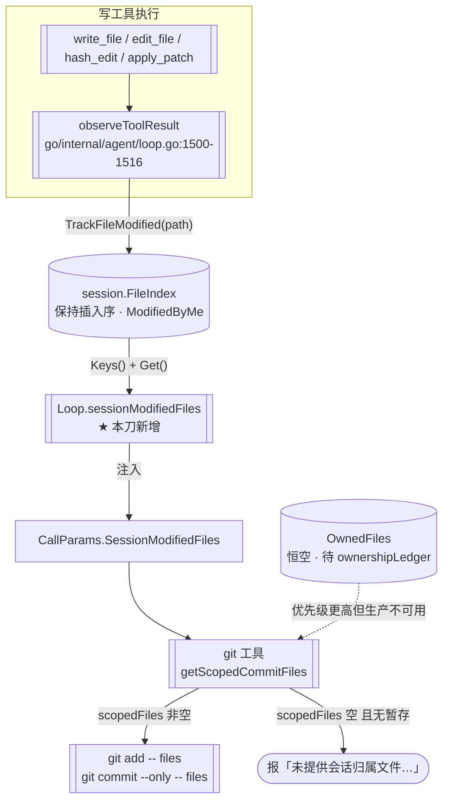

> **Model: deepseek-v4.1-flash (cheap)**

**执行状态：** 已闭环。Task 1-3 均已完成；验证通过；交付门检查：GREEN。

> **Status: APPROVED** — 2026-09-27T11:59:31.873Z

> **Status: EXECUTED** — 2026-09-27T12:11:27.386Z

# Go 运行时排期：接线 SessionModifiedFiles（修 git commit 归属回退的静默缺口）

> 分支 `go-runtime` · 基线 HEAD `8717e3cd`（HANDOFF 头部自称 `029a289e`，**已过期**）
> 一句话：把 Go 侧「有读取方、零写入方」的 `CallParams.SessionModifiedFiles`
> 接上本会话的已改文件源——它是 TS `git commit` 在无 `OwnedFiles` 时的**归属回退源**，
> 数据源在 Go 侧已存在且**同插入序**，无需新建子系统。

## 需求提炼

**用户原话**：「按 .rivet/HANDOFF.md 计划，排期实现功能」。

**提炼出的目标**：

1. **按 HANDOFF 的既定节奏继续推进**——那不是一份主干任务书，而是一份「每刀一个专章、
   逐刀独立验证」的移植账本（`.rivet/HANDOFF.md` 自述「本会话共 48 个提交……逐刀推进、
   每刀独立验证」）。它给的是**方法**（六阶段 + oracle + 变异反证 + 交付三项）与
   **候选池**，不是待办清单。
2. **选「已知的静默失效」而非「新增功能」**——这是 HANDOFF 自己在第一百零四刀写下的
   选刀判据（「已知的静默失效 > 新增功能」），我沿用它。
3. **不重复勘探已被判「不做」的项**——HANDOFF 的「下一步」多节已成修正轨迹，其中
   `semantic_search` / `update_goal` / `session_vitals` / `computer_use` / `sandbox_exec`
   已逐条归因为「造子系统」或「不可做」，本轮不再动它们。

**非目标（明确划出）**：

- **不重写 TS（`src/` 一行不动）**，不追求「功能更多」——只追求**与 TS 行为等价**。
- **不移植 `ownershipLedger` 子系统**（`OwnedFiles` 的真实源）。它的依赖链含
  `WorktreeBaseline` + `TaskLedger` + `deliver_task` 工具，是一整套；本轮只做**同刀可验证**
  的那一段。→ 见「为什么不是 `OwnedFiles`」。
- **不动 `git stash` 的归属门**（TS 亦不含 `sessionModifiedFiles`，见「回归清单」）。
- **不改 `OwnedFiles` 字段的注释结论**（它确实仍是缺口，只是本轮不修它）。

---

## 问题与根因

### 根因：`SessionModifiedFiles` 是「有读取方、零写入方」的字段

Go 的 `tools.CallParams` 声明了 `SessionModifiedFiles`，`git` 工具两处**读**它，
但**全 go 树没有任何生产写入方**：

| 位置 | 角色 |
|---|---|
| `go/internal/tools/registry.go:155`（执行期实测；规划期记为 148，已漂移） | 声明（`SessionModifiedFiles []string`，注释仅 1 行「是本会话已修改的文件」） |
| `go/internal/tools/git.go:236` | 读——`gitCommit` 的 `getScopedCommitFiles(cwd, p.OwnedFiles, p.SessionModifiedFiles)` |
| `go/internal/tools/git.go:372` | 读——`gitStash` 内（但外层门是 `len(p.OwnedFiles) > 0`，见下） |
| **写入方** | **无**（`grep -rn "SessionModifiedFiles" go/internal/` 仅命中上述三处） |

对账 TS 侧（`src/agent/tool-pipeline.ts:838`）——**同一个字段在 TS 是有写入方的**：

```ts
sessionModifiedFiles: [...deps.evidence.getState().filesModified],
ownedFiles: deps.ownershipLedger?.getOwnedFiles(),   // ← Go 侧未移植（已登记）
```

而 TS 的 `filesModified` 是**路径集合**（不是计数）：

- `src/agent/evidence.ts:33` — `filesModified: Set<string>`
- `src/agent/evidence.ts:17` — `TddGateState.filesModified: number` 是**另一个**量（计数），
  两者同名不同物。Go 侧 `EvidenceStateFromSession`（`go/internal/agent/evidence.go` 末段）
  返回的正是**计数**那一个，**不能**拿来当集合用——这正是
  `go/internal/tools/registry.go:138` 注释里说的「可选源要么语义不符……要么要移植整个子系统」。

### 缺口链：`git commit` 在 Go CLI 里退化为「报错」

`getScopedCommitFiles`（`go/internal/tools/git.go:421-435`）的语义是
**优先 `ownedFiles`，空则回退 `sessionModifiedFiles`**：

```go
func getScopedCommitFiles(cwd string, ownedFiles, sessionModifiedFiles []string) []string {
	source := ownedFiles
	if len(source) == 0 {
		source = sessionModifiedFiles   // ← 回退
	}
	// …归一化为项目相对路径（越界返 nil）
}
```

Go 侧两个源**同时为空**（`OwnedFiles` 恒空是已登记的缺口，`SessionModifiedFiles` 是本刀发现的）
→ `scopedFiles` 恒空 → 走到 `go/internal/tools/git.go:249` 的分支：

```go
} else if !hasStagedChanges(cwd) {
	return contract.Result{Content: "未提供会话归属文件给 git commit，且不存在已暂存变更。…", IsError: true}, nil
}
```

**对照 TS**：`sessionModifiedFiles` 非空 → `scopedFiles` 非空 → `git add -- <本会话文件>`
+ `git commit --only -- <本会话文件>`（`src/tools/git.ts:564` 之后）。即
**TS 的 `git commit` 会自动把本会话改过的文件纳入提交范围，Go 的会报错**。

这与 HANDOFF 反复记录的家族同型，但**更隐蔽**：`OwnedFiles` 被第一百零二刀的审查
显式登记为休眠接线（`go/internal/tools/registry.go:127` 起有 20+ 行说明），而
`SessionModifiedFiles` **从未被任何一处记录**（`grep -n "SessionModifiedFiles" .rivet/HANDOFF.md`
零命中）。同一个 `getScopedCommitFiles` 里两个源，一个被盯住了，另一个漏了。

### 为什么这值得修（称量两端）

**收益**：
- 恢复 TS 的 `git commit` 行为——无需手动 `git add` 即可提交本会话改动，且范围**限定在本会话**。
- 这是「多会话共享工作区」纪律的**结构保障**：本仓库明令「禁止用裸 git commit / git add -A 交付」，
  而 `sessionModifiedFiles` 正是把提交范围收敛到本会话的那道闸（对账 TS `src/tools/git.ts:163` 的
  `prefer ownedFiles (post-baseline) over sessionModifiedFiles (pre-baseline)`）。
- **零新建子系统**——源是 `session.FileIndex`，`go/internal/agent/loop.go:1502`/`:1513` 已在维护它。

**代价（诚实列出）**：
- `SessionModifiedFiles` 是**pre-baseline**语义（本会话改过的文件，含「本来就脏、本会话又碰过」的），
  精度**低于** `OwnedFiles`（post-baseline 的严格归属）。接线后 `git commit` 会包含
  本会话碰过的 pre-existing 文件——**这正是 TS 的行为**（TS 也是这个回退源），属 parity，
  但**不等于**「归属问题已解决」。→ 必须与 `OwnedFiles` 的既有登记区分表述，不得混为一谈。
- 顺序敏感：`git add -- <files>` 的参数序会影响提交顺序/输出。需保证与 TS 同为**插入序**。

---

## 架构与数据流



**修复点**：只在 `Loop.buildToolCallParams` 的注入处补一行——**不改 `git` 工具、
不改 `getScopedCommitFiles`**（它对账 TS，逻辑正确，缺的只是喂进来的数据）。

---

## 方案取舍

| 方案 | 做法 | 判定 |
|---|---|---|
| **A（采纳）接线 `SessionModifiedFiles`** | 从 `session.FileIndex`（`ModifiedByMe`）派生路径列表注入 | ✅ 数据源已存在、同插入序、零新子系统、与 TS 回退源逐字同源 |
| B 移植 `ownershipLedger` 全链 | 建 `WorktreeBaseline` + `TaskLedger` + 注入 `OwnedFiles` | ❌ 独立一刀的规模（含 git baseline 采集 + 跨会话接管）；本轮不混做 |
| C 用 `evidence.FilesModified` 的**计数**当集合 | 复用 `EvidenceStateFromSession` | ❌ 语义不符（计数 vs 集合），会产出**错的**提交范围——比恒空更危险（`go/internal/tools/registry.go:138` 已论证） |
| D 不修，只补文档登记 | 与 `OwnedFiles` 并列记录 | ⚠️ 可行但劣——A 的成本是**一行注入 + 一个 helper**，与「登记」同量级；能修的不修只记，是本仓库反复踩的「未接线」形态本身 |

**选 A**。B 与 A **不冲突**：A 接线后 `OwnedFiles` 仍优先（`getScopedCommitFiles` 第一分支），
将来移植 `ownershipLedger` 只需在注入处再加一行——A 是 B 的前置占位而非替代。

---

## 提议改动（file:line + 伪代码）

### 1. `go/internal/agent/loop.go` — 新增 helper

在 `observeToolResult`（`go/internal/agent/loop.go:1478` 起）或 `buildToolCallParams` 附近加：

```go
// sessionModifiedFiles 返回本会话被写工具改过的文件路径（**集合**，非计数）。
//
// 对账 TS `tool-pipeline.ts:838`：`[...deps.evidence.getState().filesModified]`
// ——TS 的 `filesModified` 是 `Set<string>`（`evidence.ts:33`），插入序，
// 元素为 trackFileModified 收到时的**原始形态**。
//
// Go 侧**同源**：`session.FileIndex` 是「保持插入序」的表
// （`go/internal/session/state.go:89`），`ModifiedByMe` 即「被 edit/write 改过」。
// 且 `observeToolResult` 传入的 path 与 TS 同形态——write/edit/hash_edit 传
// `file_path`、apply_patch 传 `ExtractPatchTargetPaths` 的解析结果
// （`go/internal/agent/loop.go:1513`）。
//
// **为什么需要它**：`CallParams.SessionModifiedFiles` 此前**有读取方零写入方**
// （`go/internal/tools/git.go:236`、`:372` 读），导致 `getScopedCommitFiles`
// 的回退源恒空 → `git commit` 在有会话改动但无暂存时**报错**，而 TS 会提交本会话文件。
//
// **为什么不复用它者**：`evidenceState.filesModified` 是**计数**
// （`go/internal/agent/evidence.go` 的 `EvidenceStateFromSession` 返回 `int`）
// ——语义不符，当集合用会产出错的提交范围。`OwnedFiles` 是另一量
// （post-baseline 归属），需未移植的 `ownershipLedger`，本轮不动。
//
// **顺序**：FileIndex 与 TS 的 Set 同为插入序 → `git add -- <files>` 参数序一致。
func (l *Loop) sessionModifiedFiles() []string {
	if l.State == nil {
		return nil
	}
	snap := l.State.Snapshot()
	keys := snap.FileIndex.Keys()
	out := make([]string, 0, len(keys))
	for _, k := range keys {
		if v, ok := snap.FileIndex.Get(k); ok && v.ModifiedByMe {
			out = append(out, k)
		}
	}
	return out
}
```

### 2. `go/internal/agent/artifact_intercept.go` — 在 `buildToolCallParams` 注入

`buildToolCallParams` 是**唯一**的 `CallParams` 构造点
（`go/internal/agent/artifact_intercept.go:192`，文件头注释明写「提取以便接线可测——
原来内联时无法单测，导致『字段有读取方、无写入方』的缺陷不会被任何测试抓到」）。
在 return 的字面量里加一行：

```diff
 		FileHistory: l.fileHistoryFunc(),
+		// SessionModifiedFiles：本会话已改文件（`git commit` 的归属回退源）。
+		//
+		// 对账 TS `tool-pipeline.ts:838`。**为什么必须在此注入**：本构造点是
+		// `CallParams` 的唯一装配点，漏填即「字段有读取方无写入方」——
+		// 本字段此前正是如此（`go/internal/tools/git.go:236` 读、零写入方）。
+		//
+		// **与 OwnedFiles 的区别**：本字段是 pre-baseline 近似（本会话碰过的
+		// 文件），精度低于 OwnedFiles（post-baseline 严格归属）。TS 亦如此
+		// ——`getScopedCommitFiles` 优先 ownedFiles、空才回退本字段。
+		SessionModifiedFiles: l.sessionModifiedFiles(),
 	}
 }
```

> **形态提醒（同 `Jobs` / `Grants` 的教训）**：`sessionModifiedFiles()` 返回
> `[]string`，nil 与空切片在此**行为等价**（消费侧只有 `len()` 与 `range`，
> 无 typed-nil 解引用）。**不需要** `xxxOrNil()` 式的显式判空包装——那是接口字段
> 才有的坑（`jobRegistryOrNil` / `grantCheckerOrNil`）。此处如实说明，避免过度设计。

### 3. `go/internal/tools/registry.go` — 订正字段注释

`SessionModifiedFiles`（`go/internal/tools/registry.go:155`）现注释只有一行。
改为写明「已接线 + 与 `OwnedFiles` 的分野」：

```diff
-	// SessionModifiedFiles 是本会话已修改的文件。
+	// SessionModifiedFiles 是本会话已修改的文件（**路径集合**，非计数）。
+	//
+	// 源：`Loop.sessionModifiedFiles()`（派生自 `session.FileIndex` 的
+	// `ModifiedByMe` 条目，**保持插入序**），经 `buildToolCallParams` 注入
+	// ——对账 TS `tool-pipeline.ts:838`。
+	//
+	// **消费方**：`go/internal/tools/git.go:236`（commit 归属范围回退）、
+	// `go/internal/tools/git.go:372`（stash 内，但外层门只看 `OwnedFiles`
+	// ——见 `getScopedCommitFiles` 的调用点）。
+	//
+	// **与 OwnedFiles 的分野**：本字段是 pre-baseline 近似，`OwnedFiles` 是
+	// post-baseline 严格归属；`getScopedCommitFiles` **优先后者**。两者的
+	// 精度差异是 TS 的既有设计，不是 Go 的偏离。
 	SessionModifiedFiles []string
```

`OwnedFiles` 的注释（`go/internal/tools/registry.go:125-147`）**保留不动**——它记录的缺口依然成立。

---

## 验证清单

| # | 场景 / 用例名 | 期望可见结果 |
|---|---|---|
| V1 | `TestSessionModifiedFilesCollectsWriteTools` | 写 A → 写 B → `buildToolCallParams().SessionModifiedFiles == ["A","B"]`（**插入序**，非排序） |
| V2 | `TestSessionModifiedFilesExcludesReads` | 只 `read_file` C → `SessionModifiedFiles` 不含 C（`ModifiedByMe` 门） |
| V3 | `TestSessionModifiedFilesApplyPatchTargets` | `apply_patch` 改多文件 → 各目标路径均入列（对账 `go/internal/agent/loop.go:1513` 的分支） |
| V4 | `TestSessionModifiedFilesNilStateSafe` | `State == nil` → 返回 nil，不 panic（headless / 测试装配路径） |
| V5 | `TestGitCommitScopesToSessionModifiedFiles` | 真临时 git 仓：本会话改 `a.txt`（未暂存）、另置一个**事先就脏**的 `b.txt` → `git commit -m …` → `git show --name-only` **含 a.txt**；`git status --porcelain` 里 **b.txt 仍为脏** |
| V6 | `TestGitCommitFailLoudWhenNothingScoped` | 无会话改动 + 无暂存 → 仍报「未提供会话归属文件…」（fail-loud 保留，防回退过头） |
| V7 | `TestSessionModifiedFilesOrderParity` | 交错写（A → 读 D → B）→ 顺序为 `[A,B]`，`read` 不入列且**不打断顺序** |

**人工检查点**：
- `cd go && go test ./internal/agent/ ./internal/tools/ -count=1` 全绿。
- `cd go && go test ./... -count=1` 全绿（**以 `go list ./... | wc -l` 为准**，
  HANDOFF 的「28 包」是早期时点）。
- `go vet ./...` exit=0；`gofmt -l .` 零违规。
- 无探针残留：`find . -name 'zz_probe*' -o -name '*.good'` 返回 0。
- **装配层可达性**（本仓库第 49 条坑）：走 `go/cmd/tianshu` 的真实装配路径确认字段被填
  ——单测注入后绿 ≠ CLI 会注入。

**变异反证**（写实现后逐个改错确认变红，且**先确认变异落地且编译通过**——第 48/72 条坑）：
- M1：`buildToolCallParams` 去掉 `SessionModifiedFiles` 注入行 → V1/V5 红。
- M2：`sessionModifiedFiles()` 去掉 `v.ModifiedByMe` 判据 → V2 红。
- M3：`sessionModifiedFiles()` 改成 `sort.Strings` 排序 → V1/V7 红（顺序断言）。
- M4：`getScopedCommitFiles` 的 `source = sessionModifiedFiles` 改回恒空 → V5 红。

---

## 反证 / 复现

> 本节的关键断言**均在本轮规划期内用工具对当前源码核实过**，逐条附证据。
> 用户可见后果（V5）尚未实测——标「待验证假设」，由 Wave 2 的 e2e 转为实测。

**断言 1 — `SessionModifiedFiles` 零生产写入方（成立）**
证据：`grep -rn "SessionModifiedFiles" go/internal/` 仅命中
`go/internal/tools/git.go:236`、`go/internal/tools/git.go:372`（两处**读**）与
`go/internal/tools/registry.go:155`（声明）。无赋值点；
`go/cmd/tianshu/main.go:225` 的 `NewDefaultRegistry(tools.Options{...})`
不含该字段（它本就在 `CallParams` 而非 `Options`）。

**断言 2 — 数据源在 Go 侧已存在且与 TS 同为插入序（成立）**
证据：`go/internal/session/state.go:85` `FileIndex *FileIndex`、`:89` 注释
「是**保持插入序**的文件记录表」、`:256` `func (m *Manager) TrackFileModified(path string)`
（置 `ModifiedByMe: true`）；写入点 `go/internal/agent/loop.go:1502`
（write/edit/hash_edit 传 `input["file_path"]`）、`go/internal/agent/loop.go:1513`
（apply_patch 传 `prompt.ExtractPatchTargetPaths(diff)` 的结果）。
TS 侧同源：`src/agent/tool-pipeline.ts:838` 取 `deps.evidence.getState().filesModified`，
`src/agent/evidence.ts:33` 为 `Set<string>`（插入序）。

**断言 3 — TS 的 `getScopedCommitFiles` 语义与 Go 逐字同构（成立）**
证据：TS `src/tools/git.ts:163-169`：
`const source = (ownedFiles?.length ? ownedFiles : sessionModifiedFiles) ?? []`；
Go `go/internal/tools/git.go:421-427`：
`source := ownedFiles; if len(source) == 0 { source = sessionModifiedFiles }`。
调用点 TS `src/tools/git.ts:564` / Go `go/internal/tools/git.go:236` 参数序一致。

**断言 4 — 本缺口在 HANDOFF 中从未被记录（成立）**
证据：`grep -n "SessionModifiedFiles\|sessionModifiedFiles" .rivet/HANDOFF.md` 零命中；
而对照 `OwnedFiles` 有第一百零二刀审查的完整登记
（`go/internal/tools/registry.go:127-147`）。

**断言 5 — 当前 Go 行为（待验证假设）**
推理：`OwnedFiles` 与 `SessionModifiedFiles` 同时为空 → `scopedFiles == []` →
`go/internal/tools/git.go:249` 的 `!hasStagedChanges(cwd)` 分支 → 返回
`IsError: true` 的「未提供会话归属文件给 git commit…」。
**未实测**（本轮为只读规划期，`bash` 被 plan mode 拦）——Wave 2 的 V5/V6 会把它转成实测。

**断言 6 — `git stash` 的门不受本刀影响（成立，防误伤）**
证据：`go/internal/tools/git.go:371` 外层门是 `len(p.OwnedFiles) > 0`（**只看 OwnedFiles**）；
TS 对应 `src/tools/git.ts:656` 同为 `params.ownedFiles?.length`。
故接线 `SessionModifiedFiles` **不改变** stash 的归属分支——parity 保持。

---

## 回归清单

改动前后**必须仍然成立**的功能锚点（逐条附验证方式）：

| 锚点 | 验证方式 |
|---|---|
| `getScopedCommitFiles` 优先 `ownedFiles` 的 fallback 顺序不变 | 读 `go/internal/tools/git.go:422-425`；`go/internal/tools/git_oracle_test.go` 的 owned 用例仍绿 |
| `git commit` 的敏感文件硬门仍在（在 `scopedFiles` 上跑 `DetectSensitiveFile`） | `go/internal/tools/git.go:239-248` 未改；`go/internal/tools/git_oracle_test.go:43` 的 `GitCommitSensitive` 用例仍绿 |
| `git commit` 无归属 + 无暂存时报错（fail-loud） | V6 |
| `git commit --only -- <files>` 参数形态不变 | `go/internal/tools/git.go:250-256` 未改 |
| `git stash` 的归属门只读 `OwnedFiles` | 断言 6 + `go/internal/tools/git.go:371` 未改 |
| `OwnedFiles` 的注释结论（仍是缺口） | `go/internal/tools/registry.go:125-147` 保留原文 |
| `evidenceTracker` 的 `GateState` 计数语义不被污染 | `go/internal/agent/evidence.go` 未改；`go/internal/agent/tddgate_*_test.go` 全绿 |
| `git` 工具的 7 个 action 入口都在（status/diff_summary/commit/log/log_graph/stash/stash_pop） | `grep -c 'case "' go/internal/tools/git.go` → 7 不变 |

---

## 分波执行（Waves）

### Wave 1

`sessionModifiedFiles()` helper + 注入（V1–V4, V7）

- `go/internal/agent/loop.go`：新增 `sessionModifiedFiles()`。
- `go/internal/agent/artifact_intercept.go`：`buildToolCallParams` 加注入行。
- 新增 `go/internal/agent/sessionmodfiles_wiring_test.go`（V1–V4、V7 + M1–M3 变异）。
- **验证要点**：`cd go && go test ./internal/agent/ -run 'TestSessionModifiedFiles' -count=1`
  全绿；M1–M3 变异各自打红。

### Wave 2

`git commit` 端到端归属 + 装配可达性（V5–V6）

- 新增 `go/internal/agent/sessionmodfiles_e2e_test.go`（真临时 git 仓，本会话文件 vs
  事先就脏的旁路文件——**注意别用真实系统路径做「出界」用例**，HANDOFF 第 ⑦ 条坑）。
- 走 `go/cmd/tianshu` 装配路径确认字段被填（装配层是「实现已有但零消费」的最后一道缺口，
  HANDOFF 第 49 条坑）。
- **验证要点**：`cd go && go test ./internal/agent/ ./internal/tools/ ./cmd/tianshu/ -count=1`
  全绿；M4 变异打红。

### Wave 3

注释订正 + 调用方复核 + 全量

- `go/internal/tools/registry.go`：订正 `SessionModifiedFiles` 注释。
- `grep -rn "SessionModifiedFiles" go/` 复核：声明 1 + 读 2 + 写 1（新增）+ 测试若干。
- 更新 `.rivet/HANDOFF.md`（新增「第一百零六刀」专章）。
- **验证要点**：`cd go && go test ./... -count=1` 全绿 + `go vet ./...` exit=0 +
  `gofmt -l .` 零违规 + 探针残留检查返回 0。

---

## 备注：为何不选 HANDOFF「下一步」里的其余候选

| 候选 | 不选的理由（均已核实，勿重复勘探） |
|---|---|
| **delegate 派发内核**（≈11744 行） | 真解是建 worker 派发内核；「改提示词文案」已被第一百零三刀证伪为**伪修复**（TS 那段文案是对的，删它背离 parity 且用户仍可手动调用 → 仍 `ErrUnknownTool`）。规模是独立计划。 |
| **LSP pull 模型** | 第一百零三刀有意未做（本机无 gopls 时无法验证）；**本机实际装有 gopls v0.23.0**（`~/Workspace/go/bin`），但有 gopls 时补 pull 路径属新功能，非修缺口。 |
| **`OwnedFiles` / `ownershipLedger`** | 需整套子系统（见方案 B）；本轮做它的**前置占位**（A），不混做。 |
| **monitor / 仓库索引 / 语义搜索** | 建了会是休眠（唯一消费方是常量）或零基础（Meridian 图 + embedding）。 |
| **`computer_use` / `sandbox_exec`** | 不可做（TS 侧开源桩 + `src/pro/` 闭源；或语义前提与 Go 重写冲突）。 |

## 7. Execution closure

已闭环：Task 1-3 均已完成并通过验证。

最终验证记录：

```bash
cd go && go test ./internal/agent/ -run 'TestSessionModifiedFiles|TestGitCommit|TestAssembly' -count=1
cd go && go test ./... -count=1
cd go && go vet ./...
cd go && gofmt -l .
```

交付门检查：GREEN。

备注：三波全部完成并提交（919de61b / 90010158 / 96001f48）。RED→GREEN 已证；变异反证 M1-M4 全红；全量 exit=0 / 30 包 ok / 0 FAIL；vet exit=0；gofmt 零违规。计划锚点纠错：registry.go:148→155、action 数 9→7。
