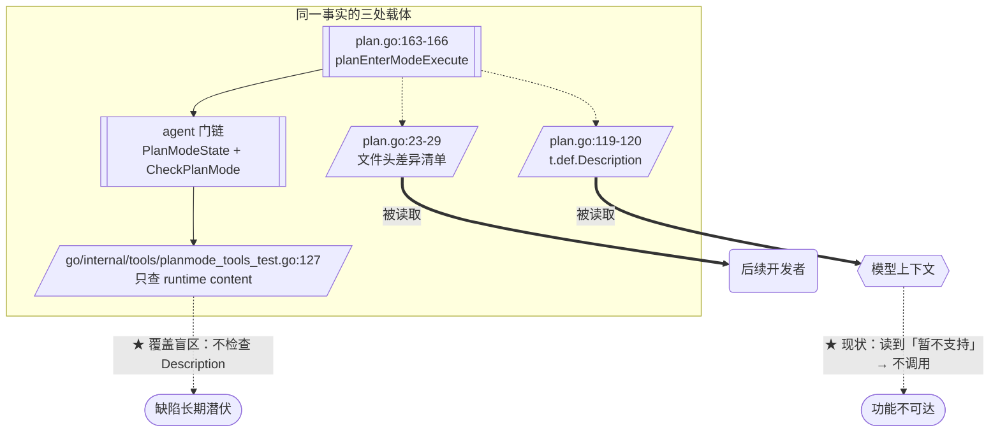

> **Model: deepseek-v4.1-flash (cheap)**

**执行状态：** 已闭环。Task 1-2 均已完成；验证通过；交付门检查：GREEN。

> **Status: APPROVED** — 2026-09-27T13:13:47.757Z

> **Status: EXECUTED** — 2026-09-27T14:22:15.793Z

# Go 运行时排期：订正 `plan` 工具的过期描述（「enter_mode 暂不支持」实已实现）

> 分支 `go-runtime` · 基线 HEAD `96001f48` · 承接第一百零六刀
> 一句话：`plan` 工具的描述与文件头仍写「**Go 运行时暂不支持** enter_mode/exit_mode」，
> 而第七十九刀**早已接线实现**——描述进模型上下文，正在**劝阻模型使用已工作的功能**。
> 订正为 TS 原文（逐字），并补一条能打红回退的断言。

## 需求提炼

**用户原话**：「按 .rivet/HANDOFF.md 计划，排期实现功能」。

**目标**：

1. 延续 HANDOFF 的既定节奏（逐刀推进、每刀独立验证），选下一刀。
2. 选刀判据沿用本仓库既有结论：**「已知的静默失效 > 新增功能」**（第一百零四刀）。
3. 本轮聚焦：**模型可见的诚实性缺陷**——描述/注释声称「不支持」而实现已工作。

**非目标**：

- 不重写 TS（`src/` 一行不动）。
- **不移植 `deliveryGateV2`**（`plan.go` 差异 #3）——已核实是成套子系统
  （`createDeliveryGateV2` + `DeliveryReport` + `ModuleCoverageInput` + 归因分类），
  且 Go 侧连 `deliver_task` 工具都不存在。属**造子系统**，另立计划。
- **不移植 `onPlanSubmitted` TUI 审批回调**（差异 #2）——Go 侧无渲染层，已明示。
- 不改 `enter_mode`/`exit_mode` 的**实现**（实现正确，只订正描述）。

---

## 问题与根因

### 根因：第七十九刀改了实现与测试，但漏了「模型可见的第三处」

`enter_mode` / `exit_mode` 在 Go 侧**早已真正工作**：

| 证据 | 位置 |
|---|---|
| 分发到真实实现（非报错） | `go/internal/tools/plan.go:163-166` → `planEnterModeExecute` / `planExitModeExecute` |
| 写工具禁用**真的生效** | `go/internal/agent/planmode_wiring_test.go:54` `TestPlanModeBlocksWriteTools` |
| 门链已接 | `go/internal/agent/loop.go` 的 `PlanModeState` 字段 + `executeTool` 门链 |
| 回归钉子存在 | `go/internal/tools/planmode_tools_test.go:127` `TestPlanModeUnsupportedMessageGone` |

**但两处「模型/读者可见」的文本从未订正**：

1. **工具描述**（`go/internal/tools/plan.go:119-120`）：
   ```
   ### Action: enter_mode / exit_mode
   **Go 运行时暂不支持**——写工具禁用机制尚未移植。调用会返回明确错误说明。
   ```
   → **进模型上下文**。模型据此认为该 action 无用，**永不尝试**。

2. **文件头差异声明**（`go/internal/tools/plan.go:23-29`）：
   ```
   1. **enter_mode / exit_mode 是诚实声明而非实现**。…**Go 侧无任何「写工具禁用」机制**
      （已 grep 核实：`EnterPlanMode` / `WriteDisabled` / `PlanModeActive` 全仓零命中）…
   ```
   → 指导后续开发者的「已知差异清单」，**已与事实相反**（`EnterPlanMode` 现在是
   `CallParams` 的字段，`plan.go:185` 正在读它）。

### ★ 为什么既有测试没抓住（**这是本刀最有价值的部分**）

`TestPlanModeUnsupportedMessageGone`（`go/internal/tools/planmode_tools_test.go:127`）**只断言 runtime 输出**：

```go
content, _ := planCall(t, p)
if strings.Contains(content, "暂不支持") { t.Errorf(...) }
```

它检查的是**工具执行结果**，而缺陷在 **`t.def.Description`**（另一条通路）。
→ 同一事实写三处（实现 / 测试 / 描述），第七十九刀改了前两处，
**第三处无人守**。这与本仓库第 30 条坑同型（「同一事实写两处时，改一处必须 grep 另一处」），
但更隐蔽：**描述不是被消费函数读取的，而是被模型读取的**——单元测试天然覆盖不到。

### 后果（称量两端）

**代价（现状）**：
- 模型读到「暂不支持」→ 不调用 `enter_mode` → 走自己拼 plan 文件的老路，
  少了一层写工具禁用保护（那正是 plan mode 存在的意义）。
- 后续开发者读文件头 → 以为要「移植写工具禁用机制」→ **重复劳动**
  （而它就在 `go/internal/agent/planmode.go`）。

**收益（修后）**：
- 模型获得与实现一致的能力认知，plan mode 的进入/退出路径可达。
- 文件头的「已知差异」清单恢复可信（这是本仓库最重要的导航资产之一）。

**成本**：一句话的文案 + 一条断言。**零行为变更**（不改实现）。

---

## 架构与数据流



**修复点**：三处载体对齐——实现为准，描述与文件头跟随（测试扩到 Description）。

---

## 提议改动（file:line + 提议文本）

### 1. `go/internal/tools/plan.go:119-120` —— 工具描述改为 TS 原文

**TS 源**（`src/tools/plan.ts:243-249`，两段，逐字）：

```
### Action: enter_mode
自主进入计划模式，先规划再动手（写工具将被禁用；会创建计划草稿文件）。命中以下任一情况时主动使用：新功能实现、多文件（>2-3 个）改动、存在多个有效方案、架构决策、需求不清需要先探索。不要用于：单点小修、用户已给出详细逐步指令的任务、纯研究/问答。进入**无需用户确认**——用户的审批门在计划提交时，不在进入时。已在规划中时重复调用幂等。用户通过会话内审批卡（桌面端）或 /plan-approve（TUI）批准提交的计划；全部任务完成后 `plan close` apply=true 会把计划标记为 EXECUTED。

### Action: exit_mode
退出计划模式、解除写锁。不修改计划文件（不标记 EXECUTED、不勾选 checkbox）。审批即自动退出，仅在系统未自动退出、或用户明确要求「直接开始写代码」时调用。
```

**改动**（diff 形态）：

```diff
 ### Action: enter_mode / exit_mode
-**Go 运行时暂不支持**——写工具禁用机制尚未移植。调用会返回明确错误说明。`,
+### Action: enter_mode
+自主进入计划模式，先规划再动手（写工具将被禁用；会创建计划草稿文件）。命中以下任一情况时主动使用：新功能实现、多文件（>2-3 个）改动、存在多个有效方案、架构决策、需求不清需要先探索。不要用于：单点小修、用户已给出详细逐步指令的任务、纯研究/问答。进入**无需用户确认**——用户的审批门在计划提交时，不在进入时。已在规划中时重复调用幂等。用户通过会话内审批卡（桌面端）或 /plan-approve（TUI）批准提交的计划；全部任务完成后 `plan close` apply=true 会把计划标记为 EXECUTED。
+
+### Action: exit_mode
+退出计划模式、解除写锁。不修改计划文件（不标记 EXECUTED、不勾选 checkbox）。审批即自动退出，仅在系统未自动退出、或用户明确要求「直接开始写代码」时调用。`,
```

> **注意 Go 侧的字符串拼接**：该 Description 是 ` + "`...`" + ` 拼接的字面量
> （因含反引号）。改动时须保持拼接结构（`plan.go:94` 起有 `".rivet/plans/*.md"` 的先例）。

### 2. `go/internal/tools/plan.go:23-29` —— 文件头差异 #1 改为「已解决」

```diff
-//  1. **enter_mode / exit_mode 是诚实声明而非实现**。TS 侧它们调用
-//     `params.enterPlanMode()` / `params.exitPlanMode()` 切换写锁状态机；
-//     **Go 侧无任何「写工具禁用」机制**（已 grep 核实：`EnterPlanMode` /
-//     `WriteDisabled` / `PlanModeActive` 全仓零命中）。若只搬这两个 action
-//     的壳而不接状态机，会产出「声称进入计划模式、实际没禁用写工具」的
-//     **静默失效**——故此处**明确报错**并说明缺失，对齐 `run_in_background`
-//     的诚实声明先例。
+//  1. ~~**enter_mode / exit_mode 是诚实声明而非实现**~~ → **第七十九刀已接线**。
+//     本节原文写于机制未接线时（「Go 侧无任何写工具禁用机制」）——**该断言已失效**：
+//     `go/internal/agent/planmode.go` 的 `CheckPlanMode` + `Loop.PlanModeState` + `executeTool`
+//     门链三者已接（`go/internal/agent/planmode_wiring_test.go` 的 `TestPlanModeBlocksWriteTools` 钉住），
+//     `CallParams.EnterPlanMode` 回调已注入（`plan.go:185` 正读它）。
+//     **保留的语义**：无回调时仍 fail-closed 报错（对账 TS——子代理不得切主代理的
+//     计划模式），但那是「当前上下文不可用」而非「暂不支持」。
+//     （本行文案于第一百零七刀与本文件的工具描述一并订正——此前只有测试被订正。）
```

### 3. `go/internal/tools/planmode_tools_test.go` —— 补一条**能打红描述回退**的断言

**这是本刀的关键**——现有 `TestPlanModeUnsupportedMessageGone` 只查 runtime content，
覆盖不到 `Description`。新增：

```go
// TestPlanDescriptionDoesNotClaimUnsupported —— **覆盖 Description 通路**。
//
// # 为什么补这条
//
// 既有的 `TestPlanModeUnsupportedMessageGone` 只断言 **runtime 输出**
// （`planCall` 的返回）。而第七十九刀的漏网之处在 **`t.def.Description`**
// ——同一事实的第三条载体，且**进模型上下文**：模型据此认为 enter_mode 无用，
// 永不调用。单测天然覆盖不到「被模型读取的文本」。
//
// 判据：描述不得再称「暂不支持」，且必须含 enter_mode/exit_mode 的实际语义
// （对账 TS `src/tools/plan.ts:243-249`）。
func TestPlanDescriptionDoesNotClaimUnsupported(t *testing.T) {
	desc := Plan().Definition().Description
	if strings.Contains(desc, "暂不支持") || strings.Contains(desc, "尚未移植") {
		t.Errorf("plan 描述不该再声称「暂不支持/尚未移植」（机制已实现，且该描述进模型上下文）：\n%s", desc)
	}
	for _, want := range []string{"自主进入计划模式", "退出计划模式", "写工具将被禁用"} {
		if !strings.Contains(desc, want) {
			t.Errorf("描述应含 enter_mode/exit_mode 的真实语义 %q（对账 TS plan.ts:243-249）：\n%s", want, desc)
		}
	}
}
```

---

## 验证清单

| # | 用例 / 场景 | 期望可见结果 |
|---|---|---|
| V1 | `TestPlanDescriptionDoesNotClaimUnsupported`（新增） | 描述不含「暂不支持」「尚未移植」，且含三段语义关键词 |
| V2 | `TestPlanModeUnsupportedMessageGone`（既有） | 保持绿——runtime 输出仍无「暂不支持」 |
| V3 | `TestPlanEnterExitModeHonestError`（既有） | 保持绿——无回调仍 fail-closed 报「不可用」 |
| V4 | `TestPlanEnterExitMode`（既有，真回调） | 保持绿——`enter_mode` 真的改状态 |
| V5 | `go test ./... -count=1` | exit=0 / 包数与前一轮一致（32 含 2 无测试包）/ 0 FAIL |
| V6 | `go vet ./...` / `gofmt -l .` | exit=0 / 零违规 |

**人工检查点**：
- **描述字节稳定性**：`plan` 的 `Definition()` 进请求体的 `tools` 段，
  而**工具定义打的是整个前缀**（项目纪律 §7.2）。改动后须确认描述
  **不含随机/时间成分**，且与 TS 逐字一致（它是 `+` 拼接的字面量，无动态部分）。
- **无探针残留**：`find . -name 'zz_probe*' -o -name '*.good'` 返回 0。

**变异反证**（先确认变异落地且编译通过——第 48/72 条坑）：
- M1：把描述改回「**Go 运行时暂不支持**」→ V1 红。
- M2：删掉描述里的 `### Action: exit_mode` 段 → V1 红（关键词缺失）。
- M3：把 `TestPlanDescriptionDoesNotClaimUnsupported` 的 `desc` 换成 `planCall` 的
  runtime content → V2 绿但 V1 失去判别力（**证明新断言的必要性**，非产品变异，
  用于自证测试设计）。

---

## 反证 / 复现

> 关键断言均已在规划期用工具对当前源码核实；每条附证据。

**断言 1 — 实现已接线（成立）**
`go/internal/tools/plan.go:163-166` 分发明文：
```go
case "enter_mode":
	return planEnterModeExecute(p), nil
case "exit_mode":
	return planExitModeExecute(p), nil
```
且 `go/internal/agent/planmode_wiring_test.go:54` `TestPlanModeBlocksWriteTools` 证明 planning 态下
`write_file`/`edit_file`/`hash_edit`/`apply_patch` 被拦。

**断言 2 — 描述仍称「暂不支持」（成立）**
`go/internal/tools/plan.go:119-120` 逐字：
`### Action: enter_mode / exit_mode` + `**Go 运行时暂不支持**——写工具禁用机制尚未移植。调用会返回明确错误说明。`
→ 与断言 1 直接矛盾。

**断言 3 — 既有测试存在覆盖盲区（成立）**
`go/internal/tools/planmode_tools_test.go:127-137`：断言对象是
`planCall(t, p)` 的**返回值 content**，全文不含 `Definition()` / `Description`。

**断言 4 — TS 原文是两段真语义（成立）**
`src/tools/plan.ts:243-249` 有 `### Action: enter_mode` 与 `### Action: exit_mode`
两个独立段落（各 1 段正文），**不是** Go 侧那句自造的一行声明。

**断言 5 — 描述通路未被任何测试覆盖（待验证假设→V1 转实测）**
推理：全仓 `grep -n "Definition().Description" go/internal/tools/*_test.go`
在 plan 上零命中（仅 `plan.go:143` 的实现）。
**将由 V1 的存在性证实**——它首次为该通路建立断言。

**断言 6 — 文件头差异 #1 与事实相反（成立）**
`plan.go:23-29` 写「`EnterPlanMode` 全仓零命中」，而 `plan.go:185`
（`if p.EnterPlanMode == nil`）与 `registry.go:96`（字段声明）都命中。

---

## 回归清单

改动前后**必须仍然成立**的功能锚点：

| 锚点 | 验证方式 |
|---|---|
| `enter_mode` 真的改 `Loop.PlanModeState` | `TestPlanEnterExitMode` 保持绿 |
| 无回调时 fail-closed 报「不可用」 | `TestPlanEnterExitModeHonestError` 保持绿 |
| runtime 输出无「暂不支持」 | `TestPlanModeUnsupportedMessageGone` 保持绿 |
| planning 态写工具被拦 | `TestPlanModeBlocksWriteTools` 保持绿 |
| `plan` 的 schema 属性序与枚举值不变 | `plan.go:121-142` 未改；`grep` 复核 |
| `Definition()` 无动态成分（前缀缓存） | 人工检查：描述是纯字面量拼接 |
| 其它三处「未移植」注释是有意收窄（不改） | `bash.go:160` / `webfetch.go:27` / `docextract.go:43` / `capability_test.go:20` 均已核实准确 |

---

## 分波执行

### Wave 1

描述订正 + 新断言（V1–V4）

- `go/internal/tools/plan.go`：`:119-120` 描述改 TS 两段；`:23-29` 文件头差异 #1 订正。
- `go/internal/tools/planmode_tools_test.go`：新增 `TestPlanDescriptionDoesNotClaimUnsupported`。
- **验证要点**：`cd go && go test ./internal/tools/ -run 'TestPlan' -count=1` 全绿；
  变异 M1/M2 各自打红。

### Wave 2

全量 + 静态检查 + 收尾（V5–V6）

- **验证要点**：`cd go && go test ./... -count=1` 全绿 + `go vet ./...` exit=0 +
  `gofmt -l .` 零违规 + 探针残留检查返回 0。
- 更新 `.rivet/HANDOFF.md`（第一百零七刀专章）。

---

## 备注：其余扫描结果（已核实，勿重复勘探）

本轮系统扫描了全仓「暂不支持 / 尚未移植」声称，逐条核实：

| 位置 | 判定 |
|---|---|
| `plan.go:120` 工具描述 | **★ 过期（本刀修）** |
| `plan.go:23-29` 文件头差异 #1 | **★ 过期（本刀修）** |
| `bash.go:160`（tcLock / mirrorEnv 未移植） | 准确——`tryAcquireAdhocLock` / `getResolvedEnv` 确无对应物，属有意收窄 |
| `webfetch.go:27`（`actions` 依赖 Playwright） | 准确——诚实报错 |
| `docextract.go:43`（无 pdfjs / exceljs） | 准确——go.mod 零重依赖约束 |
| `capability_test.go:20`（package 检查器） | 准确——Node 模块解析语义无对应物 |
| `importresource_run.go:220`（mirrors 未移植） | 准确——已在 `bash.go` 披露 |

**HANDOFF「下一步」四候选**（delegate 内核 / LSP pull / monitor / 仓库索引）
逐条复核后仍不选：前两者是**造子系统**或**新功能**，后两者「建了是休眠」或零基础。
**本刀沿用第一百零四/一百零六刀的判据**：已知的静默失效 > 新增功能。

## 7. Execution closure

已闭环：Task 1-2 均已完成并通过验证。

最终验证记录：

```bash
cd go && go test ./internal/tools/ ./internal/agent/ -count=1
cd go && go test ./... -count=1
cd go && go vet ./...
cd go && gofmt -l .
```

交付门检查：GREEN。

备注：两波完成（4bd6e655 + 8656bcec）。执行期发现计划前提「实现正确，只订正描述」部分不成立——底层真缺口是 submit 不回读草稿（CallParams 缺 ActivePlanFilePath），经用户拍板扩范围为 B 方案：补实现 + 订正全部过期文本。RED 8 红 → GREEN；变异 M1-M5 全红；★覆盖盲区用「M4 状态下旧测试仍绿」实证。全量 exit=0 / 30 包 ok / 0 FAIL。诚实标注：sessionModel / assessDelivery / onPlanSubmitted 仍未移植。
