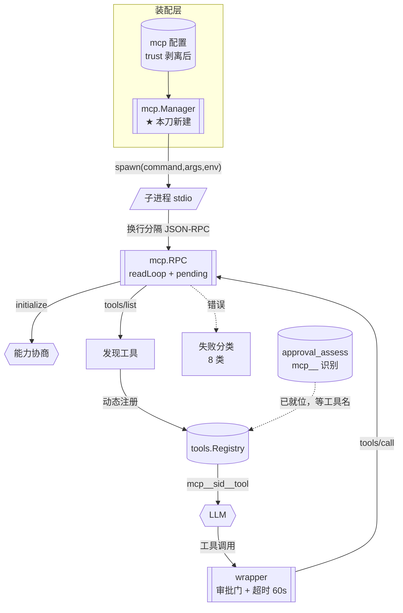

> **Model: deepseek-v4.1-flash (cheap)**

> **Status: APPROVED** — 2026-09-27T15:58:23.432Z

# 移植 MCP 子系统（第一百零九刀 · W1–W4）

> 分支 `go-runtime` · 基线 HEAD `710bd980` · 承接总纲 §6「中间层」第 2 段
> 一句话：把 TS 的 `src/mcp/`（13 文件 / 2,418 行）移植成 `go/internal/mcp/`，
> 走 **stdio 传输**优先，让三个**已在等它的消费端**第一次有真实生产者。

## 需求提炼

**用户原话**：「按计划排期，需要完整实现一个功能以上」。

**提炼目标**：

1. 按 `.rivet/plans/GO-运行时-总纲.md` §6 的既定推进顺序取下一刀——该节把
   `mcp/` 列在「中间层，可推进」。
2. **完整实现**一个子系统（非单点接线修复）——本刀交付可运行、有测试、
   已接线的 MCP 客户端。
3. 沿用项目纪律：oracle 字节对账 + RED→GREEN + 变异反证 + 交付三项报告。

**非目标（明确划出）**：

- **不移植 `manager.ts` 的重连/健康检查全量**（781 行 + `health-check.ts` 240 行）——
  W1–W3 只做「连接 + 发现工具 + 调用工具」主干；重连与健康检查列 W5（另刀）。
- **不做 `streamableHttp` / `sse-legacy` 传输**——只做 **stdio**（见 §方案取舍）。
- **不移植 `workspace-policy.ts` 的 subAgent 部分**——Go 侧无 subAgent 体系。
- **不做 REST / TUI 审批消费端**——Go 侧无 `src/server`、`src/tui`（总纲 §6：排最后）。

---

## 问题与根因

### 现状：三个消费端已就位，生产者缺失

| 消费端 | 位置 | 现状 |
|---|---|---|
| 工具风险分级 | `go/internal/agent/approval_assess.go:65` 的 `mcpToolNameRe = ^mcp__(.+)__(.+)$`；`:310` 注释**明写**「Go 侧无 mcp 包，只保留工具名识别与 low 升级」 | 识别得到，但**永无 MCP 工具**可识别 |
| 信任层剥离 | `go/internal/trust/project_trust.go:223,228` 的顶层敏感键含 `"mcp"` | 未授信时剥离 `mcp` 配置——剥的是**无人读的配置** |
| 能力声明字段 | `go/internal/contract/types.go:49-54` 的 `Definition.Capability`（注释：MCP 服务器策略声明的能力，被 `assessToolRisk` 消费） | 无生产者 |

**根因**：MCP 是 Go 侧**唯一的协议级工具动态来源**（工具名、schema、生命周期
都在运行时从外部进程获得），而 Go 的工具注册表是**静态装配**的
（`default_registry.go` 的 `Register` 逐条列出）。两者之间缺一个**动态注册通道**。

### 为什么不能照搬 TS 的实现路径

TS 用 `@modelcontextprotocol/sdk`（`src/mcp/transport-factory.ts:12-13`）
承担 JSON-RPC 编解码、传输、能力协商。**Go 侧零对应库**（`go/go.mod` 仅 3 个依赖：
`klauspost/compress` / `golang.org/x/net` / `golang.org/x/text`），且**不宜引入**
（与「go.mod 零重依赖」的既有约束冲突，见 `docextract.go:43` 的先例）。

→ 故需自实现 JSON-RPC + stdio 帧编解码。**但底座存在**（见下）。

### ★ 关键事实：MCP 的帧格式与 LSP **不同**（决定复用边界）

**官方规范原文**（`modelcontextprotocol.io/specification/2025-06-18/basic/transports`）：

> Messages are delimited by **newlines**, and **MUST NOT** contain embedded newlines.

而 `go/internal/lsp/rpc.go` 的 `EncodeMessage` 用的是
`Content-Length: N\r\n\r\n` + body（LSP 帧头）。**两者不兼容**。

**可复用的是架构模式，不是编解码**：

| `go/internal/lsp/rpc.go` 的可复用部分 | 位置 | 复用方式 |
|---|---|---|
| `Transport` 抽象（`io.Reader/Writer/Closer`） | `go/internal/lsp/rpc.go:50` | **直接复用同形态**（MCP 也是字节流） |
| pending map + readLoop + 超时 | `go/internal/lsp/rpc.go:235`（`NewRPC` 起 readLoop） | 照搬结构 |
| `AbortAllPending`（**读端终止不得让调用方永等**） | `go/internal/lsp/rpc.go:362` | 照搬（该修法源自 2026-09-08 wedge 事故） |
| server→client 请求回 `MethodNotFound` | `go/internal/lsp/rpc.go` 的 dispatch 第四分支 | 照搬（**这是 Go 侧的显式偏离**，MCP 同样有 server→client 请求如 `sampling/createMessage`） |
| **帧编解码** | `EncodeMessage`（`go/internal/lsp/rpc.go:63`）/ `DecodeMessages`（`go/internal/lsp/rpc.go:103`） | ❌ **须新写**（换行分隔，非 Content-Length） |

---

## 架构与数据流



**关键数据流**：配置 → spawn 子进程 → 换行分隔 JSON-RPC 握手 → `tools/list`
→ 包装成 `Tool` 接口 → 注册进 `Registry` → 模型可见 → 调用时经审批门 + 60s 超时。

---

## 方案取舍

| 方案 | 做法 | 判定 |
|---|---|---|
| **A（采纳）** 新建 `internal/mcp/`，只做 stdio，复用 LSP 的 RPC **架构模式** | 自写换行分帧 + pending map + 超时 | ✅ 依赖面最浅（仅 `os/exec` + `encoding/json`）；3 个消费端立刻有生产者 |
| B 复用 `internal/lsp` 的 RPC 包（改名通用化） | 把 `lsp.RPC` 提取到公共包，MCP 复用 | ⚠️ **改动面大**：`lsp/rpc.go` 已被 LSP 全量依赖（含其 `Content-Length` 编解码、4 分支 dispatch 的 LSP 语义）；抽取会触及已验证的 LSP 路径，违反「不破坏既有」 |
| C 引入第三方 Go MCP 库 | `go get` 社区实现 | ❌ 与「go.mod 零重依赖」冲突（`docextract.go:43` 已因此拒掉 exceljs/pdfjs）；且引入未审计的网络协议栈 |
| D 只做配置解析 + 工具名识别（不真连） | 把 `mcp` 配置读进来、注册空工具 | ❌ 是「桩」——本仓库明确记过「桩函数比缺失函数更危险」（调用方不报错只静默拿空） |

**选 A**。B 的收益（少写 ~200 行分帧）不抵其风险（改已验证的 LSP 路径）；
C 与项目约束直接冲突；D 是假交付。

**关于传输范围**：只做 stdio。理由——① TS 默认路径（`config.ts:22-37` 的 refine
强制 `command` 与 `url` 二选一，而 stdio 是零配置可用的那个）；② `streamableHttp`
需 HTTP/SSE 客户端，而 Go 侧 SSE 解析器（`go/internal/api/sse/sse.go`）是 **OpenAI 专用**
（`Event.Kind`/`contract.Usage` 耦合），非通用 SSE 帧解析——另建成本高；
③ 本机可测（stdio 用 `npx`/本地进程即可，HTTP 需起服务）。

---

## 提议改动（file:line + 提议代码）

### 1. `go/internal/mcp/framing.go`（新增）—— 换行分隔帧编解码

```go
// EncodeLine 把一条 JSON-RPC 消息封成一帧。
//
// 对账 MCP 规范（stdio 传输）："Messages are delimited by newlines, and
// MUST NOT contain embedded newlines." —— 故是「压平 + \n」，**不是**
// LSP 的 `Content-Length` 帧（见 internal/lsp/rpc.go 的对照）。
//
// **为什么必须压平**：json.Marshal 默认不产换行，但若上游消息体含
// 已转义的 \\n（字面反斜杠 n）无妨；真正的风险是**多行 JSON**（如手工拼装）
// ——压平保证「一帧一行」这一硬前提。
func EncodeLine(msg any) ([]byte, error)

// DecodeLines 从累积缓冲切出完整帧，返回（消息列表, 剩余缓冲）。
//
// 语义：按 '\n' 切；最后一段（无换行结尾）留作 rest。
// 空行跳过；非法 JSON 跳过该行但不阻断后续（对账 TS 的 catch 语义）。
func DecodeLines(buf []byte) (msgs [][]byte, rest []byte)
```

### 2. `go/internal/mcp/rpc.go`（新增）—— JSON-RPC 2.0 客户端

结构照搬 `lsp/rpc.go` 的**架构**（但编解码换成 `framing.go`）：

```go
type Transport interface { io.Reader; io.Writer; io.Closer }

type RPC struct { /* tr, mu, pending map[int]*pending, handlers, nextID, readDone, onDeath */ }

func NewRPC(tr Transport, opts ...RPCOption) *RPC   // 启动 readLoop
func (r *RPC) Request(method string, params any, timeoutMS int) (json.RawMessage, error)
func (r *RPC) Notify(method string, params any) error
func (r *RPC) OnNotification(method string, fn func(json.RawMessage))
func (r *RPC) AbortAllPending(err error)            // 读端终止不永等（wedge 事故修法）
func (r *RPC) Dispose()
```

**dispatch 四分支**照搬 `go/internal/lsp/rpc.go` 的 `dispatch`（其第四分支见该函数 `case msg.Method != nil && msg.ID != nil`），含**显式偏离**：`method` 与 `id` 同现
（server→client 请求，如 MCP 的 `sampling/createMessage`）→ 回 `MethodNotFound`
（JSON-RPC 2.0 要求请求必须有响应；TS 静默丢弃）。

### 3. `go/internal/mcp/types.go` + `policy.go` + `failure_classifier.go`（新增）

纯函数层，可 oracle 对账：
- `types.go`：`ConnectionState`（对账 `src/mcp/types.ts` 的 7 态）
- `policy.go`：`ParseMcpTool`（对账 `policy.ts:19-22`）、`ToolName(serverID, toolName)`
  （对账 `wrapper.ts:7-11` 的 `replaceAll('__','_')` 转义）
- `failure_classifier.go`：`ClassifyMcpError`（对账 `failure-classifier.ts` 的 8 类）

### 4. `go/internal/mcp/stdio.go`（新增）—— stdio 传输

```go
// SpawnStdio 启动 MCP server 子进程，返回 Transport。
//
// **复用既有进程原语**（已核实存在，不重造）：
//   - tools.PrepareCommand（proctree.go:73）：平台进程组语义 + WaitDelay 兜底
//   - tools.KillProcessTree（proctree.go:87）：整棵进程树回收
// 形态参照 lsp/platform.go:111 的 defaultLspSpawn（同款 stdin/stdout 三管道）。
func SpawnStdio(cfg ServerConfig, cwd string) (Transport, error)
```

### 5. `go/internal/mcp/wrapper.go`（新增）—— MCP 工具 → `tools.Tool`

```go
// WrapTool 把 MCP 工具定义包成 tools.Tool。
//
// 对账 src/mcp/wrapper.ts。**审批门**（wrapper.ts:88,163-169）：
//   needsApproval = securityPolicy.requireApproval || policy.action != "allow"
//   → requiresApproval() 恒真
// 未命中的 → 首次调用需一次 consent。
//
// **超时**：60s（对账 manager.ts:48 的 DEFAULT_MCP_TIMEOUT_MS）。
func WrapTool(serverID string, def ToolDef, call CallFn, opts WrapOptions) tools.Tool
```

### 6. `go/internal/mcp/manager.go`（新增）—— 生命周期与发现

```go
type Manager struct { /* cfg, servers map[string]*serverEntry, mu */ }

func NewManager(cfg Config) *Manager
func (m *Manager) Initialize(ctx) error          // 并发连所有启用的 server
func (m *Manager) AllTools() []tools.Tool        // 供装配层注册
func (m *Manager) Shutdown()                     // 关所有连接 + 杀进程
func (m *Manager) KillChildrenSync()             // 对账 bootstrap.ts:1393
```

**W1–W3 不含**：指数退避重连、health-check 后台探测（列 W5）。

### 7. 装配接线（**本刀的「最后一环」**）

`go/internal/tools/default_registry.go` 已核实有 `Options.Extra []Tool`
（`:13`）与 `Options.LspNavigator`（`:15`，条件注册的现成模式）。
→ 在 `go/cmd/tianshu/main.go` 加：读 `mcp` 配置 → `mcp.NewManager` → `Initialize`
→ 把 `AllTools()` 经 `Options.Extra` 注册。

**注意**：Go 的 `tools.Options` **已有 `Extra` 通道**，故无需为 MCP 新增字段
（避免「造无消费者的机制」）。

---

## 验证清单

| # | 用例 / 场景 | 期望可见结果 |
|---|---|---|
| V1 | `TestMethodAny`（纯函数） | `EncodeLine` 对含 `\n` 的消息不产生多行；`DecodeLines` 跨 chunk 边界切帧正确（穷举切点） |
| V2 | `TestDecodeLinesMalformedSkipped` | 坏行跳过不阻断后续帧（对账 TS catch 语义） |
| V3 | `TestParseMcpTool` | `mcp__sid__tool` 解析出 (sid, tool)；含 `__` 的 id 经转义后无歧义 |
| V4 | `TestWrapToolRequiresApproval` | `policy.action != "allow"` → `RequiresApproval()` 恒真 |
| V5 | `TestSpawnStdioEcho` | 起一个**本地 echo 式 JSON-RPC 假 server**，`initialize` 握手成功 |
| V6 | `TestManagerDiscoverTools` | 假 server 返回 `tools/list` → `AllTools()` 得到包装后的工具 |
| V7 | `TestEndToEndCallTool` | 经 `Registry.Execute` 调 `mcp__fake__echo` → 假 server 收到 `tools/call` 并回结果 |
| V8 | `TestShutdownKillsChildren` | `Shutdown()` 后子进程消失（无孤儿） |
| V9 | `TestClassifyMcpError` | 8 类错误各一条样本分类正确（对账 TS） |
| V10 | **装配层可达性** | 走 `cmd/tianshu` 的真实装配路径，确认 `mcp` 配置 → 工具出现在 `Definitions()` |

**人工检查点**：
- `cd go && go test ./internal/mcp/ -count=1` 全绿
- `cd go && go test ./... -count=1` 全绿（基线 30 包 ok / 0 FAIL）
- `go vet ./...` exit=0；`gofmt -l .` 零违规；`-race` 干净（本刀有并发：readLoop + pending）
- 无探针残留

**变异反证**（先确认变异落地且编译通过——第 48/72 条坑）：
- M1：`EncodeLine` 不压平换行 → V1 红
- M2：`DecodeLines` 遇坏行即中断 → V2 红
- M3：`WrapTool` 去掉 `policy.action` 判定 → V4 红
- M4：`AbortAllPending` 在读端终止时不调用 → V5/V7 超时红
- M5：`Shutdown` 不杀进程树 → V8 红

---

## 反证 / 复现

> 关键断言均在本轮规划期内用工具对当前源码/官方规范核实；未复现者标「待验证假设」。

**断言 1 — 三个消费端已就位（成立）**
- `go/internal/agent/approval_assess.go:65`：`mcpToolNameRe` 定义
- 同文件 `:310` 注释逐字：「MCP 工具风险（Go 侧无 mcp 包，只保留工具名识别与 low 升级）」
- `go/internal/trust/project_trust.go:223/228`：`mcp` 在 `untrustedTopLevelKeyOrder` 与 `untrustedTopLevelKeys`
- `go/internal/contract/types.go:49-54`：`Definition.Capability` 及「被 assessToolRisk 消费」注释
- 全仓 `glob go/**/mcp*/**` 零命中 → **无 mcp 包**（已独立核实）

**断言 2 — MCP stdio 是换行分隔（成立，外部规范）**
`modelcontextprotocol.io/specification/2025-06-18/basic/transports` 原文：
「Messages are delimited by newlines, and MUST NOT contain embedded newlines.」
→ 与 `lsp/rpc.go` 的 `Content-Length` 帧**不兼容**（该实现见 `rpc.go:64`）。

**断言 3 — LSP 的 RPC 架构可复用但编解码不可（成立）**
`go/internal/lsp/rpc.go:50` 的 `Transport` 只要求 `io.Reader/Writer/Closer`
（纯字节）；`:235` `NewRPC` 起 readLoop；`:362` `AbortAllPending`；
`:308` dispatch 的第四分支（server→client 回 MethodNotFound）。以上均为协议无关结构。
编解码 `DecodeMessages`（`:95`）用 `Content-Length` → **不可用于 MCP**。

**断言 4 — Go 侧进程原语已存在（成立）**
- `go/internal/tools/proctree.go:73` `PrepareCommand`、`:87` `KillProcessTree`
- `go/internal/lsp/platform.go:64` `procTransport`（三管道包成双向 Transport）、`:111` `defaultLspSpawn`

**断言 5 — 工具动态注册通道已存在（成立）**
`go/internal/tools/default_registry.go:14` `Options.Extra []Tool`（`:21` `Options.LspNavigator`）
`:15` `Options.LspNavigator`（nil = 不注册）是**条件注册的现成模式**。

**断言 6 — Go 无 MCP SDK 且不宜引入（成立）**
`go/go.mod` 仅 3 个 require；`docextract.go:43` 记录了「因 npm 包无 Go 对应物
而放弃」的先例。

**待验证假设（执行期转实测）**：
- **A1**：本机可用 `npx` 起一个真实 MCP server 做端到端验收（若不可用，退化为
  本地假 server——V5/V6/V7 已按此设计，不依赖外部包）。
- **A2**：MCP 的 `initialize` 握手参数（`protocolVersion` 取值）需在执行期
  对账 TS 侧 `transport-factory.ts` 的实际传参，而非按规范猜。

---

## 回归清单

| 锚点 | 验证方式 |
|---|---|
| LSP 子系统不受影响（本刀不改 `internal/lsp/`） | `go test ./internal/lsp/ -count=1` 保持绿 |
| `approval_assess` 的 `mcp__` 识别行为不变 | `go test ./internal/agent/ -run TestAssessToolRisk -count=1` 保持绿 |
| `trust` 的 mcp 键剥离行为不变 | `go test ./internal/trust/ -count=1` 保持绿 |
| 既有工具定义字节稳定（新增 MCP 工具不影响无 MCP 配置时的 `Definitions()`） | 无 mcp 配置时 `len(Definitions())` 仍为 40 |
| `tools.Options.Extra` 语义不变 | `go test ./internal/tools/ -count=1` 保持绿 |
| 全量包数不减少 | `go test ./...` 包数 ≥ 30（新增 mcp 包后 31） |

---

## 分波执行

### Wave 1

纯函数层（V1–V4, V9）：分帧 / 工具名 / 失败分类 / 类型

- [ ] 新增 `go/internal/mcp/framing.go`（`EncodeLine` / `DecodeLines`）+ `framing_test.go`（V1/V2：跨 chunk 穷举切点、坏行跳过）
- [ ] 新增 `go/internal/mcp/types.go`（`ConnectionState` 7 态，对账 `src/mcp/types.ts`）
- [ ] 新增 `go/internal/mcp/policy.go`（`ParseMcpTool` / `ToolName`，对账 `src/mcp/policy.ts:19-22` 与 `src/mcp/wrapper.ts:7-11`）+ `policy_test.go`（V3）
- [ ] 新增 `go/internal/mcp/failure_classifier.go`（8 类，对账 `src/mcp/failure-classifier.ts`）+ `failure_classifier_test.go`（V9）

**验证要点**：`cd go && go test ./internal/mcp/ -count=1` 全绿；`go vet ./internal/mcp/` exit=0；
变异 M1（不压平换行）与 M2（坏行即中断）各自打红。
**波末自证**：本波结束即可 `go build ./...` 通过，包可独立编译测试。

### Wave 2

RPC + stdio 传输（V5, V8）——**并发路径，须 `-race`**

- [ ] 新增 `go/internal/mcp/rpc.go`（`Transport` / `NewRPC` / `Request` / `Notify` / `AbortAllPending` / `Dispose`，dispatch 四分支含 server→client 回 MethodNotFound）+ `rpc_test.go`
- [ ] 新增 `go/internal/mcp/stdio.go`（`SpawnStdio`，复用 `tools.PrepareCommand` / `tools.KillProcessTree`）+ `stdio_test.go`
- [ ] 新增 `go/internal/mcp/testserver_test.go`（本地假 JSON-RPC server 夹具，不依赖外部包）

**验证要点**：`cd go && go test ./internal/mcp/ -race -count=1` 全绿；变异 M4（读端终止不 Abort）打红。
**波末自证**：能起子进程、完成 `initialize` 握手、`Shutdown` 后无孤儿（V5/V8）。

### Wave 3

wrapper + manager（V6, V7）

- [ ] 新增 `go/internal/mcp/wrapper.go`（`WrapTool`：审批门 + 60s 超时）+ `wrapper_test.go`（V4）
- [ ] 新增 `go/internal/mcp/manager.go`（`NewManager` / `Initialize` / `AllTools` / `Shutdown` / `KillChildrenSync`）+ `manager_test.go`（V6/V7）

**验证要点**：`go test ./internal/mcp/ -race -count=1` 全绿；变异 M3（去掉 policy 判定）与 M5（不杀进程树）各自打红。
**波末自证**：假 server 的 `tools/list` 能变成 `[]tools.Tool`，且经 `Registry.Execute` 可调用成功（V7）。

### Wave 4

装配接线 + 全量（V10）

- [ ] `go/cmd/tianshu/main.go`：读 `mcp` 配置 → `mcp.NewManager` → `Initialize` → `Options.Extra`
- [ ] 新增装配层可达性测试（V10：无 mcp 配置时工具数仍为 40；有配置时 MCP 工具出现在 `Definitions()`）
- [ ] 更新 `.rivet/HANDOFF.md`（第一百零九刀）+ 总纲 §3/§4 标注 `mcp/` 已移植

**验证要点**：`cd go && go test ./... -count=1` 全绿（包数 ≥ 30，新增 mcp 包后 31）；
`go vet ./...` exit=0；`gofmt -l .` 零违规；探针残留检查返回 0。
**波末自证**：走生产装配路径可见 MCP 工具，且 LSP/trust/agent 三个既有包的测试保持绿（回归清单）。
