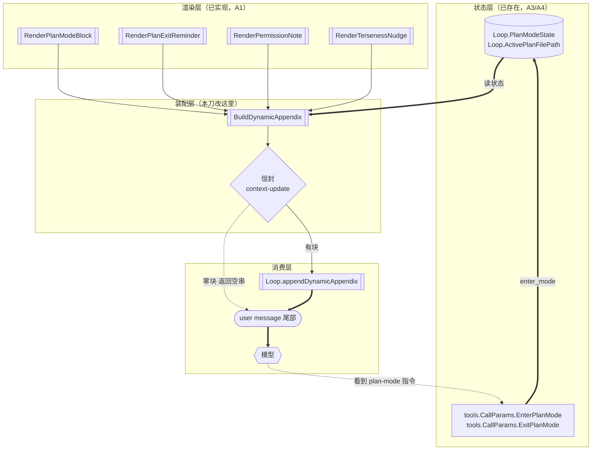

> **Model: deepseek-v4.1-flash (cheap)**

**执行状态：** 已闭环。Task 1-3 均已完成；验证通过；交付门检查：GREEN。

> **Status: APPROVED** — 2026-09-28T01:42:17.197Z

> **Status: EXECUTED** — 2026-09-28T01:49:47.598Z

# 第一百一十一刀 · 接线模式块与 `<context-update>` 信封

> 前情：第一百一十刀（`061db449`→`6e7abb4a`）修完 MCP 装配的语义缺陷。
> 按总纲 §6 第 1 步「内核收口——继续按『已知的静默失效 > 新增功能』找接线缺口」，
> 本刀切的是**已实现却零消费者的模式块**及其**缺失的 appendix 信封**。

---

## 需求提炼

**用户原话**：「按计划排期，需要完整实现一个功能以上。」

**提炼出的目标**：闭合**「用户进入 Plan Mode 后模型能看见并遵守」**这一个功能面。

这条功能面在 TS 侧是完整的、在 Go 侧是**半截的**：
门链已经拦写操作（第七十九刀），但**模型完全不知道自己处于 plan mode**——
附录里从不出现 `<plan-mode>` 指令块。结果是模型在 plan mode 下
继续按普通模式作答，我们只能靠硬拦纠正，且用户看不到「系统知道自己在计划模式」。

**非目标**（明示边界，避免本刀膨胀）：

- **不接 `RenderAskModeBlock`**——Go 侧**无 ask mode 状态载体**（下文有 grep 证据），
  接它属「先造子系统」，是另一个功能面（独立一刀）。
- **不实现 appendix 的 seq/delta 状态机**——TS 的 `engine.ts:1386-1408` 是一套
  「比对上次发出的 parts、只发变化子块、无变化发自闭合标签」的增量机制。
  它要求跨轮持久化 `lastEmittedAppendixParts` + `appendixSeq` + `appendixBaselineSent`，
  属**独立子系统**。本刀只对齐**无 delta 的 baseline 信封形态**（见方案取舍）。
- **不改 `src/`**（TS 一行不动）。

---

## 问题与根因

### 症状 1：三个模式块零生产消费者（静默失效）

`go/internal/prompt/modeblocks.go` 的 `RenderPlanModeBlock`（`:57`）、`RenderAskModeBlock`（`:69`）、
`RenderPlanExitReminder`（`:76`）三函数**已完整移植**，且带逐字节 oracle 用例
（`go/internal/prompt/modeblocks_test.go:81/127/137`）。但 `grep` 全 `go/` 生产代码**零调用**——
唯一命中是各自的测试与 `HANDOFF.md` 的历史文本。

**根因**：`go/internal/agent/dynamic_appendix.go` 的文件头注释写「其余块（plan/ask/terseness）都需要
Go 侧不存在的状态载体」——**该断言在第一〇七刀之后已过期**。
实测（下文「事实锚点」表）plan mode 状态载体**早已存在**：
`Loop.PlanModeState`（`go/internal/agent/loop.go:148`）、`Loop.ActivePlanFilePath`（`:154`）、
门链（`go/internal/agent/planmode.go` 的 `CheckPlanMode`）、入口回调（`CallParams.EnterPlanMode`）。

即：**载体就位了，但没人来取**。这正是本项目纪律 §8.3「装配层是最后一道缺口」
的又一实例。

### 症状 2：appendix 缺 TS 的 `<context-update>` 信封

Go 的 `BuildDynamicAppendix`（`go/internal/agent/dynamic_appendix.go:83`）返回
`strings.Join(parts, "\n\n")`——**裸拼接，无信封**。

而 TS 侧**两种路径都包信封**（`src/prompt/engine.ts`）：

| TS 路径 | 行 | 输出形态 |
|---|---|---|
| 无 delta（`appendixDelta` 关） | `:1383` | `` `<context-update>\n${parts.join('\n\n')}\n</context-update>` `` |
| delta · 首次 baseline | `:1395` | `` `<context-update seq="${n}">\n…\n</context-update>` `` |
| delta · 无变化 | `:1398` | `` `<context-update seq="${n}"/>` ``（自闭合） |
| delta · 有变化 | `:1401` | `` `<context-update seq="${n}" mode="delta">\n…\n</context-update>` `` |

**根因**：Go 侧当初接线时只取了「子块内容拼接」这一层，**丢掉了包裹层**。
这不是「少一个标签」的小事——`<context-update>` 是模型识别「这段是系统注入的
上下文」的唯一标记，且 TS 的 `appendix-anatomy` / `payload-diagnostic` 等下游
都按块名解析该结构。

### 症状 3（顺带订正）：`go/internal/agent/dynamic_appendix.go` 的头注释自我矛盾

文件头 `:9-11` 写「只接当前 Go 侧**已有状态载体**的块」，
`:26-27` 写「**本文件当前接的块**：仅 `RenderPermissionNote`」，
`:60-63` 写「其余块（plan/ask/terseness）都需要 Go 侧不存在的状态载体」。

三句里后两句与实测矛盾（plan 载体存在；terseness 也已接，见 `:110-115`）。
**注释落后于实现**（本项目纪律 §8.5），本刀一并订正。

---

## 事实锚点（全部经工具对当前源码核实）

| # | 断言 | 证据（file:line） |
|---|---|---|
| A1 | 三块已实现且带 oracle | `go/internal/prompt/modeblocks.go:57`（`RenderPlanModeBlock`）`:69` `:76`；`go/internal/prompt/modeblocks_test.go:81/127/137` |
| A2 | 三块生产零调用 | `grep 'RenderPlanModeBlock\|RenderAskModeBlock\|RenderPlanExitReminder' go/` → 仅 `go/internal/prompt/modeblocks.go` 自身定义、`go/internal/prompt/modeblocks_test.go`、`go/HANDOFF.md:6331/6336/6350` |
| A3 | plan mode 状态载体**已存在** | `go/internal/agent/loop.go:148`（`PlanModeState PlanModeState`）、`:154`（`ActivePlanFilePath string`）；`:136-154` 的注释明写「第七十九刀接线」 |
| A4 | 门链与入口回调已接 | `go/internal/agent/planmode.go:26-30`（「门链最前已调 CheckPlanMode」「CallParams.EnterPlanMode 已注入」）；`go/internal/tools/plan.go:27` 同款订正 |
| A5 | 现有接线点 | `go/internal/agent/dynamic_appendix.go:83`（`BuildDynamicAppendix`）、`:130`（`Loop.appendDynamicAppendix`），调用点 `go/internal/agent/loop.go` 的 `Run`（HANDOFF 记为 `loop.go:502`，需在执行时重核） |
| A6 | Go 缺信封 | `go/internal/agent/dynamic_appendix.go:126`：`return strings.Join(parts, "\n\n")`（无 `<context-update>`） |
| A7 | TS 信封与 join | `src/prompt/engine.ts:1383`（`` `<context-update>\n${parts...join('\n\n')}\n</context-update>` ``）、`:1395`（seq baseline）、`:1398`（自闭合）、`:1401`（delta） |
| A8 | 仅 `buildDynamicAppendix` 带无分隔 join | `src/prompt/volatile.ts:865-869`（无 delta 的兼容 wrapper，`join('\n')`）——**主路径不用它**（`engine.ts:9` 只 import `buildDynamicAppendixParts`） |
| A9 | TS plan 门控条件 | `src/prompt/volatile.ts:93`（`renderPlanModeBlock`）；门控在 `buildDynamicAppendixParts` 内（执行时须精读其确切分支，标为待验证假设 H1） |
| A10 | Go 无 ask mode 状态 | `grep -i 'askmode\|ask_mode\|AskModeState' go/internal go/cmd` → 零命中（除 `go/internal/prompt/modeblocks.go` 自身的 `RenderAskModeBlock`） |
| A11 | `RenderPlanModeBlock` 的 truthy 语义 | `go/internal/prompt/modeblocks.go:48-55` 注释 + `go/internal/prompt/modeblocks_test.go` 的 `TestRenderPlanModeBlockTruthySemantics`（nil/null/空串三者输出相同） |
| A12 | 现有 appendix 调用链 | `go/internal/agent/loop.go`（`appendDynamicAppendix`）+ `go/internal/agent/appendix_wiring_test.go`（7 子用例） |

---

## 架构与数据流



---

## 方案取舍

| 决策点 | 方案 A（采用） | 方案 B | 结论 |
|---|---|---|---|
| `<context-update>` 信封 | **本刀补齐**：`BuildDynamicAppendix` 返回 `` `<context-update>\n{join}\n</context-update>` ``（对齐 `engine.ts:1383` 的无 delta 形态） | 维持裸拼接，只补模式块 | **A**。信封是 TS 两种路径的**共同点**（A7），是「这是系统注入」的语义标记；只补内容不补信封，等于继续让模型读一段无标记的裸文本。B 会造成「补了一半」的新形式缺口。 |
| seq/delta 机制 | **本刀不做**，且**必须显式说明**：Go 恒发无 seq 的 baseline 形态 | 一并实现 `appendixSeq` + parts 比对 + 自闭合标签 | **A**。delta 要求跨轮持久化三个字段（`lastEmittedAppendixParts`/`appendixSeq`/`appendixBaselineSent`）且与「历史被压缩后须重发 baseline」耦合（`engine.ts:1420` 附近的 `forceAppendixBaseline`）——那是**独立一刀**。无 seq 形态在 TS 侧**真实存在**（`appendixDelta=false` 分支），故不是「发明中间态」。 |
| plan-exit reminder 的状态载体 | 在 `Loop` 增 `PlanModeJustExited bool`（一次性标志，由 `exit_mode` 置位、appendix 消费后清除） | 不做该块 | **A**。TS 用 `planModeJustExited`（须在执行时精读 volatile.ts 确认字段名）表达「刚退出」这一**瞬时**事件——无载体则该块永远不出现，或退化成「退出后一直提示」。加一个 bool 是最小实现。 |
| `RenderAskModeBlock` | **不接**（Go 无 ask mode 状态载体，A10） | 顺带造一个 ask mode 状态机 | **A**。造模式机是**功能开发**不是**接线**，且 ask mode 的拦截语义（禁写/禁执行/禁委派/禁跑测试）需一整套门链——远超本刀。留待独立一刀。 |
| 信封与「零块返回空串」的交互 | **零块时仍返回 `""`**（不返回空信封） | 零块时返回 `` `<context-update/>` `` | **A**。TS 明确 `if (parts.length === 0) return ''`（`engine.ts:1382`/`:1394`）。返回空信封会**改变所有无 appendix 轮次的字节**，破坏既有缓存稳定性。 |

---

## 分波实现

### Wave 1 — `<context-update>` 信封（字节对齐 TS 基线）

**文件**：`go/internal/agent/dynamic_appendix.go`、`go/internal/agent/appendix_wiring_test.go`

`dynamic_appendix.go` 的改动：

```go
// BuildDynamicAppendix 装配动态 appendix（user message 尾部的增量块）。
//
// 对账 TS `engine.ts:1382-1383` 的**无 delta 分支**：
//
//	if (!this.config.appendixDelta) {
//	  if (parts.length === 0) return ''
//	  return `<context-update>\n${parts.map(p => p.content).join('\n\n')}\n</context-update>`
//	}
//
// **为什么是这一支而非 volatile.ts 的 buildDynamicAppendix(866)**：
// 后者是 `join('\n')` 且带信封的**兼容 wrapper**，主路径不用它
// （`engine.ts:9` 只 import `buildDynamicAppendixParts`）——见事实锚点 A8。
//
// **seq/delta 分支不在本刀范围**（见方案取舍）：Go 恒发无 seq 的 baseline 形态。
func BuildDynamicAppendix(ctx AppendixContext) string {
	var parts []string
	// …（各子块装配，保持不变）

	if len(parts) == 0 {
		// 空串语义见本文件既有注释：调用方据此不追加任何内容，
		// 保证无 appendix 的轮次字节与接线前**逐字节相同**。
		return ""
	}
	// 对齐 TS engine.ts:1383 的 `<context-update>\n…\n</context-update>`
	return "<context-update>\n" + strings.Join(parts, "\n\n") + "\n</context-update>"
}
```

**验证命令**：`cd go && go test ./internal/agent/ -run 'TestBuildDynamicAppendix|TestAppendix' -count=1`

### Wave 2 — 接线 plan mode 块（含 exit reminder 的瞬时状态）

**文件**：`go/internal/agent/dynamic_appendix.go`、`go/internal/agent/loop.go`、`go/internal/tools/plan.go`、`go/internal/prompt/modeblocks.go`（仅注释）、测试

`AppendixContext` 增字段：

```go
type AppendixContext struct {
	ApprovalMode string
	TerseEnv     string

	// PlanModeState 是当前计划模式状态（对账 TS volatile.ts 的 `planModeState`）。
	//
	// **取值差异（重要）**：TS 是三态 `'off' | 'planning' | 'approved'`，
	// 而 Go 的 `PlanModeState`（agent/planmode.go:54）是**两态**——因为它的
	// 用途是**工具拦截**（`approved` 在拦截层等价于 `off`，计划已批准即解锁写入）。
	//
	// 本字段消费 `<plan-mode>` 块，需要的是「是否正在规划」——
	// 故 `PlanModePlanning` → 出块，`PlanModeOff` → 不出块。
	// **`approved` 态在 Go 侧不存在**（批准后即 `PlanModeOff`），
	// 这是既有的架构选择，本刀不引入第三态。
	PlanModeState PlanModeState

	// ActivePlanFilePath 是活动计划文件路径（对账 TS 的同名字段）。
	// 空串 = 无活动计划文件（TS 的 nil/null/空串三者输出相同，见 A11）。
	ActivePlanFilePath string

	// PlanModeJustExited 是「本 turn 刚从 plan mode 退出」的瞬时标志。
	// 消费 `RenderPlanExitReminder` 后由装配方清除（一次性）。
	PlanModeJustExited bool
}
```

`BuildDynamicAppendix` 增块（**顺序需对账 TS，见待验证假设 H1**）：

```go
	// ── <plan-mode> / <plan-mode-exit> ──
	switch {
	case ctx.PlanModeState == PlanModePlanning:
		// 返回值语义：*string 传「无活动计划文件」用 nil 或空串指针——
		// RenderPlanModeBlock 内部按 truthy 判定（A11）。
		var p *string
		if ctx.ActivePlanFilePath != "" {
			p = &ctx.ActivePlanFilePath
		}
		parts = append(parts, prompt.RenderPlanModeBlock(p))
	case ctx.PlanModeJustExited:
		parts = append(parts, prompt.RenderPlanExitReminder())
	}
```

`Loop` 增字段 + `exit_mode` 置位（`go/internal/tools/plan.go` 的 exit 分支）：

```go
// go/internal/agent/loop.go
// PlanModeJustExited 记录「刚退出 plan mode」——供下一轮 appendix 发一次
// <plan-mode-exit> 提示。消费一次后由 appendDynamicAppendix 清除。
PlanModeJustExited bool
```

```go
// go/internal/tools/plan.go 的 exit_mode 分支（ExitPlanMode 回调内）
params.ExitPlanMode()   // 既有
// 新增：置位一次性提示标志
params.MarkPlanModeJustExited()
```

> `CallParams` 需增 `MarkPlanModeJustExited func()`（与既有 `EnterPlanMode`/`ExitPlanMode`
> 同款注入模式）。**实现时须 grep 确认 `CallParams` 的唯一构造点**
> （`agent.buildToolCallParams`）并同步注入——这是第一〇六刀踩过的坑
> （`SessionModifiedFiles` 只注入一处）。

**验证命令**：`cd go && go test ./internal/agent/ ./internal/tools/ -run 'TestPlanMode|TestAppendix' -count=1`

### Wave 3 — 端到端可达性 + 全量

**文件**：`go/cmd/tianshu/appendix_e2e_test.go`（新增）、`go/internal/agent/dynamic_appendix.go`（注释订正）

- e2e：真 CLI 二进制 + 捕获请求体，断言进 plan mode 后 user message 尾部
  出现 `<context-update>` 与 `<plan-mode>`。
- 订正 `go/internal/agent/dynamic_appendix.go` 头注释的三处过期断言（症状 3）。
- 订正 `go/internal/prompt/modeblocks.go` 的「零生产消费者」表述。

**验证命令**：`cd go && go test ./... -count=1`

---

## 回归清单（改动前存在、改动后必须仍存在）

| # | 功能锚点 | 验证方式 |
|---|---|---|
| 1 | **无块时返回空串**（无 appendix 轮次字节不变） | `go test ./internal/agent/ -run TestBuildDynamicAppendix` |
| 2 | `<permission-note>` 仅在 `dangerously-skip-permissions` 出现 | `-run TestAppendixPermissionNote` |
| 3 | `<output-style>` 的 terse 三态（optOut/optIn/未识别） | `-run TestAppendixTerseness` |
| 4 | 块间分隔符 `\n\n`（对齐 TS join） | 同上 |
| 5 | appendix 注入的是 **user message** 而非 system prompt | `-run TestAppendixInjectedIntoUserMessage` |
| 6 | plan mode 门链仍拦写操作 | `-run TestPlanModeBlocksWriteTools` |
| 7 | `go/internal/prompt/modeblocks.go` 三函数的逐字节 oracle | `-run TestRenderPlanModeBlockParity\|TestRenderPlanModeBlockTruthySemantics\|TestRenderAskModeBlockParity\|TestRenderPlanExitReminderParity` |
| 8 | MCP 装配（第一百一十刀）不受影响 | `go test ./internal/mcp/ ./cmd/tianshu/ -count=1` |
| 9 | 全量包数不降 | `go test ./... -count=1`（基线 31 包 ok / 0 FAIL） |

---

## 验证清单

| # | 用例 / 场景 | 期望可见结果 |
|---|---|---|
| V1 | `TestAppendixWrapsInContextUpdate` | 有块时输出以 `<context-update>\n` 开头、以 `\n</context-update>` 结尾 |
| V2 | `TestAppendixEmptyReturnsEmptyString` | 零块时返回 `""`（**不是**空信封）——保住字节稳定性 |
| V3 | `TestAppendixJoinUsesDoubleNewline` | 两块之间的分隔符是 `\n\n`（对齐 A7） |
| V4 | `TestAppendixPlanModeBlockWhenPlanning` | `PlanModeState=planning` → 含 `<plan-mode>` |
| V5 | `TestAppendixNoPlanBlockWhenOff` | `PlanModeState=off` → **不含** `<plan-mode>` |
| V6 | `TestAppendixPlanModeBlockCarriesActivePath` | 有 `ActivePlanFilePath` → 块内含「活动计划文件: \`<path>\`」 |
| V7 | `TestAppendixPlanModeJustExitedOnce` | `PlanModeJustExited=true` → 含 `<plan-mode-exit>`，且**下一轮不再含** |
| V8 | `TestAppendixAskModeNotWired` | 恒不含 `<ask-mode>`（Go 无该状态载体，显式钉住以免被误认为遗漏） |
| V9 | 端到端 | 真 CLI 进 plan mode → 捕获请求体含 `<context-update>` + `<plan-mode>` |
| V10 | 回归 | 全部回归清单 9 条绿 |

**人工检查点**：全量 `go test ./...` ≥31 包 ok / 0 FAIL；`go vet ./...` exit=0；
`gofmt -l .` 零违规；`-race` 干净；无探针残留。

---

## 瑶光反证

**反证 1 — 「三块零消费者」不是因为缺载体**（本刀的前提，必须成立否则方案是空转）：

```bash
grep -rn 'PlanModeState\b' go/internal/agent/loop.go
# loop.go:148:	PlanModeState PlanModeState
grep -rn 'EnterPlanMode' go/internal/tools/plan.go
# 命中（第七十九刀注入的 CallParams 回调）
```

若载体不存在，本刀应改为「先造状态机」；实测存在 → 接线成立。

**反证 2 — Go 缺信封不是「有意选择」**：
`dynamic_appendix.go:126` 的 `strings.Join(parts, "\n\n")` 上方注释自称
「对账 `buildDynamicAppendix`(866)」，而该 TS 函数（`volatile.ts:865-869`）
**是带信封的**。故「缺信封」与自身注释矛盾——是有意选择还是遗漏，以
注释的自我声明为准：它声明要对齐，就没对齐。

**反证 3 — 分隔符 `\n\n` 是对的（我先前的报警有一半是错的，记录在此）**：
我最初按 `volatile.ts:868` 的 `join('\n')` 判断 Go 的 `"\n\n"` 是错的。
核验 `engine.ts:1383`/`:1395`/`:1401` 三处主路径后确认它们**全部用 `join('\n\n')`**
（`volatile.ts:866` 的 wrapper 主路径不用，A8）。**保留 `\n\n`，只补信封**。
这条记录下来是因为它示范了「同一函数有两个版本时，必须确认哪个在主路径」。

**待验证假设**（执行时必须先精读源码，不得凭记忆）：

- **H1**：TS `buildDynamicAppendixParts` 里 plan/ask 块的确切门控条件与**块顺序**。
  `volatile.ts:93` 是 `renderPlanModeBlock` 定义，但调用点在其上层函数内——
  执行 Wave 2 前须读该函数完整实现，确认（a）门控是 `planModeState === 'planning'`
  还是有额外条件；（b）plan/ask/exit 三块相对 permission-note 与 terse 的**排列顺序**。
- **H2**：TS 的 `planModeJustExited` 字段名与置位/清除时机（`engine.ts` 或
  `volatile.ts` 内）。若 TS 用别的表达（如 `planModeState === 'off' && 上一轮是 planning`），
  则 Go 的一次性 bool 需相应调整。
- **H3**：`CallParams` 的唯一构造点是否只有 `agent.buildToolCallParams`——
  执行时须 `grep -rn 'CallParams{' go/` 全量枚举（第一〇六刀的教训）。

---

## 执行期假设解算（H1–H3 全部解开，两处修正原计划）

> 天权纪律：方案到达执行期后先解假设再动手。以下每条的结论都带 file:line，
> 且**两处推翻了原计划的写法**——记录修正而非静默改道。

### H1 已解：TS 门控与块顺序（`src/prompt/volatile.ts:824-841`）

原文（逐字）：

```ts
  if (ctx.planModeState === 'planning') {
    push(renderPlanModeBlock(ctx.activePlanFilePath))
  } else if (ctx.planExitReminderPending) {
    push(renderPlanExitReminder())
  }

  // Ask-mode instruction block — mutually exclusive with plan at the UI layer;
  // if both somehow set, plan block already rendered above
  if (ctx.askModeState === 'asking') {
    push(renderAskModeBlock())
  }
```

**结论三条**：
1. **门控是 `if/else if`（互斥）**——不是两个独立 `if`。原计划的 `switch` 语义正确，但需明确
   `planning` 优先（若两个条件同时成立，只出 plan 块）。
2. **块顺序**：plan/plan-exit 块在 **`activePlanPointer` 之后**、**ask 块之前**、**terseness 之前**
   （`volatile.ts:797` 的 `activePlanPointer` → `:824` plan → `:833` ask → `:838` terseness）。
   Go 侧既有顺序是 permission-note → terseness，故 plan 块须插在 **terseness 之前**。
3. **`activePlanFilePath` 直接透传**（TS 未做 truthy 归一，由 `renderPlanModeBlock` 内部判，
   这与 A11 的 Go 实现一致）。

### H2 已解：字段真名是 `planExitReminderPending`，不是 `planModeJustExited`

`src/prompt/engine.ts:229` 逐字：

```ts
  /** One-shot: emit the plan-mode exit reminder on the next rendered turn. */
  private planExitReminderPending?: boolean
```

**★ 原计划猜的 `planModeJustExited` 是错的**（我按语义推测的字段名，实测不存在）。
Go 侧字段名**对齐 TS 用 `PlanExitReminderPending`**（便于将来对账时 grep 一致）。

### H3 已解：无需新增 `CallParams` 回调——直接改 `Loop.exitPlanMode`

原计划提议新增 `CallParams.MarkPlanModeJustExited func()` 并同步注入点。实测**不必**：

- `CallParams` 的 plan 回调注入点在 `go/internal/agent/loop.go:966-967`：
  ```go
  p.EnterPlanMode = l.enterPlanMode
  p.ExitPlanMode = l.exitPlanMode
  ```
  即 **`Loop` 方法本身就是注入源**。
- 故置位 `PlanExitReminderPending` 直接写在 `Loop.exitPlanMode` 内即可——
  **少一次跨包字段传递、少一个可能漏注入的回调**（第一〇六刀踩过「只注入一处」的坑）。

**修正后的方案**（W2 采用此版，非原计划的 `CallParams` 版本）：
在 `go/internal/agent/loop.go` 的 `func (l *Loop) exitPlanMode()` 内置位，
并在 `appendDynamicAppendix` 消费后清除。

## 提交计划

| Wave | 提交信息 |
|---|---|
| 1 | `fix(appendix): 补 <context-update> 信封，对齐 TS engine.ts 基线形态（第一百一十一刀 W1）` |
| 2 | `feat(appendix): 接线 plan-mode 与 plan-mode-exit 块（第一百一十一刀 W2）` |
| 3 | `test(appendix): 端到端可达性 + 订正过期注释（第一百一十一刀 W3）` |

## 7. Execution closure

已闭环：Task 1-3 均已完成并通过验证。

最终验证记录：

```bash
cd go && go test ./... -count=1  # exit=0 / 31 包 ok / 0 FAIL
cd go && go vet ./...  # exit=0
cd go && gofmt -l .  # 零违规
cd go && go test ./internal/agent/ -count=1  # 514 用例全绿
cd go && go test ./internal/agent/ -run TestPlanModeBlockReachesRequestBody -count=1  # 端到端主干绿
```

交付门检查：GREEN。

备注：三波全部落地（4 提交 562da4f9→2f904bbe）。两条真 parity 缺口已修：① <context-update> 信封（对齐 TS engine.ts:1383 无 delta 基线形态）② plan-mode / plan-mode-exit 块接线（此前三块纯函数零消费者，Go 侧 plan mode 对模型完全不可见）。执行期 H1–H3 假设全部解开，其中**两处推翻原计划**（H2 字段真名是 planExitReminderPending 非 planModeJustExited；H3 不必新增 CallParams 回调，Loop 方法即注入源）。验收 3 条全部 met。范围边界明示：AskMode 不接（Go 确实无状态载体，需先造模式机）、seq/delta 机制不做（独立子系统）。
