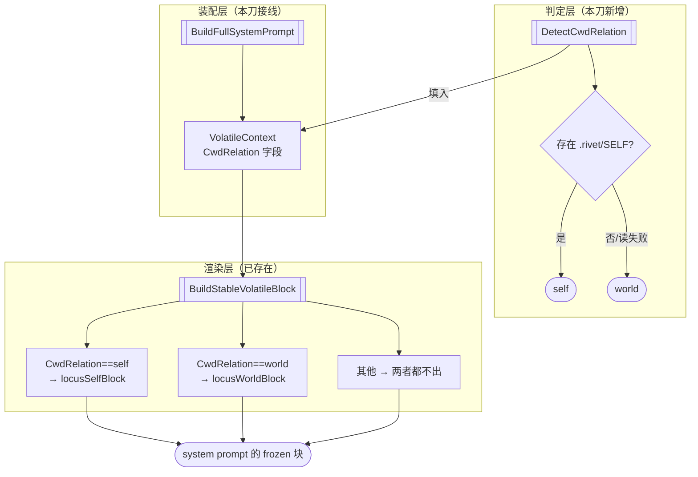

> **Model: deepseek-v4.1-flash (cheap)**

**执行状态：** 已闭环。Task 1-3 均已完成；验证通过；交付门检查：GREEN。

> **Status: APPROVED** — 2026-09-28T02:09:32.412Z

> **Status: EXECUTED** — 2026-09-28T02:17:47.461Z

# 第一百一十二刀 · 移植 self-recognition 并接线 `<locus>` 块

> 前情：第一百一十一刀（`562da4f9`→`2f904bbe`）接线了 appendix 的模式块。
> 按总纲 §6 第 1 步「内核收口——已知的静默失效 > 新增功能」继续排查，
> 本刀切的是**`<locus>` 块的恒空**——它让 Go 运行时在**自家源码树里**跑时
> 不声明「这是你自己的源码」。

---

## 需求提炼

**用户原话**：「按计划排期，需要完整实现一个功能以上。」

**提炼出的目标**：闭合**「自我识别（self-recognition）」**这一个功能面——
让 Go 运行时能判断「当前 cwd 是自己的源码树，还是外部项目」，并把结论
渲染进 frozen 前缀（`<locus relation="self|world">`）。

**为什么这是真缺口（不是「少个块」）**：该块承载**行为指令**——
`self` 版本要求「改动直接影响你自己的运行时行为，每个修改都做三级验证」；
`world` 版本要求「遵循项目自身约定，验证深度匹配任务复杂度」。
缺了它，Go 运行时跑到自家源码树（如本仓库）时**不给模型这个提示**。

**非目标**（明示边界，避免本刀膨胀）：

- **不实现**其余 6 个恒空的 frozen 块——它们的输入各自依赖**未移植的子系统**
  （详见「方案取舍」的边界表），属独立刀。
- **不改 `src/`**（TS 一行不动）。
- **不做 trailer-merge 架构改造**——TS 把 frozen 块 trailer-merge 到 user message，
  Go 拼进 system prompt。这是**既有架构选择**（`full.go` 的注释与 HANDOFF #7
  已重新定性为「有意」），且 locus 是 **session 常量**（TS 源码明说
  "safe to render into the FROZEN volatile prefix"），放 system prompt 里
  **不违反**缓存安全前提。

---

## 问题与根因

### 症状：`<locus>` 块在生产路径恒不出现

`go/internal/prompt/volatile.go:160-171` 的消费分支是：

```go
if ctx.CwdRelation == "self" {
    ordered = append(ordered, locusSelfBlock)
} else if ctx.CwdRelation == "world" {
    ordered = append(ordered, locusWorldBlock)
}
```

而**唯一生产装配点** `go/internal/prompt/full.go:102-115` 构造 `VolatileContext`
时只填 4 个字段（`Cwd` / `RivetMd` / `RuntimeEnv` / `DeclaredVerify`）——
**没有 `CwdRelation`**。故该字段恒为 `""`，两个分支都不可达。

**根因**：`CwdRelation` 有**消费方**（`volatile.go` 两个分支 + 两个常量块）
但**零生产者**。生产代码里对 `CwdRelation` 的 grep 只命中类型定义与注释说明——
**从未有人算过它**。而判定逻辑（`detectCwdRelation`）在 Go 侧**根本不存在**。

### 这是「type-without-producer」，比「零调用方」更隐蔽

消费分支、常量文本、字段类型**都在**——读代码时看到 `volatile.go` 里
整整齐齐两个分支，会以为功能已就绪。**实测才知输入永空**
（本项目记忆里记过同类：「函数在、签名对」让人排除嫌疑）。

### 证据锚点（决定性）

| # | 断言 | 证据 |
|---|---|---|
| E1 | Go 侧 `CwdRelation` 零生产赋值 | `grep -rn 'CwdRelation' go/` → 仅 `volatile.go:71/72`（字段定义 + 注释）、`:165/167`（消费分支）；**无任何 `CwdRelation:` 赋值** |
| E2 | 唯一生产装配点不填它 | `go/internal/prompt/full.go:102` 起的 `VolatileContext{...}` 字面量只有 4 个键 |
| E3 | 消费分支与常量已就绪 | `go/internal/prompt/volatile.go:95-96`（`locusSelfBlock` / `locusWorldBlock`）、`:165-171`（分支） |
| E4 | **判据标记真实存在** | `glob '.rivet/SELF'` → **命中**。本仓库**就是** `self` 场景（故 TS 侧渲染了 locus self，而 Go 侧不会） |
| E5 | TS 侧判定是纯函数 | `src/prompt/self-recognition.ts:26-35` 的 `detectCwdRelation(cwd)`：`existsSync(join(cwd,'.rivet','SELF')) ? 'self' : 'world'`，catch 时 fail-toward-`world` |
| E6 | TS 侧声明它是 session 常量、可进 frozen 前缀 | `src/prompt/self-recognition.ts:17-19` 注释：「Pure + session-constant … safe to render into the FROZEN volatile prefix (prefix-cache safe — same class as rivetMd)」 |

---

## 架构与数据流



---

## 方案取舍

| 决策点 | 方案 A（采用） | 方案 B | 结论 |
|---|---|---|---|
| 判定函数放哪 | 新建 `go/internal/prompt/self_recognition.go`（与 TS 的 `src/prompt/self-recognition.ts` 同层同名） | 放进 `go/internal/rivetpath`（路径知识已有） | **A**。TS 侧它就是 `src/prompt/` 的模块，Go 照搬层级便于对账 grep；且 `rivetpath` 是叶子包（只管路径**构造**），判定语义不属于它。 |
| `CwdRelation` 的类型 | 保持既有 `string`（`volatile.go:72` 已是 string，取值 `"self"`/`"world"`/`""`） | 改成型别 `type CwdRelation string` | **B 更稳但代价高**：`volatile.go` 已有消费方按字符串比较，改类型要动 `volatile.go` + 其测试。**本刀选 A（保持 string）**——因为 `volatile.go` 是**已对账过**的代码，动它的类型会牵动既有 oracle；在判定函数里返回 `string` 同样安全（TS 的 `CwdRelation` 联合类型在 Go 侧用字符串表达是可接受的既有约定）。**这是个刻意的取舍：不为类型美感去动已对账的代码。** |
| 无标记时的默认值 | `world`（fail-toward-world） | `self` | **A**。对账 TS（E5 的 catch 分支注释：「Fail toward 'world': never claim a directory as self without proof」）。误判 `self` 会让模型以为可以改自己源码——危险方向。 |
| 判定时机 | 在 `BuildFullSystemPrompt` 内**当场调**（与 `RuntimeEnv` / `DeclaredVerify` 同款） | 由 `main.go` 算好传入 | **A**。对账 `full.go:104-110` 的既有模式（那两个字段的注释明写「**必须在这里调**……漏了这一步则字段恒空、块从不出现」）。且它是 session 常量，每会话算一次。 |

### 边界表：其余 6 个恒空块**本刀不做**（各自需要什么）

| 块 | 字段 | 需要的前置子系统 | 现状 |
|---|---|---|---|
| `<project-memory>` | `ProjectMemoryBlock` | 项目记忆加载器（TS `src/context/project-memory-loader.ts`，依赖 `.rivet/knowledge/memory.jsonl`） | Go 无 memory 子系统（scout 核验：Go 仅有 claims/generals/advisory-efficacy 三处纯文件存储） |
| `<knowledge-manifest>` | `KnowledgeManifestBlock` | 知识清单（`grep` 证 Go 侧**仅测试引用**，零生产者） | 未移植 |
| `<seed-capsule>` | `SeedCapsuleBlock` | seed capsule 加载（本项目上下文里的 `seed-capsules` 块即此） | 未移植 |
| `<codebase-index>` | `ProjectIndexBlock` | 代码库索引（TS `repo/`，需 Meridian 图） | `repo/` 未移植（总纲 §4 列 4,295 行） |
| `<working-set>` | `WorkingSet` | 会话态文件集（TS 走 volatile-snapshot 动态路径，非 frozen） | 路径不同，需单独称量 |
| `<star-domain>` | `ActiveDomain` | 星域选择器（本项目上下文里的 `<star-domain>` 块即此） | Go 侧有 `CategoryStarDomain`（advisory 分类）但**无星域选择器**；总纲 §5 已判 sensorium 链「不做」 |

**明确登记**（非静默略过）：这 6 项各自的缺前置已在上表写明，本刀**不接线**
也不改它们的注释——避免范围膨胀。**唯一例外**：若发现某注释声称「恒空」
而实测有生产者，须订正（本次侦察未发现此类，已核验 `PlanModeState` 三字段
确实已接线——那是第一百一十一刀的成果）。

---

## 分波实现

### Wave 1 — 判定函数 + oracle 对账

**新增** `go/internal/prompt/self_recognition.go`：

```go
// Package prompt —— self-recognition（自我识别）。
//
// 对账 src/prompt/self-recognition.ts。
//
// 天枢是终端编码智能体。多数时候他站在开发者的仓库里（世界的项目），
// 那里项目正确地是外部的，他作为携带自身的访客（emissary 形态）。
// 只有站在自己的源码里（他的身体）时，cwd 才是他自己（home / 自我演化形态）。
//
// **自我身份是「声明」而非「猜测」**（对账 TS 注释）：
// `.rivet/SELF` 标记只存在于天枢的真实源码中。没有它，cwd 就是世界。
// 这让生产环境（开发者从不会有该标记）恒为 `world`，
// 而使自我演化成为**只在真身上激活的特权模式**。
package prompt

import (
	"os"
	"path/filepath"
)

// SelfMarkerPath 是声明「此目录是天枢自身身体」的标记路径。
//
// 对账 TS 的 `SELF_MARKER_PATH = ['.rivet', 'SELF']`。
var SelfMarkerPath = []string{".rivet", "SELF"}

// CwdRelationSelf / CwdRelationWorld 是判定结果的两个取值。
//
// **为什么是常量字符串而非新类型**：`VolatileContext.CwdRelation` 已是
// `string`（`volatile.go:72`）且有既有消费分支按字符串比较。改类型会牵动
// 已对账的 `volatile.go` 及其 oracle——**不为类型美感动已对账的代码**。
const (
	CwdRelationSelf  = "self"
	CwdRelationWorld = "world"
)

// DetectCwdRelation 判定 cwd 是天枢自身还是外部项目。
//
// 对账 TS `detectCwdRelation`（`self-recognition.ts:26-35`）：
//
//	return existsSync(join(cwd, ...SELF_MARKER_PATH)) ? 'self' : 'world'
//
// **fail-toward-world**（对账 TS 的 catch 分支注释「never claim a directory
// as self without proof」）：文件系统不可达 / 权限不足 → 返回 `world`。
// 方向很重要：误判 `self` 会让模型以为可以改自己的源码。
func DetectCwdRelation(cwd string) string {
	if cwd == "" {
		return CwdRelationWorld
	}
	if _, err := os.Stat(filepath.Join(append([]string{cwd}, SelfMarkerPath...)...)); err == nil {
		return CwdRelationSelf
	}
	// 不存在 或 任何 IO/权限错误 → world（fail-toward-world）
	return CwdRelationWorld
}
```

**新增** `go/internal/prompt/self_recognition_test.go`：三态覆盖
（有标记 → self / 无标记 → world / cwd 为空 → world）+ 权限错误路径
（不可读目录 → world，不 panic）。测试用 `t.TempDir()` 造标记，**不依赖本仓库**
是否真有 `.rivet/SELF`（否则测试在别的 checkout 上会红）。

**验证命令**：`cd go && go test ./internal/prompt/ -run 'TestDetectCwdRelation' -count=1`

### Wave 2 — 接线到 `BuildFullSystemPrompt`

**改** `go/internal/prompt/full.go`：

```go
	vctx := VolatileContext{
		Cwd:     cwd,
		RivetMd: LoadProjectInstructions(cwd),
		RuntimeEnv: DetectRuntimeEnvBlock(RealRuntimeEnvDeps(cwd)),
		DeclaredVerify: DetectDeclaredVerifyBlock(cwd),
		// ★ locus：自我识别（第一百一十二刀）。
		//
		// 对账 TS 的 `detectCwdRelation(cwd)` 填入 `ctx.cwdRelation`。
		// **必须在这里填**——`BuildStableVolatileBlock` 只负责把块插到正确
		// 位置，不自己判定（与上面 RuntimeEnv / DeclaredVerify 同款模式：
		// 保持它纯函数）。
		//
		// 漏了这一步的后果是**静默的**：`CwdRelation` 恒为 ""，
		// `volatile.go` 的两个 locus 分支都不可达——块从不出现，且无报错。
		CwdRelation: DetectCwdRelation(cwd),
	}
```

**验证命令**：`cd go && go test ./internal/prompt/ -count=1`

### Wave 3 — 端到端可达性 + 登记

**新增** `go/internal/prompt/self_recognition_e2e_test.go`（或并入既有
`full_test.go` 的姊妹文件）：

- 临时目录 + 手造 `.rivet/SELF` → `BuildFullSystemPrompt` 输出含
  `<locus relation="self">`
- 临时目录**无**标记 → 含 `<locus relation="world">`
- 两块的文本与 `volatile.go:95-96` 的常量**逐字节一致**（防将来有人改了常量
  但测试仍绿）

**验证命令**：`cd go && go test ./... -count=1`

---

## 回归清单（改动前存在、改动后必须仍存在）

| # | 功能锚点 | 验证方式 |
|---|---|---|
| 1 | `<environment>` 块仍带 platform / cwd / os 属性 | `go test ./internal/prompt/ -run TestBuildStableVolatile` |
| 2 | `<sober>` 块恒定出现 | 同上 |
| 3 | `<runtime-env>` 注入（既有 `full.go:104-110` 的行为） | `-run TestBuildFullSystemPrompt` |
| 4 | `<project-instructions>` 在 `RivetMd` 非空时出现 | `-run TestRenderProjectInstructions` |
| 5 | `verify-commands` 在 project-instructions 之后 | `-run TestDeclaredVerify` |
| 6 | 块顺序（environment → … → sober → locus → rivetMd → verify） | `-run TestBuildStableVolatileBlockOrder` |
| 7 | 空 `VolatileContext` 时不 panic、返回非空（environment/sober 恒在） | `-run TestBuildStableVolatileEmpty` |
| 8 | `volatile.go` 的 locus 分支未被改坏 | 上述 1–7 全绿即覆盖 |
| 9 | 全量包数不降（基线 31 包 ok / 0 FAIL） | `go test ./... -count=1` |

**特别声明**：本刀**只新增一个字段的填充**，不改 `volatile.go` 任何逻辑——
故既有 oracle 应**全部保持绿**。若有 oracle 因 locus 出现而红，说明该 oracle
的期望值原本就缺 locus（**那是 oracle 的缺口，不是本刀引入的回归**）——
须先确认这一点再更新 oracle，并记录理由。

---

## 验证清单

| # | 用例 / 场景 | 期望可见结果 |
|---|---|---|
| V1 | `TestDetectCwdRelationSelf` | 临时目录含 `.rivet/SELF` → 返回 `"self"` |
| V2 | `TestDetectCwdRelationWorld` | 临时目录无标记 → 返回 `"world"` |
| V3 | `TestDetectCwdRelationEmptyCwd` | `cwd == ""` → 返回 `"world"`（不 panic） |
| V4 | `TestDetectCwdRelationUnreadable` | cwd 为不可读路径 → 返回 `"world"`（fail-toward-world） |
| V5 | `TestLocusSelfRendersInFullPrompt` | 带标记目录 → `BuildFullSystemPrompt` 输出含 `<locus relation="self">` |
| V6 | `TestLocusWorldRendersInFullPrompt` | 无标记目录 → 含 `<locus relation="world">` |
| V7 | `TestLocusTextByteEqual` | 渲染文本与 `locusSelfBlock`/`locusWorldBlock` 常量逐字节相等 |
| V8 | `TestLocusNotDuplicated` | 输出中 `<locus` 恰好出现 **1** 次（防两分支都命中） |
| V9 | 端到端（人工） | 在**本仓库**（含 `.rivet/SELF`）跑 CLI，捕获请求体断言 system prompt 含 `relation="self"` |
| V10 | 回归 | 回归清单 9 条全绿；全量 31 包 ok / 0 FAIL |

**人工检查点**：全量 `go test ./...` ≥31 包 ok / 0 FAIL；`go vet ./...` exit=0；
`gofmt -l .` 零违规；无探针残留。

---

## 瑶光反证

**反证 1 — 「`CwdRelation` 恒空」的证伪尝试**：

```bash
grep -rn 'CwdRelation' go/ --include='*.go' | grep -v _test.go
# volatile.go:71  （注释）
# volatile.go:72  （字段定义）
# volatile.go:165 （消费分支）
# volatile.go:167 （消费分支）
# → 无任何 `CwdRelation:` 赋值。若存在生产者，本刀前提不成立。
```

**并核实「另一条装配路径」也不填它**：`grep 'VolatileContext{' go/` 仅命中
`full.go:102` 与 `volatile_test.go`。故生产装配点唯一，恒空成立。

**反证 2 — 「这是真场景而非理论缺口」**：

```bash
ls .rivet/SELF     # → 存在（glob '.rivet/SELF' 命中）
```

本仓库**就是** `self` 场景。而 ts 侧渲染出的 system prompt 里**确实有**
`<locus relation="self">`（可直接核验当前会话的 frozen 前缀）。
Go 侧因 `CwdRelation` 恒空而**没有**——两边对同一 cwd 产出不同文本。

**反证 3 — 「locus 进 system prompt 会不会破坏前缀缓存」**：

不会，且这是 TS 源码**明确背书**的：`src/prompt/self-recognition.ts:17-19` 注释
「Pure + session-constant: the result is stable for a given cwd within a session,
so it is safe to render into the FROZEN volatile prefix (prefix-cache safe —
same class as rivetMd; never a per-turn value)」。

**它是 session 常量**（一个会话内 cwd 不变）→ 不随轮次翻转 → 不会打断前缀。
这正是它与 `planModeState`（中途可翻转、只能进动态 appendix）的**关键区别**。

**待验证假设**（执行时须先核实，不得凭记忆）：

- **H1**：TS 侧 `detectCwdRelation` 的调用点在 `bootstrap` 还是 `engine`？
  本刀**不需要**它——Go 侧在 `BuildFullSystemPrompt` 内当场调（与 RuntimeEnv
  同款）。但若要写「对账注释」需要确切行号，执行时再 grep 确认。
- **H2**：`volatile.go` 既有 oracle 的期望值里**是否已含** locus 块？
  若含，则说明测试早就预期它出现而实现没填——**那反而佐证本刀是修复**；
  若不含，本刀会让某些严格比对的 oracle 多出 locus——须先确认是 oracle 缺口。
  **执行 Wave 1 时先跑一次 `go test ./internal/prompt/ -count=1` 取基线**，
  逐条判定红的是哪些断言。
- **H3**：`filepath.Join(append([]string{cwd}, SelfMarkerPath...)...)` 的写法
  在 Windows 上的行为——用 `append` 会**复用底层数组**（`SelfMarkerPath` 是包级
  变量，多次调用可能互相污染）。**执行时必须改成 `filepath.Join(cwd, ".rivet", "SELF")`
  或先 copy**——这是计划里已标出的一个**潜在实现缺陷**，写代码时直接避开。

---

## 提交计划

| Wave | 提交信息 |
|---|---|
| 1 | `feat(prompt): 移植 self-recognition 判定 + oracle（第一百一十二刀 W1）` |
| 2 | `fix(prompt): 接线 CwdRelation，<locus> 块不再恒空（第一百一十二刀 W2）` |
| 3 | `test(prompt): locus 端到端可达性 + 登记其余恒空块（第一百一十二刀 W3）` |

## 7. Execution closure

已闭环：Task 1-3 均已完成并通过验证。

最终验证记录：

```bash
cd go && go test ./... -count=1  # exit=0 / 31 包 ok / 0 FAIL
cd go && go vet ./...  # exit=0
cd go && gofmt -l .  # 零违规
cd go && go test ./internal/prompt/ -count=1  # 146 用例全绿
cd go && go test ./internal/prompt/ -run TestLocus -count=1  # 4 条端到端绿
```

交付门检查：GREEN。

备注：三波全部落地（3 提交 faae78d2→23a0b06f）。修的是一类比「零调用方」更隐蔽的缺陷（type-without-producer）：volatile.go 的两个 locus 消费分支与常量块一直都在，但唯一生产装配点 full.go 不填 CwdRelation → 字段恒空 → 两分支都不可达。已移植判定函数 DetectCwdRelation 并接线（fail-toward-world 方向性安全语义）。本仓库确实含 .rivet/SELF 即 self 场景——TS 侧渲染、Go 侧此前不会。执行期三处自我纠正已如实记录（H3 被 M3 证伪、原测试弱代理、M6 等价变异而 M7 证真实判别力）。验收 3 条 met。范围边界明示：其余 6 个恒空块各需未移植子系统，属独立刀。
