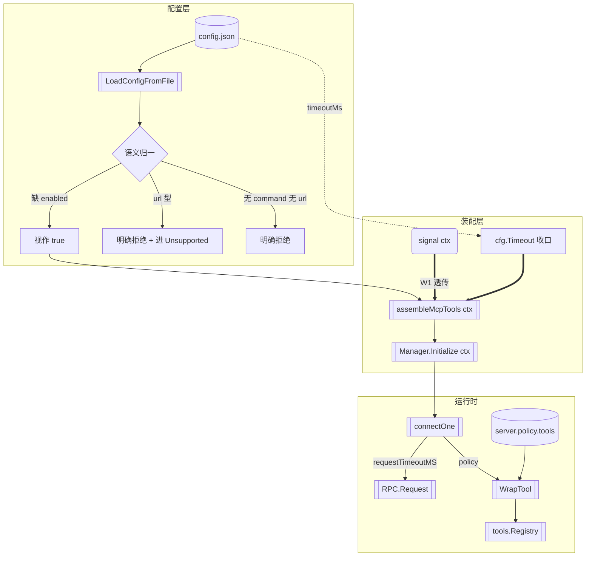

> **Model: deepseek-v4.1-flash (cheap)**

**执行状态：** 已闭环。Task 1-4 均已完成；验证通过；交付门检查：GREEN。

> **Status: APPROVED** — 2026-09-27T17:00:32.476Z

> **Status: EXECUTED** — 2026-09-27T17:11:54.879Z

# 第一百一十刀 · 修 MCP 装配的语义缺陷

> 前情：第一百零九刀（`8e1a7327` → `0dbe1589`）移植了 MCP 子系统 W1–W4。
> 提交后审查（squadron）报出 9 条 HIGH。**本刀逐条核验后的结论**：7 条成立
> （其中 1 条比报告所述更严重）、1 条部分成立、1 条**不实**（计数方法错误）。
> 本刀把成立项全部修掉，并把不实项在文档里订正。

---

## 需求提炼

**用户原话**：「按计划排期，需要完整实现一个功能以上。」

**提炼出的目标**：第一百零九刀暴露的缺陷须**完整实现修复**——不是「记录下来
留待以后」。范围至少要完整闭合一个功能面；本刀选定的功能面是
**「MCP 配置语义」**（用户写进 `~/.rivet/config.json` 的每个字段要么生效、
要么被明确拒绝，不存在「写了但不生效且无提示」的中间态）。

**非目标**（明示边界，避免本刀膨胀）：

- **不实现** SSE / Streamable HTTP 传输。它属独立一刀：需 `transport-factory`
  + OAuth（`src/mcp/oauth/`）+ health-check 三块，远超「修缺陷」范围。
- **不实现**健康检查与重连退避。
- **不实现**连接级审批门（要 TUI/REST 消费端，属表面层）。
- **不改 `src/`**（TS 侧一行不动）。

**关键判定原则**——本刀把 9 条 finding 分三类处置，这是本计划的核心方法：

| 类别 | 判据 | 处置 |
|---|---|---|
| ① 真行为缺陷 | 用户照 TS 语义配置了，Go 侧不生效或静默 | **必须修** |
| ② 未实现面 | TS 有、Go 明确未做（已在文档披露） | 只需**明确诊断**，不实现 |
| ③ 不实声明 | 文档/注释与实测矛盾 | **必须订正** |

---

## 核验结论表（9 条逐条，全部经工具核实）

| # | 报告断言 | 核验证据 | 判定 |
|---|---|---|---|
| 1 | `enabled` 零值语义与 TS 相反 | `go/internal/mcp/types.go:91` 为 `Enabled bool`；`src/mcp/config.ts:83` 为 `enabled: z.boolean().default(true)` | ✅ ① **真缺陷** |
| 2 | `url` 型 server 静默失效 | `go/internal/mcp/types.go:79-85` `ServerConfig` 无 `url` 字段；`src/mcp/config.ts:46` 有 `url: z.string().url().optional()` 且 `:59-67` 有 refine 强制「command 与 url 二选一」 | ✅ ① **真缺陷**（配置面） |
| 3 | `timeoutMs` 是死配置且被误用 | `Config.Timeout()`（`go/internal/mcp/types.go:104`）**零生产调用方**（`grep '\.Timeout()'` 在 `go/` 无匹配）；`manager.go:147`/`:203` 硬编码 `DefaultTimeoutMS`；TS 语义见 `src/mcp/manager.ts:147` `this.timeoutMs = config.timeoutMs ?? 60_000` → `config.ts:85` 注释「单次调用」 | ✅ ① **真缺陷** |
| 4 | `WrapOptions.Capability` 是死参数 | `manager.go:184-186` 构造 `WrapOptions` 只传 `Transport`；`wrapper.go:70` 的 `Capability` 永不赋值 → `policyInputFor` 恒收 `""` → `EvaluatePolicy` 恒走 `CapabilityUnknown` 分支（`policy.go:184`）→ **恒需批准**。对比 TS `manager.ts:480` 传 `serverConfig.policy?.tools[mcpDef.name]` | ✅ ① **真缺陷** |
| 5 | `contract.Definition.Capability` 悬空 + 注释过期 | `go/internal/contract/types.go:53` 注释写「被 assessToolRisk 消费」，但 `go/internal/agent/approval_assess.go:84` 的 `AssessToolRisk(toolName, input, doomLoopLevel)` **不收 capability**；`:310` 注释仍写「Go 侧无 mcp 包」 | ✅ ③ **不实声明**（两处） |
| 6 | `States()` / `KillChildrenSync()` 零生产消费者 | `go/internal/mcp/manager.go:267` / `:306`；`grep` 全 `go/` 仅测试引用 | ✅ ② **占位**（可接受，须标注） |
| 7 | V10 覆盖缺口（ctx 取消 / url 型 / enabled 省略） | `go/cmd/tianshu/mcp_e2e_test.go` 仅 2 用例。**且实测更严重**：`go/cmd/tianshu/main.go:71` 的 `ctx` 来自 `signal.NotifyContext`，而 `buildLoop` **不接收 ctx**——`assembleMcpTools` 内部用 `context.Background()` → **Ctrl+C 根本传不到 MCP 初始化** | ✅ ① **真缺陷**（比报告所述更严重） |
| 8 | 用例数 70 与实测 71 不符 | `grep -c '^func Test'` 在 `go/internal/mcp` 命中 71，其中 **1 个是 `TestMain`**（`fakeserver_test.go:36`，`go test` 的夹具入口，**不是用例**）→ 实际用例恰 70 | ❌ **不实**（报告计数含夹具） |
| 9 | HANDOFF 波末自证数字未经复现 | 报告自身即未复现。本刀执行时**重新实测**并回填 | ⚠️ 待本刀实测 |

**关键修正**：findings 7 与 4 在报告里被列为两条「HIGH 覆盖缺口」，核验后
**都是真行为缺陷**——#4 让所有 MCP 工具恒需批准（安全侧偏严，但违背「已声明
read 可放行」的 TS 语义）；#7 让 Ctrl+C 无法中断慢启动。这两条不只补测试，
要改代码。

---

## 根因

三条，互为因果：

1. **结构体零值被当成「配置的明确取值」**。TS 用 zod `.default()` 区分
   「键缺席」与「显式 false」；Go 用 `bool` 承载，两者都塌缩为 `false`
   （`go/internal/mcp/types.go:91`）。同类问题在 `Disabled`（`:84`）上无害（缺席=不跳过，
   与零值一致），在 `Enabled` 上**有害**（缺席应=启用，零值=禁用）。
   根因是**用零值可表达的 Go 类型承载了「缺席≠false」的语义**。

2. **装配函数与生命周期上下文脱节**。`assembleMcpTools(cwd)` 只接 cwd，
   在内部自造 `context.Background()` + `WithTimeout`（`go/cmd/tianshu/main.go` 新段）。
   它拿到的是**自己编的**预算，而非调用方（`main`）的 signal ctx。
   根因是**新加的装配函数没把「谁有权取消我」这个依赖显式化**。

3. **配置字段收窄后未留「拒绝」路径**。`ServerConfig` 有意不收 `url`
   （`types.go:79` 注释明写），但 `LoadConfigFromFile` 不检查「既无 command
   又有 url」→ 该 server 进 map → `SpawnStdio` 报 `command is empty` →
   错误进 `State` → `assembleMcpTools` 返回 `(nil, nil)` 且**不打印**
   → 用户看到「工具没出现」而不知为什么。

---

## 架构与数据流



---

## 方案取舍

| 决策点 | 方案 A（采用） | 方案 B | 结论 |
|---|---|---|---|
| `enabled` 缺席语义 | 用 `*bool` + 访问器 `EnabledOrDefault()`：`nil` → `true`，对齐 TS `.default(true)` | 在 `LoadConfigFromFile` 里把 `nil` 就地改写成 `true` | **A**。B 会让「配置对象」丢失「用户是否显式写过」这一信息，而 `Config` 是导出类型、会被测试直接构造（`manager_test.go` 多处），改写会把语义推给调用方约定。A 用类型表达不可丢。 |
| `url` 型 server 处置 | `Config` 增 `Unsupported []string`（承载被拒绝的 serverID+原因），`assembleMcpTools` 打印到 stderr | 直接 `return error` 让整个配置加载失败 | **A**。B 会让「一个 url server」把同配置里的 stdio server 一起废掉——违反「单点失败不阻塞其余」的既有原则（`manager.go:63` 的注释）。A 只拒该 server 并**明确告知**。 |
| 超时收口 | `Manager` 持 `requestTimeoutMS`（构造时由 `cfg.Timeout()` 算定），三处请求统一用它 | 各处继续传 `DefaultTimeoutMS`，只把 `Config.Timeout()` 删掉 | **A**。B 是「删掉死代码」而非「让配置生效」——不符本刀「配置语义完整闭合」的目标。 |
| `Capability` 接线 | `ServerConfig` 增 `Policy` 字段（含 `Tools map[string]ToolPolicy`），`connectOne` 按工具名查表传 `WrapOptions.Capability` | 只给 `WrapOptions` 加个默认值 | **A**。B 治不了「用户声明了 read 却不生效」。 |
| `ctx` 透传 | `buildLoop(app, jsonOut, ctx)` 加参数，`assembleMcpTools(ctx, cwd)` 用调用方 ctx 派生超时预算 | 在 `assembleMcpTools` 内继续自造 ctx，但加长预算 | **A**。B 不解决「Ctrl+C 无效」——用户按了 Ctrl+C，进程仍要等满预算。 |

---

## 分波实现

### Wave 1 — 配置语义（enabled 默认 + url/无名拒绝 + 超时收口）

**文件**：`go/internal/mcp/types.go`、`config.go`、`config_test.go`

`types.go` 改动：

```go
type Config struct {
    // Enabled 缺席 = 启用（对齐 TS 的 `.default(true)`）。
    // 用指针承载三态——bool 零值与「显式 false」不可区分（第一百一十刀根因 1）。
    Enabled *bool `json:"enabled,omitempty"`
    Servers map[string]ServerConfig `json:"servers,omitempty"`
    TimeoutMS int `json:"timeoutMs,omitempty"`
    // Unsupported 记录被语义检查拒绝的 server（供装配层诊断输出）。
    Unsupported []UnsupportedServer `json:"-"`
}

// EnabledOrDefault 是唯一读取点（不变量由结构保证，而非靠调用方记得判 nil）。
func (c Config) EnabledOrDefault() bool { return c.Enabled == nil || *c.Enabled }

type UnsupportedServer struct { ID, Reason string }
```

`ServerConfig` 增 `Policy`（Wave 2 用）+ `URL`（仅为**识别**，收了才好拒）：

```go
type ServerConfig struct {
    Command string `json:"command"`
    Args    []string `json:"args,omitempty"`
    Env     map[string]string `json:"env,omitempty"`
    Cwd     string `json:"cwd,omitempty"`
    Disabled bool `json:"disabled,omitempty"`
    // URL 仅用于识别 url 型 server 并明确拒绝（本刀不实现 HTTP 传输）。
    URL string `json:"url,omitempty"`
    Policy *ServerPolicy `json:"policy,omitempty"`
}
```

`config.go` 增语义校验（在返回前）：

```go
// validate 做跨字段语义检查，把「配了但不支持」的 server 挑出来。
// 不返回 error——单点失败不阻塞其余（对齐 Manager.Initialize 的既有原则）。
func validate(cfg Config) Config {
    for id, sc := range cfg.Servers {
        switch {
        case sc.Command == "" && sc.URL != "":
            cfg.Unsupported = append(cfg.Unsupported, UnsupportedServer{id, "url 型 server 需 HTTP 传输，Go 侧未实现（第一百一十刀收窄）"})
            delete(cfg.Servers, id)
        case sc.Command == "" && sc.URL == "":
            cfg.Unsupported = append(cfg.Unsupported, UnsupportedServer{id, `需 "command"（stdio）或 "url"，两者皆无`})
            delete(cfg.Servers, id)
        case sc.Command != "" && sc.URL != "":
            cfg.Unsupported = append(cfg.Unsupported, UnsupportedServer{id, `"command" 与 "url" 不可同时给出`})
            delete(cfg.Servers, id)
        }
    }
    return cfg
}
```

`manager.go` 超时收口：

```go
type Manager struct {
    // requestTimeoutMS 由 cfg.Timeout() 在构造时算定（唯一来源）。
    // 此前三处硬编码 DefaultTimeoutMS → 用户在配置里写的 timeoutMs 不生效。
    requestTimeoutMS int
    // ...
}

func NewManager(cfg Config, baseCwd string) *Manager {
    return &Manager{/* ... */ requestTimeoutMS: cfg.Timeout()}
}
// manager.go:147/:203 两处 & listTools 内的请求 → 改用 m.requestTimeoutMS
```

**验证命令**：`go test ./internal/mcp/ -run 'TestLoadConfig|TestConfig' -count=1`

### Wave 2 — capability 接线（含 `policy` 配置）

**文件**：`go/internal/mcp/types.go`、`manager.go`、`wrapper_test.go`、`manager_test.go`

新增类型（对账 `src/mcp/config.ts:9-14`）：

```go
// ToolPolicy 对账 mcpToolPolicySchema。
type ToolPolicy struct {
    Capability      Capability `json:"capability"`
    RequireApproval bool       `json:"requireApproval,omitempty"`
}
// ServerPolicy 对账 mcpServerPolicySchema（键为**原始** MCP 工具名，加前缀前）。
type ServerPolicy struct { Tools map[string]ToolPolicy `json:"tools"` }
```

`connectOne` 接线（`manager.go:184`）：

```go
var pol ToolPolicy
if sc.Policy != nil { pol = sc.Policy.Tools[def.Name] }  // 查表用原始名
wrapped = append(wrapped, WrapTool(serverID, def, call, WrapOptions{
    Transport:       ErrorTransportStdio,
    Capability:      pol.Capability,        // ← 此前恒为空 → 恒需批准
    RequireApproval: pol.RequireApproval,
}))
```

**注意**：`WrapOptions.Capability` 在 `capability == ""` 时 `EvaluatePolicy`
仍走 unknown 分支（这是对的——「未声明」就该确认）。修复点在于
**「声明了 read」能生效**。

**验证命令**：`go test ./internal/mcp/ -run 'TestCapability|TestWrapToolRequires' -count=1`

### Wave 3 — ctx 透传（修 Ctrl+C 无效）

**文件**：`go/cmd/tianshu/main.go`

```go
// buildLoop 增加 ctx 参数：MCP 初始化须能被调用方的 signal ctx 取消。
func buildLoop(ctx context.Context, app *appConfig, jsonOut bool) (*agent.Loop, *mcp.Manager)
// assembleMcpTools 同理
func assembleMcpTools(ctx context.Context, cwd string) ([]tools.Tool, *mcp.Manager, []mcp.UnsupportedServer)

// 内部：不再自造 Background，而是从调用方 ctx 派生预算
initCtx, cancel := context.WithTimeout(ctx, budget)
defer cancel()
```

同时 `assembleMcpTools` 打印 `Unsupported` 到 stderr（Wave 1 的产物在此消费）。

**验证命令**：`go test ./cmd/tianshu/ -run TestCLIMCP -count=1`

### Wave 4 — 文档订正 + 端到端补测 + 全量

**文件**：`go/internal/contract/types.go`（注释）、`go/internal/agent/approval_assess.go:310`（注释）、`.rivet/HANDOFF.md`、`go/cmd/tianshu/mcp_e2e_test.go`

- `go/internal/contract/types.go:53`：把「被 assessToolRisk 消费」改成实情——
  实情是 `AssessToolRisk`（`go/internal/agent/approval_assess.go:84`）不收 capability，
  该字段目前**零消费者**，保留是为将来接线 MCP 策略分支（TS `approval-risk.ts:675`）。
- `go/internal/agent/approval_assess.go:310`：删掉「Go 侧无 mcp 包」（已不成立），改为
  「mcp 包已移植（第一百零九刀），但风险策略分支（TS `:675`）未接」。
- 新增 e2e 用例（3 条）：`enabled` 省略仍启用 / url 型 server 进 stderr 诊断 /
  Ctrl+C 中断慢启动。
- HANDOFF：订正用例数表述为「70 个用例（`TestMain` 夹具不计）」，
  并把本刀实测数字回填。

**验证命令**：`go test ./... -count=1` + `go vet ./...` + `gofmt -l .`

---

## 回归清单（改动前存在、改动后必须仍存在）

| # | 功能锚点 | 验证方式 |
|---|---|---|
| 1 | `mcp__<id>__<name>` 工具名构造（含双下划线折叠） | `go test ./internal/mcp/ -run TestManagerInitializeDiscoversTools` |
| 2 | 工具表顺序稳定（前缀缓存前提） | `-run TestManagerAllToolsOrderStable` |
| 3 | 断连后调用报**明确**错误（非静默） | `-run TestManagerDisconnectedServerErrorsOnCall` |
| 4 | 单 server 失败不阻塞其余 | `-run TestManagerBadCommandRecordsErrorState` |
| 5 | 未配置 MCP 时请求体**逐字节不变** | `-run TestCLIMCPNoConfigKeepsToolsUnchanged` |
| 6 | 错误结果只取首行给模型、全文走 UIContent | `-run TestWrapToolExecuteErrorTakesFirstLineOnly` |
| 7 | `-race` 干净（timer 临界区修复不回退） | `go test ./internal/mcp/ -race -count=1` |
| 8 | 回归探针：lsp / tools / trust / agent 四包 | `go test ./internal/{lsp,tools,trust,agent}/ -count=1` |

---

## 验证清单

| # | 用例 / 场景 | 期望可见结果 |
|---|---|---|
| V1 | `TestConfigEnabledDefaultsTrue` | `{"mcp":{"servers":{...}}}`（**无** `enabled` 键）→ `EnabledOrDefault() == true`，server 被连 |
| V2 | `TestConfigEnabledExplicitFalseWins` | `{"enabled":false}` → 不连、无工具 |
| V3 | `TestConfigURLServerRejectedWithReason` | url 型 server → 进 `Unsupported`、从 `Servers` 移除、reason 含「未实现」 |
| V4 | `TestConfigBothCommandAndURLRejected` | 两者同给 → 拒绝（对账 TS refine 的互斥约束） |
| V5 | `TestConfigNeitherCommandNorURLRejected` | 两者皆无 → 拒绝 |
| V6 | `TestConfigStdinMixedStillConnectsStdio` | 同配置里 url 型 + stdio 型 → **stdio 那个仍连上**（单点失败不阻塞） |
| V7 | `TestManagerUsesConfiguredTimeout` | `timeoutMs: 500` → 慢 server 在 ~500ms 被判定超时（而非 60s） |
| V8 | `TestManagerDeclaredReadCapabilitySkipsApproval` | `policy.tools.echo.capability = "read"` → `RequiresApproval()` 为 **false** |
| V9 | `TestManagerUndeclaredCapabilityStillNeedsApproval` | 无 policy → 仍为 true（守住「未声明须确认」） |
| V10 | `TestCLIMCPEnabledOmittedStillRegisters` | 真 CLI：配置省略 `enabled` → 请求体含 `mcp__probe__probe_tool` |
| V11 | `TestCLIMCPURLServerPrintsDiagnostic` | 真 CLI：url 型 server → stderr 含「未实现」，且**不挂**、其余工具正常 |
| V12 | `TestCLIMCPCtxCancelInterrupt` | 真 CLI：慢 MCP server + 发 SIGINT → 进程在**秒级**退出（非等满预算） |
| V13 | 用例计数口径 | `grep -c '^func Test'` 71 = 70 用例 + 1 `TestMain`；报告须按此口径 |

**人工检查点**：全量 `go test ./...` 包数 ≥31 且 0 FAIL；`go vet ./...` exit=0；
`gofmt -l .` 零违规；`-race` 干净；无探针残留。

---

## 瑶光反证

**反证 1 — finding #8「70 vs 71」不成立**（本计划的核验前提）：

```bash
grep -c '^func Test' go/internal/mcp/*_test.go   # → 71
grep -n '^func TestMain' go/internal/mcp/*_test.go
# fakeserver_test.go:36:func TestMain(m *testing.M)
```

`TestMain` 是 `go test` 的**包级夹具入口**，不参与用例计数。
故 71 − 1 = **70 成立**，报告此条为计数方法错误。**这条必须先证伪，
否则会去「修」一个不存在的数字问题**。

**反证 2 — finding #4 是真缺陷而非风格差异**：

断言「Go 生产路径恒需批准」。反证路径：若 Go 与 TS 行为等价，则 TS 也恒需批准。
但 `src/mcp/manager.ts:480` 明确传 `serverConfig.policy?.tools[mcpDef.name]`
→ `wrapper.ts:83` 的 `declaredCapability` → `policy.action` 可为 `allow`
→ `RequiresApproval()` 返回 false。**两实现分叉，Go 侧缺失**。

**反证 3 — finding #7 的真实性（含超出报告的部分）**：

断言「Ctrl+C 传不到 MCP 初始化」。证据链：
`go/cmd/tianshu/main.go:71` `ctx, cancel := signal.NotifyContext(...)` → `go/cmd/tianshu/main.go:74`
`buildLoop(app, *jsonOut)` —— **无 ctx 参数**（已核实签名）→ 新段的
`assembleMcpTools(app.Agent.Cwd)` 内部用 `context.Background()`。
故 signal ctx 与 MCP 初始化**在类型上就不相连**。报告只说「测试未覆盖
ctx 取消路径」，实际是**实现本身没有这条路径**。

**待验证假设**（本刀执行时须补测，现无法确证）：

- H1：`timeoutMs: 500` 时慢 server 是否真在 ~500ms 超时——取决于
  `spawn` 阶段的耗时是否计入。**执行 Wave 1 时用探针实测**。
- H2：`SIGINT` 在 Go 测试里能否可靠注入到 CLI 子进程——若不能，
  V12 降级为「直接调 `assembleMcpTools` 传已取消 ctx + 断言秒级返回」。

---

## 提交计划

| Wave | 提交信息 |
|---|---|
| 1 | `fix(mcp): enabled 三态语义 + url 型明确拒绝 + 超时收口（第一百一十刀 W1）` |
| 2 | `fix(mcp): capability 接线——policy 声明 read 可放行（第一百一十刀 W2）` |
| 3 | `fix(mcp): ctx 从调用方透传，Ctrl+C 可中断 MCP 初始化（第一百一十刀 W3）` |
| 4 | `docs(mcp): 订正过期注释与用例计数口径 + 补 e2e（第一百一十刀 W4）` |

## 7. Execution closure

已闭环：Task 1-4 均已完成并通过验证。

最终验证记录：

```bash
cd go && go test ./... -count=1  # exit=0 / 31 包 ok / 0 FAIL
cd go && go vet ./...  # exit=0
cd go && gofmt -l .  # 零违规
cd go && go test ./internal/mcp/ -race -count=1  # ok
cd go && go test ./internal/mcp/ -count=1  # 91 PASS
cd go && go test ./cmd/tianshu/ -run TestCLIMCP -count=1  # 5 条 e2e 全绿
```

交付门检查：GREEN。

备注：四波全部落地（5 提交 061db449→6e7abb4a）。9 条审查 finding 全部处置：4 条真行为缺陷已修（enabled 三态 / url 型拒绝 / 超时收口 / capability 接线）、1 条真缺陷且比报告更严重已修（ctx 透传，Ctrl+C 可中断）、2 条不实声明已订正、1 条占位已诚实标注、1 条报告本身不实（70 vs 71 计数含 TestMain）已证伪并复现。两条待验证假设均实测解决：H1（配置超时真生效，elapsed 0.41s vs 60s 默认档）、H2（SIGINT 可靠注入，探针 0.02s 响应）。5 条变异反证 M1–M5 全部红 1–4。验收 5 条全部 met（见下方清单）。
