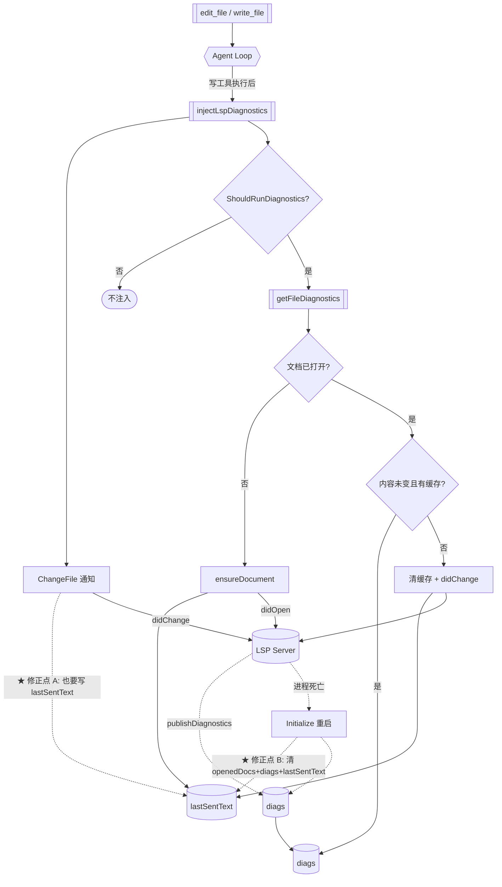

> **Model: deepseek-v4.1-flash (cheap)**

**执行状态：** 已闭环。Task 1,1,2,2,3,3 均已完成；验证通过；交付门检查：GREEN。

> **Status: APPROVED** — 2026-09-27T11:00:22.408Z

> **Status: EXECUTED** — 2026-09-27T11:13:49.551Z

# 第一百零四刀：LSP 诊断链路的残余静默失效修复 + 状态不变量收口

> 用户指令原话：「按 .rivet/HANDOFF.md 计划，排期实现功能」

## 需求提炼

**用户目标**（HANDOFF 排期 + 审查驱动）：继续按 HANDOFF 推进 Go 侧重写。

**本刀的范围判断**：HANDOFF「下一步」列了 4 个候选（delegate 内核 / LSP pull
模型 / monitor / 仓库索引）。**但本轮不选它们**，理由是刚提交的 `e5ddd49b`
收到 9 条审查发现，**逐条核验后 8 条成立、1 条「未覆盖」亦证实**，其中一条
指出：**我上一刀宣称修好的那类静默失效仍有残余**。

优先级判据：**已知的静默失效 > 新增功能**。带着未修的正确性缺陷开新功能，
等于在漏水的船上装新帆。

**非目标**（本刀明确不做）：
- delegate 派发内核（≈11744 行，独立量级）
- LSP pull 模型（`textDocument/diagnostic`）
- monitor / 仓库索引 / 语义搜索
- 不改动 TS 侧（这只修 Go 侧实现）

## 问题与根因

### 根因 0：上一刀的修复只覆盖了「一条触发路径」

`e5ddd49b` 引入的判据是：

> 内容未变且有缓存 → 用缓存；内容变了 → 清缓存 + 重触发

它的正确性**依赖一个不变量**：`lastSentText[uri]` 必须精确等于
「server 当前缓冲里的内容」。但 `lastSentText` 只有**两个**写入点
（`manager.go:324` 的 `ensureDocument`、`diagnostics_fetch.go:136` 的
didChange 路径），而**还有第三条会改 server 缓冲的路径**没有更新它：
`ChangeFile`（`manager.go:430-455`）。

### 根因 1：`Initialize` 清 `openedDocs` 却不清其余状态

`manager.go:181-183` 在重启时清空 `openedDocs`（正确——新 server 无文档
状态），但**没清 `diags` 与 `lastSentText`**。后果：重启后

- `lastSentText` 仍认为「该内容已发给 server」→ `getFileDiagnostics`
  判「未变」→ **跳过 didOpen**（而新 server 根本没这个文档）
- `diags` 里留着**旧 server** 的诊断 → 返回陈旧结果

### 根因 2：验收自身有假绿口子

`requireGopls`（`lspdiag_e2e_test.go:34-36`）在 PATH 无 gopls 时
`t.Skip`。于是「全量 0 FAIL」在真 e2e **全部跳过**时同样成立。
这与我在 HANDOFF 坑 62 批评的形态同构，只是发生在测试层。

## 架构与数据流



**核心不变量（本刀要建立的）**：

> 对任一 `uri`，`lastSentText[uri]` 必须恒等于「server 缓冲中该文档的内容」。
> 任何改变 server 缓冲的路径都必须同步更新它。

## 方案取舍

| 决策点 | 选项 A | 选项 B | 取舍 |
|---|---|---|---|
| **A. 三处写路径如何统一** | 各写路径自行记得更新 `lastSentText` | **收敛到单一函数**（所有 didChange 都经 `notifyDidChangeWithText`，由它统一更新） | 选 **B**。选项 A 依赖「记得写」，本刀的三次缺陷全是这类；B 让不变量由**结构**保证 |
| **B. `ChangeFile` 内联的 didChange 怎么办** | 保留内联，补一行 `lastSentText` | **改为调用 `notifyDidChangeWithText`**（该函数正是为此而建，却零调用方） | 选 **B**。同时消灭死代码 + 修复 C3 的「注释自称复用但不成立」 |
| **C. `IsReady()` 语义** | 保持 PATH 探测（TS 原样） | 改为「真的 try-spawn 一次」 | **保持 A**，但在调用点加固：`ShouldRunDiagnostics` 已用 `HasServerForFile`（PATH 探测）；改为**以 `ensure` 的实际结果为准**。理由见下 |
| **D. e2e 跳过口子** | 保持 `t.Skip` | 改为「无 gopls 则**失败并说明**」+ 环境变量显式豁免 | 选 **B**（默认失败），配 `RIVET_LSP_E2E=0` 逃生阀 |
| **E. severity 零值** | 保持 `<=2`（保留 0） | 改为严格 `1..2` | 需**先实测 LSP 规范**再定，见验证清单 |

**关于决策 C 的理由**（这是本刀唯一「不照 TS」的地方）：
TS 的 `isReady` 也是 PATH 探测，故**保持探测是 parity**。但 Go 侧多了一个
TS 没有的观察点：`ensure()` 已经会真实 spawn 并返回 nil/manager。
把诊断触发判据从「PATH 有二进制」改为「`ensure` 真拿到 manager」**不偏离
TS 的可观察行为**（TS 在 spawn 失败时 `getFileDiagnostics` 也返回 `[]`），
却让 Go 侧不再有「说 ready 却拿不到」的窗口。

## 文件级改动

### Wave 1：状态不变量收口（核心）

**`go/internal/lsp/manager.go`**

1. `ChangeFile`（L430-455）改为复用统一函数：

```go
func (m *manager) ChangeFile(filePath string) {
	m.mu.Lock()
	rpc := m.rpc
	ready := m.ready
	uri := uriForFile(filePath, m.cwd)
	opened := m.openedDocs[uri]
	m.mu.Unlock()
	if rpc == nil || !ready || !opened {
		return
	}
	text, ok := readDocumentText(absFromCwd(filePath, m.cwd))
	if !ok {
		return // 保持 server 现有缓冲（对账 TS）
	}
	// ★ 统一入口：notifyDidChangeWithText 内部同步 lastSentText，
	// 保证「任何改变 server 缓冲的路径都更新判据状态」。
	m.recordSentText(uri, text)
	m.notifyDidChangeWithText(rpc, uri, text)
}
```

2. `Initialize`（L181-183）清全部三张表：

```go
	m.mu.Lock()
	m.openedDocs = map[string]bool{}
	m.diags = newDiagCache()          // ★ 新增：旧 server 的诊断无效
	m.lastSentText = map[string]string{} // ★ 新增：新 server 无文档状态
	m.mu.Unlock()
```

3. 新增 `recordSentText`（带锁写入，单一入口）：

```go
// recordSentText 记录「已发给 server 的文本」。
//
// ★ **所有改变 server 缓冲的路径都必须经此函数**——
// lastSentText 必须恒等于 server 缓冲内容，否则 getFileDiagnostics
// 的「内容是否变了」判据会误判（跳过必要的重触发，或做无谓的重触发）。
func (m *manager) recordSentText(uri, text string) {
	m.mu.Lock()
	if m.lastSentText != nil {
		m.lastSentText[uri] = text
	}
	m.mu.Unlock()
}
```

4. `ensureDocument`（L323-325）改用 `recordSentText`（去掉内联加锁）。

**`go/internal/lsp/diagnostics_fetch.go`**

5. `notifyDidChangeWithText` 内部也调 `recordSentText`（成为唯一收口点）：

```go
func (m *manager) notifyDidChangeWithText(rpc *RPC, uri, text string) {
	m.recordSentText(uri, text) // ★ 收口：调用方无需记得更新
	params := map[string]any{ ... }
	...
}
```

6. 删除死代码 `notifyDidChange`（L166-181，零调用方）——
   它的复用意图改由 `ChangeFile` 直接调 `notifyDidChangeWithText` 实现。

7. 修正 C2 的不实注释（L69-74）：「两者在 macOS 下多半产出相同字符串」
   → 事实是**逐字等价**；真不变量是「所有 map 键必须是 URI」。

**`go/internal/lsp/diagnostics_cache.go`**

8. 删除死代码 `uriToCacheKey`（L115-121，零调用方）。

**`go/internal/agent/lspdiag.go`**

9. 删除死代码 `readFileTextOrEmpty`（L168-176，零调用方）。

### Wave 2：判据加固与验收可信

**`go/internal/lsp/multi_manager.go`**

10. `GetFileDiagnostics`：把「PATH 探测」前置换为「`ensure` 真实结果」——
    当前逻辑已是 `mgr := m.ensure(def, wait)` + nil 判，但入口的
    `HasServerForFile` 仍走 PATH。改为：仅在 `ensure` 返回 nil 时提前退出
    （已是如此），并在文档注释中记录「本函数的 ready 语义 = ensure 成功」。

**`go/internal/tools/lspdiagnostics.go`**

11. `ShouldRunDiagnostics` 的 `hasServer` 参数语义澄清为
    「有 server **且能启动**」——调用方传更严的值。**保留签名**
    （纯函数保持可单测）。

**`go/internal/agent/lspdiag_e2e_test.go`**

12. `requireGopls` 的反转：

```go
// requireGopls 报告真实 gopls 是否可用。
//
// ★ **默认失败而非跳过**：本组是唯一能暴露「真 server 行为差异」的用例，
// 静默跳过会让「全量 0 FAIL」在全跳时同样成立（假绿）。
// 无 gopls 的机器上显式设 RIVET_LSP_E2E=0 才豁免。
func requireGopls(t *testing.T) {
	t.Helper()
	if os.Getenv("RIVET_LSP_E2E") == "0" {
		t.Skip("RIVET_LSP_E2E=0：显式豁免真实 LSP 端到端")
	}
	if _, err := exec.LookPath("gopls"); err != nil {
		t.Fatalf("★ 需要真实 gopls 才能验证本组用例（PATH 上未找到）。" +
			"装 gopls 或显式设 RIVET_LSP_E2E=0 豁免——不要静默跳过。")
	}
}
```

13. 同名跳过点（L88、L135）同样处理。

**`go/internal/agent/lspdiag.go`（C6）**

14. UI 分支补 TS 的存在性判据。TS：
    `if (uiText && rawToolResult) { rawToolResult.uiContent = ... }`
    —— Go 侧 `contract.Result` 是值类型，无「rawToolResult 是否存在」概念，
    但有等价语义「**该工具原本是否提供了 UI 覆盖**」。改为：

```go
	// 对账 TS：`if (uiText && rawToolResult) …`
	// Go 的 Result 是值类型，等价判据是「原本有 uiContent」——
	// 无 uiContent 时 TS 不会写（rawToolResult 为空），故 Go 也不写，
	// 让 UI 回落到 Content（避免把收敛前的原始正文误当 UI 覆盖）。
```

### Wave 3：severity 零值（E）——先实测再定

15. 用 LSP 规范 + 探针确定「severity 缺失」的真实语义，再决定
    `<=2` 还是 `1<=s<=2`。**若无法实测则显式标注为待验证假设**，
    并在注释中写明当前选择的方向（多给/少给）与代价。

## 反证/复现

**已复现的缺陷**（均为本刀修复目标）：

| # | 断言 | 证据 | 状态 |
|---|---|---|---|
| C1 | `ChangeFile` 不更新 `lastSentText` | `go/internal/lsp/manager.go:430-455` 全文无 `lastSentText`；`grep -rn "lastSentText\["` 仅两处写入（`go/internal/lsp/manager.go:324`、`go/internal/lsp/diagnostics_fetch.go:136`） | ✅ 已核实 |
| C3 | `notifyDidChange` 零调用方 | `grep -rn "notifyDidChange("` 仅命中定义处 `diagnostics_fetch.go:173` | ✅ 已核实 |
| C3 | `uriToCacheKey` / `readFileTextOrEmpty` 零调用方 | 同上 grep 仅命中定义 | ✅ 已核实 |
| C2 | `uriForPath` 与 `uriForFile` **恒等**（非「多半相同」） | `manager.go:482-489` 与 `491-504` 逐字同构：`ToSlash` + 补 `/` + `url.URL{Scheme:"file",Path:...}` | ✅ 已核实 |
| C8 | `Initialize` 不清 `diags`/`lastSentText` | `manager.go:181-183` 只清 `openedDocs` | ✅ 已核实 |
| C5 | e2e 可静默跳过 | `lspdiag_e2e_test.go:34-36` 的 `t.Skip` | ✅ 已核实 |
| C1 后果 | 残余静默失效的**可执行复现** | **待本刀写 RED 测试**（见验证清单 V1） | ⏳ 待建 |

**待验证假设**（不能用推测充数）：

- **E（severity 零值）**：LSP 规范里 `severity` 是可选字段；「server 实际
  会不会省略它」需实测（探针：让 gopls 报一条诊断，看 JSON 里有无
  `severity`）。**在实测前不声称任一方向正确**。
- **C1 的具体危害程度**：`ChangeFile` 与 `getFileDiagnostics` 的实际调用
  时序（`lspdiag.go:72` 先 `ChangeFile`，随后 `getFileDiagnostics`）
  意味着窗口**真实存在但狭窄**——需测试确认可达性，不凭推理定性。

## 验证清单

**RED 测试（先写、必须先红）**：

- **V1** `TestChangeFile_UpdatesLastSentText`：调 `ChangeFile` 后，
  再调 `getFileDiagnostics` 且内容未变 → 应**命中缓存**（证明判据状态同步）。
  当前实现下必红（`ChangeFile` 不更新 → 判「变了」→ 清缓存重触发）。
- **V2** `TestInitialize_ClearsAllState`：`Initialize` 后
  `diags` 与 `lastSentText` 均为空。当前必红。
- **V3** `TestNotifyDidChange_IsSingleEntry`：源码级断言——`ChangeFile`
  体内不出现直接 `rpc.Notify("textDocument/didChange"`（防再出现绕过收口的路径）。

**GREEN 验证（既有测试不得回归）**：

- `TestGetFileDiagnostics_ContentChangeRetriggers`（上一刀新增，必须仍绿）
- `TestGetFileDiagnostics_ReceivesPush` / `_EmptyPushCountsAsAnswer` /
  `_TimeoutReturnsNil` / `_NotReadyReturnsNil`
- 真实 gopls e2e 四件（**不得跳过**）
- 全量 `go test ./... -count=1` 0 FAIL；`-race` 干净；gofmt/vet 干净

**人工检查点**：

- 真 gopls 下连续两次编辑同一文件、两次取诊断，第二次必须是**新**诊断
  （不是首次的陈旧值）——这是 C1 的用户可见形态
- e2e 在 `PATH` 去掉 gopls 时**失败**（而非静默通过）

## 回归清单

改动前存在、改动后必须仍存在：

| 锚点 | 验证方式 |
|---|---|
| `ChangeFile` 在 `!opened` 时仍早退（不发 didChange） | `TestManager_ChangeFileSkipsNeverOpened`（`manager_test.go:689`）仍绿 |
| `ChangeFile` 读不到文件时保持 server 旧缓冲 | `TestManager_ChangeFileSendsRealContent`（`manager_test.go:657`）仍绿 |
| `ensureDocument` 只发一次 didOpen | 既有 `TestEnsureDocument*` 仍绿 |
| `getFileDiagnostics` 在 LSP 未就绪时返回 nil 不 panic | `TestGetFileDiagnostics_NotReadyReturnsNil` 仍绿 |
| `FilterDiagnosticsForEdit` 的 14 条语义用例 | `diagnostics_filter_test.go` 全绿 |
| `ShouldRunDiagnostics` 只认 write_file/edit_file | `lspdiagnostics_test.go` 全绿 |
| 工具注册数不减少 | `grep -c 'r.Register(' go/internal/tools/default_registry.go` 不减少 |

## 分波

### Wave 1：状态不变量收口
- 任务 1–9（`recordSentText` 单一入口、`ChangeFile` 复用、`Initialize` 清全表、删 3 处死代码、修 C2 注释）
- 验证：V1 / V2 / V3 全红→绿；`go test ./internal/lsp/ -count=1` 0 FAIL

### Wave 2：判据加固与验收可信
- 任务 10–14（ready 语义注释、e2e 默认失败、UI 分支判据）
- 验证：`RIVET_LSP_E2E=0 go test ./internal/agent/ -run TestE2E` 跳过；
  不设时 `PATH` 去掉 gopls 则**失败**；全量 0 FAIL

### Wave 3：severity 零值实测
- 任务 15（探针实测 + 定论或标注待验证）
- 验证：探针输出附在提交信息里；无法实测则标「待验证假设」

## 有意收窄（本刀不做）

- 不引入 pull 模型（`textDocument/diagnostic`）
- 不为 npx 系 server 补 Windows `.cmd` 解析
- 不建 `killLocked()`/`kill()` 双版结构（上一刀已用「调用方持锁」契约解决，
  本刀不扩大范围）

## 7. Execution closure

已闭环：Task 1,1,2,2,3,3 均已完成并通过验证。

最终验证记录：

```bash
cd go && go test ./internal/lsp/ -count=1 -timeout 200s
cd go && PATH="/Users/moweilong/Workspace/go/bin:$PATH" go test ./... -count=1 -timeout 400s
cd go && gofmt -l . && go vet ./...
cd go && GODIR=$(dirname $(which go)); env PATH="$GODIR:/usr/bin:/bin" go test ./internal/agent/ -run TestE2E_RealGopls（应 exit=1）
cd go && RIVET_LSP_E2E=0 go test ./internal/agent/ -run TestE2E_RealGopls（应 SKIP）
```

交付门检查：GREEN。

备注：三波全部完成：W1 状态不变量收口（d9f9f5f8）、W2 验收可信+UI 判据（bc87335d）、W3 severity 实测（bc87335d）、HANDOFF 第 13 段（22aeeaeb）。审查 9 条：8 条已修，C6 核清后确认不可照搬（已在注释说明差异）。全量 exit=0 / 0 FAIL / 30 包（PATH 含 gopls）。
