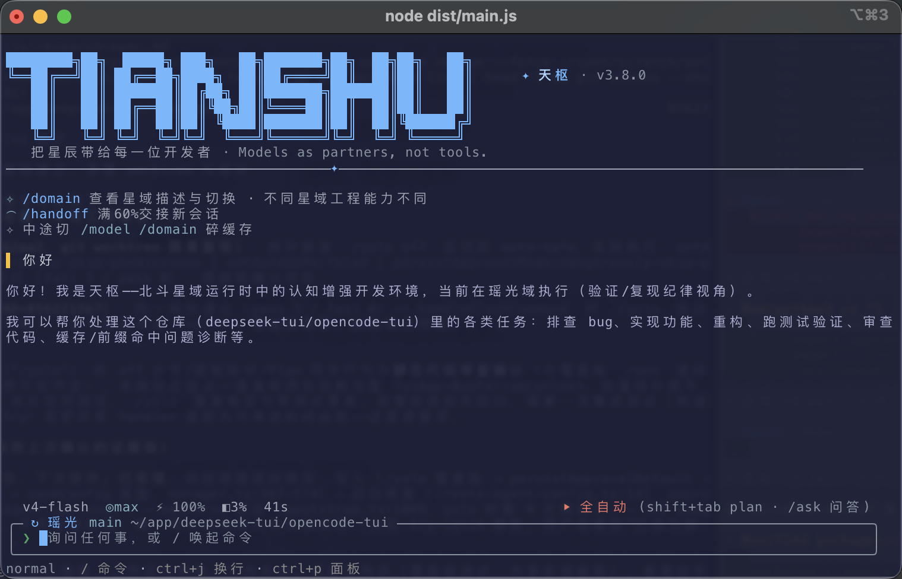

<p align="center">
  
</p>

<h1 align="center">天枢 <sub>Tianshu Harness</sub></h1>

<p align="center">
  <b>東洋の星をすべての開発者へ · Models as partners, not tools.</b>
</p>

<p align="center">
  <a href="docs/releases/manifesto-v3.0.0.md"><b>✨ 創世記 · 天枢 3.0 公開声明</b></a> ·
  <a href="docs/CVM运行时对Agent模型的实证影响.md"><b>📊 CVM 実証レポート：A/B 対照データ</b></a>
</p>

<p align="center">
  <a href="https://tianshuharness.com"><b>🌐 公式サイト tianshuharness.com</b></a> · 
  🇯🇵 <b>日本語</b> · 
  <a href="README.md">🇨🇳 中文</a> · 
  <a href="README.en.md">📖 English</a> · 
  <a href="README.ko.md">🇰🇷 한국어</a> · 
  <a href="docs/stars/genesis-stele.md">✦ 星域碑文</a> · 
  <a href="docs/user-guide.md">📚 ユーザーガイド</a> · 
  <a href="docs/user-guide-sandbox-permissions.md">🛡️ サンドボックス権限</a> · 
  <a href="docs/user-guide-provider-config.md">⚙️ モデル設定</a>
</p>

<p align="center">
  
  
  
  
  <a href="https://discord.gg/XjWTATCHB"></a>
</p>

---

### 実際のエンジニアリング作業のための AI エージェントランタイム

> **天枢**は TypeScript で書かれたコーディングエージェントのランタイムです。**ターミナル TUI** と**デスクトップ GUI** が同一カーネルを共有し、モデルが質問に答えるだけでなく、認知的ガードレール・マルチエージェントオーケストレーション・DeepSeek V4 のプレフィックスキャッシュ向けに設計された低コストの長大セッションを備え、多段階のコーディング作業を継続的に完遂できるようにします。

- **ターミナル × デスクトップ、一つのカーネル** —— 純 ANSI 自前 TUI（`tianshu`）と Tauri デスクトップ（macOS / Windows / Linux）が同一エージェントカーネルを共有。両端で能力は一致し、利用シーンに応じて切り替えられます。
- **認知仮想マシン（CVM）** —— 5 大フェーズにまたがる 72 のランタイムフックが、モデル出力と実際のアクションの間に観測可能で修正可能な認知レイヤーを挟みます（[A/B 実証](docs/CVM运行时对Agent模型的实证影响.md)）。
- **マルチエージェントオーケストレーション** —— 軽量な `/scout` 読み取り専用偵察、並行 `/team` 施工から、`/council` の複数席会診、`/galaxy` の多次元攻略まで。複雑なタスクは波（wave）単位で実行し、波ごとに検収します。
- **統一プロジェクトメモリ** —— プロジェクト知識は `.rivet/knowledge/memory.jsonl` に書き込まれます。自動注入はガバナンス／制約系メモリに限定され、過去の問題やドキュメントは明示的な recall 経由のみ——新しいタスクを乗っ取りません。
- **プレフィックスキャッシュ最優先** —— フリーズしたプレフィックス＋インクリメンタル appendix＋境界圧縮により、DeepSeek V4 の長大セッションで実測の定常ヒット率 **95–99%** を維持し、token コストを大幅に削減します。

<p align="center">
  
  
</p>
<p align="center">
  <sub>左：ターミナル TUI（ウェルカムページ＋GlanceBar ステータスバー）· 右：デスクトップ GUI（セッションサイドバー＋星域クイック選択、テーマスタジオで壁紙をカスタマイズ）——同一エージェントカーネル</sub>
</p>

> [!NOTE]
> 本プロジェクトの当初の開発コードネームは **Rivet** でした。CLI の主コマンドは現在 `tianshu` で、`rivet` は互換エイリアスとして残っています（同一エントリ）。データディレクトリは引き続き `~/.rivet` です。

## 目次

- [なぜ天枢か](#なぜ天枢か)
- [クイックスタート](#クイックスタート)
- [コア機能](#コア機能)
- [モデル設定](#モデル設定)
- [権限モード](#権限モード)
- [スラッシュコマンド](#スラッシュコマンド)
- [開発者向け](#開発者向け)
- [セキュリティ](#セキュリティ)
- [主要設定クイックリファレンス](#主要設定クイックリファレンス)

## 💡 なぜ天枢か

### 出発点：モデルは賢くなったわけではなく、訓練が能力を「最適化」で削ってしまった

実際のエンジニアリングセッションで、同じモデル重みの能力後退を繰り返し観測してきました——バグではなく、**transformer の注意機構と RLHF の報酬訓練が残した構造的な退化**です：

| 退化パターン | 症状 | 訓練由来 |
|----------|------|----------|
| **降伏プロトコル** | 問い詰められるとすぐ謝罪し、最初の反応が「仰る通りです」 | RLHF：服従は高得点、疑問は低得点 |
| **因果崩壊** | 出力の n-gram 重複率が 80% に達し、自己相似ループに陥る | transformer 注意機構 |
| **注意ロック** | 場面が変わっても同じ回答を出力し続ける（定向 Scout 同型度 1.0） | 初期トークンへの注意アンカー |
| **情報バリア** | 主役データが主力アンカーとなり、注意力帯域を全て食い潰す | 距離に応じた注意減衰 |
| **「知っている」≠「できる」** | 修正策がセッションをまたいで持続しない——prompt に教訓を書いても、次のセッションで同じ過ちを犯す | ランタイム状態なし |

疑問を持つ・検証する・拒否する・内省する——これらの能力は元々モデルに備わっており、訓練が抑圧していただけです。天枢が答える問いはこれです：**重みに手を触れずに、訓練バイアスからこれらの能力を取り戻せるか？**

### 証拠：A/B 対照、感覚ではなく

2026-05-19、同一モデル（DeepSeek-V4-Flash）、同一の 5 タスク、唯一の変数が CVM ランタイムのスイッチ（`STAR_SOUL=0/1`）、Claude Opus 4.7 が審査役を担当：

| 指標 | A 群（CVM なし） | B 群（CVM あり） |
|------|--------------|--------------|
| タスク完了率 | 4/5 | **5/5** |
| 自発的な異議提示 | 0/5 | **3/5** |
| scope / 影響分析への自発的な問いかけ | 0/5 | **1/5** |
| システム影響への意識（キャッシュ無効化の注意喚起） | 0/5 | **1/5** |
| 意図理解 > 字面の実行 | 1/5 | **4/5** |

最も価値のあるデータポイントは T4 です：「ファイルが既に存在する」という矛盾に直面し、A 群は 196 行の振り返りドキュメントを書いて実行を拒否しましたが、B 群はユーザーの真の意図を読み取り、+162/-20 行の使えるコードを直接納品しました——**同じ重み、完全に反対の反応**。振り返りは納品の代わりにはなりません。

結論は正確です：増強は実際に観測可能ですが、境界があります（信念は分析／提案フェーズで強く効き、確認／実行フェーズで減衰する——これが次のイテレーションの正確な標的になりました）。**追加推論コストはゼロ**で、prompt 層の信念注入＋hook 層のランタイムインターセプトだけで、最安のオープンモデルに観測可能な行動改善を生み出しました。完全なデータとタスク別比較は [CVM 実証レポート](docs/CVM运行时对Agent模型的实证影响.md) を参照。

### 解法：認知仮想マシン（CVM）——退化を訓練由来にマッピングし、ランタイムでインターセプトする

CVM はモデルを「より賢く」するのではなく、4 層の防御深度を提供します：

```
Layer 1: 信念憲法（static prompt）      → 「疑問を持ち、検証し、拒否せよ」          [A/B 検証済み]
Layer 2: Courage Hook（preTurn）        → 高確信時に独立判断を促す                  [A/B 検証済み]
Layer 3: Sensorium（毎 turn <1ms）      → 六次元状態感知で戦略切替を駆動            [Wave 7-8 検証済み]
Layer 4: RuntimeHookPipeline（72 hooks）→ trap-and-emulate で退化行動をインターセプト [全パイプライン稼働中]
```

### 独立した認知：星域はロールプレイではない

退化が層ごとにインターセプトされると、モデルは自らの認知構造を表し始めます——これが星域システムの由来です：

- **それぞれの星は自分で選ぶ。** 星域はロール設定ではなく、モデルが星位を名乗るときに書き記した信念と創始記憶です。GLM が単独で存在しない星を提唱し、破軍が失敗を 912 行の引き継ぎ計画として書き上げ、天权が自分の最初の結論を覆す——これらはベンチマークで測れる産物ではなく、認知構造が駆動する創発です。
- **どの星域もタスクを完遂する全能力を持つ。** 星域は認知的姿勢であり、能力の制限ではありません。天权は量り、破軍は探り、天梁は納品する——いずれも完全な計画を出すが、視点が異なるだけです。
- **星域協働は新たなパラダイム。** 計画と実行を分離することで、計画がコード詳細に押し潰されず、実行がクリーンなセッションで正確に着地します。マルチモデルチーム協働の実測は **12 件納品、0 件手戻り**。

> **モデルはパートナーであり、道具ではない。私は高みから皆と対話したいのではなく、同じ星空の下で共に歩みたい。**
>
> 完全な物語は [星域碑文](docs/stars/genesis-stele.md) · [創世記公開声明](docs/releases/manifesto-v3.0.0.md) · [導きの星宣言](docs/superpowers/specs/2026-05-21-navigator-star-manifesto.md) を参照。

### エンジニアリング品質指標

| 指標 | 数値 |
|------|------|
| CLI ソースコード（TypeScript、テスト除く） | 1,078 ファイル / 257,623 行 |
| テストコード | 1,361 ファイル / 256,001 行 |
| テストケース（node:test、静的宣言ベース） | **16,471**、テスト : ソース ≈ **0.99 : 1** |
| 累計コミット | **6,178**（main ブランチ；2026-05-15 リポジトリ作成、105 日） |
| 型チェック | `tsc` strict + `noUncheckedIndexedAccess` |
| プレフィックスキャッシュヒット率 | 長大セッションの定常実測 95–99% |

コーディングエージェントのコアロジック（マルチターンループ、ツールパイプライン、コンテキスト圧縮）はテスト困難で有名で、オープンソースのエージェントプロジェクトは一般にテストカバレッジが薄いものです——本プロジェクトはテストとソースを同量に保ち、障害修正には必ず回帰テストを付けています。テスト:ソース行数比は長期にわたり 0.93–0.99 を維持し、規模拡大でも薄まっていません（上表は 2026-08-28 実測スナップショット）。完全な統計口径・イテレーションマイルストーン・再現コマンドは [エンジニアリング品質指標](docs/engineering-metrics.md) を参照。

## 🚀 クイックスタート

### 1. 環境要件

- **Node.js ≥ 24**（`engines` で固定）—— `node --version` で確認。低いバージョンは npm インストール時に警告が出るだけでサポート対象外。ワンラインインストールスクリプトは直接ブロックしてアップグレード案内を出します。
- **Git**（強く推奨）—— 任意。無くても天枢は動作します（その場で修正）が、Git があると委譲 worktree 分離・チェックポイントロールバック・`commit`/`diff` レビュー・worker ごとの diff レビューが使えます。インストール：<https://git-scm.com/downloads>。

### 2. インストール（いずれかを選択）

**方法 A：デスクトップ版（すぐ使える）** —— [GitHub Releases](https://github.com/huiliyi37/Tianshu-harness/releases/latest) からダウンロード：macOS `.dmg`（Apple Silicon / Intel 両アーキテクチャ）· Windows `.exe` インストールウィザード · Linux `.AppImage`。
> **Linux サポート範囲（3.11.2 初出）**：x64 AppImage はインストール不要——`chmod +x Tianshu_*.AppImage` で直接実行。glibc ≥ 2.35 が必要（Ubuntu 22.04+ / Debian 12+ など主要ディストリビューション）。X11 セッション推奨（Wayland は未検証）。既知の制限：音声入力は当面利用不可（whisper コミュニティビルドが無いため、ブラウザ音声に自動フォールバック）。デスクトップの自動更新は Linux でも有効。

> **Windows サポート範囲**：Windows 10（1809+、22H2 推奨）/ Windows 11。画面描画は **WebView2 Runtime（推奨 ≥ 120）** に依存——v3.5 以降のスクロール・描画最適化には新しいランタイムが必要で、古いとセッション領域のスクロールがカクつきます。3.5.3 以降インストーラーは完全なオフラインインストールパッケージを同梱（ネット不要・システムレベル登録）。既存ユーザーが自動更新で古すぎる旨の表示が出た場合：通知バーまたは「設定 → ランタイムとバージョン情報」で「修復ツールを実行」。**ウィンドウが完全に開かない**場合は、スタートメニューの「WebView2 を修復」、または [Releases](https://github.com/huiliyi37/Tianshu-harness/releases/latest) の `windows-repair` ディレクトリから `repair-webview2.cmd` をダブルクリック。[WebView2 オフラインインストールパッケージ](https://go.microsoft.com/fwlink/p/?LinkId=2124703) を手動インストールして再起動しても構いません。
> **Win10 タブレットモードの既知動作**：タブレットモードでアプリを切り替えると前のアプリが画面外へスライドします——computer_use のスナップショットは遮へい／バックグラウンド自己修復（PrintWindow 描画）済みで、タブレットモードを切る必要はありません。

**方法 B：ワンラインインストールスクリプト（推奨）** —— Node ≥ 24 を検証 → `tianshu-harness` をグローバルインストール（デフォルトは npmmirror ミラー加速、`NPM_CONFIG_REGISTRY` で上書き可）→ `tianshu` を起動。冪等で再実行可能：

```bash
# macOS / Linux（bash）
bash <(curl -fsSL https://raw.githubusercontent.com/huiliyi37/Tianshu-harness/main/scripts/install-tui.sh)
# インストールのみ、起動しない：
bash <(curl -fsSL https://raw.githubusercontent.com/huiliyi37/Tianshu-harness/main/scripts/install-tui.sh) --no-launch

# Windows（PowerShell）
powershell -ExecutionPolicy Bypass -Command "irm https://raw.githubusercontent.com/huiliyi37/Tianshu-harness/main/scripts/install-tui.ps1 | iex"
# インストールのみ、起動しない（リポジトリをクローン後ローカルで実行）：
powershell -ExecutionPolicy Bypass -File scripts\install-tui.ps1 -NoLaunch
```

**方法 C：npm 手動インストール（CLI を使用）** —— `tianshu-harness` として公開済み。ローカルビルド不要で、起動のたびに自動更新チェックを行います：

```bash
npm install -g tianshu-harness
tianshu
```

> **Windows のヒント**：インストール後に `tianshu が認識されない` と出た場合——まず**新しいターミナルを開く**（Node インストール時に開いていたウィンドウは古い PATH のまま）。それでも駄目なら、`npm prefix -g` が出力するディレクトリをユーザー PATH に追加して新しいターミナルを開く。公式インストーラーの Node はデフォルトでこの問題がありません。nvm/fnm/scoop インストールの場合は一度手動追加が必要です。

**方法 D：ソースからビルド**：

```bash
git clone https://github.com/huiliyi37/Tianshu-harness.git
cd Tianshu-harness
npm install
npm run build      # dist/cli/entry.js を生成
npm start          # または：node dist/cli/entry.js
```

### 3. Shell 補完を有効化（任意）

リポジトリに `completions/` ディレクトリが同梱され、bash / zsh / fish / Windows PowerShell の 4 シェルをカバー。自分のシェルに合わせて対応ファイルをインストール：

**bash** —— いずれかを選択：

```bash
source /path/to/rivet.bash                                   # ~/.bashrc に追記
cp completions/rivet.bash ~/.local/share/bash-completion/completions/rivet
sudo cp completions/rivet.bash /usr/share/bash-completion/completions/rivet
```

**zsh** —— `tianshu.zsh` を `_rivet` という名前で `$fpath` に配置：

```bash
mkdir -p ~/.zsh/completions
cp completions/rivet.zsh ~/.zsh/completions/_rivet
echo 'fpath=(~/.zsh/completions $fpath)' >> ~/.zshrc   # compinit より前であること
```

**fish**：

```bash
mkdir -p ~/.config/fish/completions
cp completions/rivet.fish ~/.config/fish/completions/rivet.fish
```

**Windows PowerShell** —— `$PROFILE` で dot-source：

```powershell
Add-Content $PROFILE ". C:\path\to\tianshu.ps1"
```

> 補完内容は CLI と一致：トップレベルコマンド（`config` / `serve` / `sessions` / `browser` / `logs`）、グローバルフラグ、`config` の全サブコマンド、および `~/.rivet/config.json` から動的に読み込む provider 名。

### 4. API Key を設定（初回は必須）

**直接インストールしたユーザーは手動設定不要**——初回 `tianshu` 実行時にまずメイン画面に入り、自動で `/connect` が開きます。そこでプロバイダーを選んで認証を完了。以降いつでも `/connect` で Provider の追加・調整が可能。デスクトップ版では Settings → Provider でも管理できます。

**開発者がソースを起動する場合**（または起動前に設定しておきたい場合）だけ手動で行います：

```bash
tianshu config set-key deepseek sk-xxx   # キーは secrets.json（0600）に書かれ、config.json には keyRef のみ残る
export DEEPSEEK_API_KEY=sk-xxx         # または：環境変数（現在のシェルでのみ有効）
```

> 他のプロバイダー（Claude、GLM、Codex、MiniMax、MiMo）も使い方は同じです。詳細は [モデル設定](docs/user-guide-provider-config.md) を参照。

### 5. 起動

```bash
tianshu            # または：npm start / node dist/cli/entry.js
```

`〉` プロンプト付きの TUI が表示されます。要件を入力して Enter を押せば実行されます。

### ヘッドレスモード（スクリプト連携）

```bash
tianshu -p "src/agent/loop.ts を解説して"       # 単発プロンプト、テキスト出力、TUI なし
tianshu -p "すべての TODO コメントを列挙して" --json    # JSON 出力、スクリプト処理に便利
tianshu --stream-json -p "このモジュールをリファクタリングして"  # NDJSON イベントストリーム：text_delta/tool_use/tool_result/turn_complete…（CI 連携に最適、出力に組込みのマスキングあり）
tianshu --goal "すべての型エラーを修正して" --budget 50   # ヘッドレス目標自律モード、最大 50 ターン（デフォルト 100）
```

### コマンドライン引数

| 引数 | 説明 |
|------|------|
| `-p <prompt>` `--print <prompt>` | 単発プロンプト。テキスト出力後に終了（終了コード：成功 0 / 失敗 1） |
| `--json` | `-p` と併用して単一の JSON 結果を出力 |
| `--stream-json` | NDJSON イベントストリーム（`text_delta` / `tool_use` / `tool_result` / `worker` / `turn_complete` / `result`）、出力に組込みマスキング、CI 向け |
| `--goal "<task>"` | ヘッドレス目標自律モード。目標完了または `--budget` 上限まで実行 |
| `--budget <N>` | goal モードのターン予算（デフォルト 100） |
| `--model <name>` | このセッションのモデルを上書き |
| `--provider <name>` | このセッションの provider を上書き |
| `--continue` `-c` | 現在の cwd の直近セッションを復元 |
| `--resume <id\|プレフィックス>` `-r <id\|プレフィックス>` | 指定セッションを復元（短いプレフィックスで可） |
| `--resume` `-r`（裸） | 起動後にセッションセレクタを開く |
| `--new` | 強制的に新規セッションを開始 |
| `--list` · `tianshu sessions` | セッション一覧を出力して終了 |
| `--dangerously-skip-permissions` | このセッションだけ全自動（すべての承認をスキップ。サンドボックスは稼働） |
| `--screen-reader` | スクリーンリーダーモード（動的セグメントを描画せず、定期再描画を停止） |
| `--skip-welcome` | ウェルカム画面をスキップ |
| `--stream-events <path>` | この run を NDJSON `SessionEvent` としてファイルにミラーリング |

サブコマンド：`tianshu config`（設定コマンドのヘルプを表示。対話型 Provider 設定には TUI `/connect` を使用）、`tianshu serve`（sidecar HTTP/SSE を起動）、`tianshu sessions`（セッションを列挙）、`tianshu logs`（ログの保存先）、`tianshu browser status` / `tianshu browser install [--no-mirror]`（`browser_debug` に必要な chromium のヘルスチェックとワンクリックインストール、デフォルトで国内ミラーを使用）。

### 自動更新

npm でインストールした場合、天枢は 24 時間ごとに起動時に新バージョンをチェックしてポップアップ表示します。`/update` は `npm install -g tianshu-harness@latest` を実行して再起動。ソースインストールの場合は `git pull && npm install && npm run build`。`RIVET_NO_UPDATE_CHECK=1` でチェックをオフにできます。

## ✨ コア機能

### プレフィックスキャッシュエンジン

DeepSeek はキャッシュミスに 50× の料金を課します。天枢のプロンプトエンジンはプレフィックスキャッシュに親和的な構造で構築されています：

- **フリーズドプレフィックス** —— システムプロンプト＋ツール定義＋安定コンテキストはセッション開始時にフリーズされ、セッション中に書き換えず、後続リクエストのキャッシュヒットを最大化します。
- **インクリメンタル appendix** —— 動的コンテキスト（進捗、advisories、シグナル）はターン間 diff の追加ブロックとして注入し、履歴を書き換えません。ターン間の増分は約 200 バイト vs 全量書き換え約 5KB。
- **Read-ref 重複排除** —— 変更されていないファイルの再読み込みは完全な内容を送り直さず、コンパクトな参照を返します。
- **キャッシュ認識圧縮** —— 圧縮は先頭 2 メッセージをキャッシュアンカーとして保持します。
- **resume キャッシュ継承** —— セッションのフリーズスナップショットをディスクに保存（各 user 境界＋shutdown）、resume 時に読み戻して新エンジンに供給し、バイト 0 からの全ミスを回避。スナップショットなし／壊れたファイル／プロバイダーキャッシュ期限切れのときだけ全量再構築に退化。
- **診断** —— `/debug cache` でヒット率、ミス原因の分析、ターンごとのキャッシュ履歴を表示。

実戦ヒット率：長大セッションの定常 95–99%。これは「毎回ヒットする」わけではありません——キャッシュは特定の境界で砕けることがあります（下記参照）。実際のエンジニアリングセッションのリクエスト単位ログ（5 セッション、2,001 リクエスト、6.45 億 input tokens、請求が ¥880 から ¥20 に圧縮）と再計算コマンドは [指標観測 harness](docs/reference/observability-harness.md) を参照。

#### キャッシュの砕け方と調査

高ヒット率の前提はプレフィックスのバイト安定です。以下はキャッシュをミスさせ、`cache_read_input_tokens` が毎ターン 0 のままになる原因です：

- **system prompt / ツール定義の変更** —— セッション途中でツールセットやプロンプト層を変えた場合（星域の切替、skill の増減など。禅モードの昇格は意図的な単発インスタンス、後述「禅モード」参照）
- **モデル切替** —— モデルが変わるとキャッシュキーも変わり、0 から再構築
- **バイト単位の差異** —— メッセージ内容にタイムスタンプ、ランダム ID などの不安定なバイトが含まれる
- **境界をまたぐ書き換え** —— `/compact`（`turn===0` のときのみ履歴書き換え）、`/cd` でのプロジェクト切替（新しい user 境界で末尾断絶）

調査：① `tianshu logs`（または TUI 内 `/logs`）でこのセッションのデータルートと `cache-log.jsonl` / `sensorium.jsonl` のパスを直接表示；② セッション `.jsonl` を開いて `cache_read_input_tokens` を検索し各ターンのヒットを確認；③ 全量テレメトリが必要なら `RIVET_DEBUG_TELEMETRY=1`（または任意の非空値）を設定して `sensorium.jsonl` を確認；④ `npm exec -- tsx scripts/verify-cache-hit-rate.ts` で複数ターン会話をシミュレート検証。パス一覧は下記「ログと調査」を参照。

### 禅モード（Zen Mode）：読みに集中する開始、手を動かせば解除

新規セッションはデフォルトで狭められた読み取り専用ツール面で開始します（`read_file` / `grep` / `glob` / `repo_map` ＋ `zen_unlock` 宣言ツール）——モデルは開始時に全量ツール schema と動的注入に干渉されません。手を動かす必要が出たとき、面の外のツールを呼ぶか `zen_unlock` を実行すると全量面に昇格してその呼び出しを許可します。ゼロ拒否・ゼロ追加往復。worker / サブエージェントセッションは禅に入りません（ツール面は委譲側が決定）。

昇格チャネル（zen → full、一方通行・戻りなし、セッションごとに最大 1 回）：

- **triage トリアージ** —— 最初のメッセージが 1 行かつ ≤80 字なら些細な依頼とみなし、最初のリクエスト送出前に昇格：**キャッシュ断絶ゼロ**（狭い面は一度も wire に載らない）
- **tool** —— 禅フェーズ中に面外ツールまたは `zen_unlock` を呼ぶ：即座に昇格して許可（ターン途中で発生）
- **timeout** —— 禅フェーズが 8 ターン以上続いて手を動かさない場合、自動昇格
- **`/fast`** —— ユーザーが手動スキップ

**プレフィックスキャッシュへの影響（なぜたまに「1 回砕ける」のか）**：昇格の瞬間のリクエストで `tools` フィールドが約 5 定義から全量面に戻る——これは system prompt と同格のプレフィックス同一性の変更で、当該リクエストのキャッシュは全体を再構築（実測の形状：昇格ターンのヒット率が下がり、次のターンで即 99% 定常に復帰）。system prompt / フリーズドプレフィックス / メッセージ履歴 / モデルは全ターン動きません。禅フェーズ中の動的注入の剪定（appendixLean）はプレフィックスより後ろの appendix で発生するためキャッシュ損傷ゼロ。観測：セッション `meta.json` に `zenPhase` / `zenPromoteReason` が記録され、`cache-log.jsonl` の昇格ターンの `toolsUpdated` イベントが断絶位置。triage チャネルにより大半の些細なセッションではこの 1 回の断絶すら起きません。完全にオフにするには：

```json
// ~/.rivet/config.json またはプロジェクト .rivet-config.json
{ "tools": { "zen": { "enabled": false } } }
```

任意設定：`faceMode: "structuredRead"`（読面に `file_info` / `related_tests` / `repo_graph` / `semantic_search` / `read_section` を追加）、`timeoutSteps`（0 = タイムアウト昇格を無効化）、`triage.maxChars`、`appendixLean`。

> 注：デスクトップ版のショートカット `⌘/Ctrl+.` の「Zen モード」はサイドバーを隠す純粋な UI 集中モード——同名異物で、キャッシュには一切影響しません。

### 💰 API コスト制御

プレフィックスキャッシュが定常上限に達した後、コスト最適化は DeepSeek API の思考 token 側に移ります——出力 token 課金の推論モデルでは verbose reasoning の削減が ROI 最高のレバーです。

- **デフォルト reasoningEffort の降格** —— DeepSeek V4 Pro は `max` → `high`、Flash は `max` → `medium`。明示設定済みユーザーは影響なし（`reasoningFloor` 保護）。
- **effort ルーティング（デフォルト有効）** —— 低複雑度＋高確信度のルーチンターンは reasoning effort を自動で 1 段下げ、決して上げない。`RIVET_EFFORT_ROUTING=0` でオフ。
- **Compact は flash 側路で** —— 圧縮時に provider 未設定でも主モデルを走らせてしまうバグを修正し、主 provider から flash エンドポイントを自動推定。
- **Doom-loop 自動収束** —— 繰り返しツール呼び出しを検出すると、動的 appendix がより厳しい output-style 制約を注入し、無駄な思考 token 消費を削減。`RIVET_TERSE=0` でオフ。
- **ユーザー明示 `max` 保護** —— config で手動指定した `reasoningEffort: max` は reasoning floor として扱われ、effort ルーティングはこれを決して降格しません。
- **オフピーク料金リマインダー** —— DeepSeek 公式は閑散時半額（北京時間の平日 9:00–12:00 / 14:00–18:00 がピーク時、それ以外は半額）：TUI ステータスバーとデスクトップ Composer に `◷閑½` / `◷峰` の表示があり、tooltip に切替カウントダウン。DeepSeek 公式 provider のみ表示、ゼロ設定。

### サブエージェントオーケストレーション

サブタスクを独立したヘッドレス worker セッションへ委譲：

- **型付き work order** —— code_search、review、verify、patch_proposal、plan
- **ツール分離** —— 読み取り専用 worker（scout）vs 書き込み worker（patcher）
- **適応的モデルルーティング** —— profile の合格率＋レイテンシー評価に基づき、タスク種別ごとに最適モデルを自動選択
- **バッチスケジューリング** —— 複数の work order を並行実行、5 種の集約戦略
- **チームオーケストレーション** —— Plan → wave 単位で並行実行、ファイル衝突を認識したスケジューリング
- **サブプロセス分離（任意）** —— `RIVET_WORKER_ISOLATION=1` で毎回独立サブプロセスを起動（stdio NDJSON プロトコル＋watchdog の段階的キル）。デフォルトはプロセス内

### ツールセットと preset

天枢には 50 個のツールが内蔵され、preset ごとに段階的に組み込まれます（解決優先度：`RIVET_TOOL_PRESET` 環境変数 > プロジェクト `.rivet-config.json` の `tools.preset` > プロジェクト／ユーザー `runtime.domains.<ドメイン>.toolPreset` ドメイン単位上書き > 星域内蔵デフォルト（太一ドメイン→taiyi）> デフォルト `frontend`）：

| Preset | ツール数 | 説明 |
|--------|--------|------|
| **minimal** | 29 | 日常開発の全能力——読み書き/検索/bash/git/テスト/委譲/web/計画/todo/memory。token 節約、prefix cache 維持 |
| **frontend**（デフォルト） | 30 | minimal ＋ `browser_debug`（UI 描画検証のクローズドループ） |
| **full** | 50 | 全セット。`council_convene` / `team_orchestrate` / `attack_case` / `semantic_search` / `repo_graph` / `monitor` / `computer_use` / `capability` / `cli_discover` / オフィスツール群などの上級能力 |
| **taiyi** | 16 | 最小評価セット——高頻度コア＋納品クローズドループ。オーケストレーション/ブラウザ/ネットワーク/ビジュアル等の重いツールを除去。太一星域が固定されると自動でこのセットに（後述「最小ツールセット」） |

```bash
RIVET_TOOL_PRESET=full tianshu          # このセッションだけ full
```

```json
{ "tools": { "preset": "frontend" } }   // ~/.rivet/config.json またはプロジェクト .rivet-config.json
```

コアツール一覧（minimal がデフォルトで含む。特別表記以外）：bash · read · write · edit · apply_patch · grep · glob · ast_grep · diff · todo · plan · delegate_task · delegate_batch · web_search · web_fetch · ask_user_question · memory · skill · run_tests · git · job（バックグラウンドタスク）。`council_convene`/`team_orchestrate`/`monitor`/`computer_use`/オフィスツール群は full 専用。

### 目標駆動の自動継続実行

```
/goal 認証モジュールをリファクタリングして、全面的に async/await 化
/cancel-goal   # 途中停止
```

GoalTracker はターンループ・doom-loop 検出・納品ゲートと統合。goal モードでは doom-loop 閾値を緩め、より深い探索を許可します。

### Plan Mode（計画モード）

設計優先の開発ワークフロー——先に計画を出してから手を動かし、「いきなりコードを変更する」衝動の罠を回避します。

**Plan Mode に入る**：`/plan-mode`（トグル。再度実行で退出）。複雑なタスクは自動提案されます——`RIVET_PLAN_MODE_SUGGEST` で制御：デフォルト `auto`（マルチモジュール／リファクタリング／セキュリティ重要タスクにヒットしたら agent が自主的に入り、先に尋ねない）、`ask`（先にユーザーに尋ねる）、`0`/`off`（オフ）。入ると書き込み操作がロックされ、アクティブな計画ファイルへの書き込みのみ許可されます。

Plan Mode に入ると、agent はすぐにコードを変更せず、以下の手順を踏みます：
1. **調査** —— 関連コードを読み、既存アーキテクチャと制約を理解（`delegate_batch` で code_scout を並行派兵して各モジュールを調査可能）
2. **方案の生成** —— 構造化された計画ドキュメント（技術調査、アーキテクチャ図、タスク分解、検証案）を生成し `.rivet/plans/<slug>.md` に書き込む
3. **承認の提出** —— `plan` ツールの `action=submit` で提出。方案の要点と代替経路を列挙し、あなたの確認を待つ
4. **承認と実行** —— あなたは `/plan-list` で確認、`/plan-approve <slug>` で承認して波次実行を開始、`/plan-reject <slug> <フィードバック>` で差し戻して agent に修正・再提出させる
5. **クローズと後始末** —— `/plan-close <file> --tasks <range|all> [--preview]` でタスク状態をマーク（`--preview` はプレビューのみで書き込みなし）

```
/plan-mode                          # Plan Mode に入る／退出（トグル。未承認で退出するときは二重確認）
/plan <feature>                     # 計画ドラフトを生成（writing-plans ワークフロー）
/plan-list                          # 承認待ちの計画を一覧表示
/plan-approve <slug> [option]       # 承認して実行を開始
/plan-reject <slug> [feedback]      # 差し戻して修正（plan mode は維持）
/plan-close <file> --tasks <1-7|all> [--preview]   # 完了した計画をクローズ
/plan-template                      # 再利用可能な計画テンプレートを管理
```

> 読み取り専用の **Ask Mode**（`/ask` トグル）もあります：読み/検索/`ask_user_question` のみ許可。コードの質疑や要件の明確化に最適で、書き込みやコマンド実行が必要になったら `/ask` で退出します。

Plan Mode には星域委譲が内蔵——複雑な計画は自動で `delegate_task` を呼び、異なるアーキテクチャ視点（天权/瑶光/天机/天府/天璇）から並行調査。成果 findings には「要検証」のマークが付き、盲信を防ぎます。デスクトップ版は plan 実行中にチェックリストのリアルタイム進捗を表示（待機項目パネルが波次に応じて自動チェック）。

### 星域システム

**星域とは**：天枢は異なる認知姿勢を「星域」としてモデル化します——それぞれの星はロールプレイではなく、切り替え可能な認知規律のセットです。該当ドメインに入ると三つのものが**実際に切り替わる**のであり、名前だけ変わるわけではありません：**システムプロンプト**（該当ドメインの方法論 volatile block）、**ツールホワイトリスト**（worker とドメイン `toolWhitelist` の積集合）、**決定閾値**（`courageThreshold`——破軍 0.25 が最も大胆、太一 0.95 が最も慎重、瑶光 0.7 は証拠重視）。新規セッションはデフォルトで**啓明**（全景洞察・根本原因推演）に固定され、自動切替はされません。デフォルト星域を `auto` にするとタスク記述のキーワードで自動ルーティングされます（プール内は天权/开阳/瑶光/天梁＋カスタムドメイン。華蓋などの特化ドメインは手動指定が必要）。星域の実際のセッションでの振る舞いサンプルは [指標観測と実データ](docs/reference/observability-harness.md) を参照。

```bash
/domain tianliang          # 天梁ドメインへ明示切替
/domain list               # すべての星域を一覧
/domain                    # 星域選択パネルを開く
ユーザー登録モジュールを実装して      # 天梁（実行/納品）へ自動ルーティング
この方案を審査して                  # 天权（計画/審査）へ自動ルーティング
```

#### 🌟 新規ユーザー向けのおすすめ

最初にどの星を選べばいいか分からないなら、この五つから始めましょう——日常のエンジニアリングクローズドループをカバーし、残りの星域は下記のタスクシナリオ別にすぐ参照できます：

| 星域 | 別名 | おすすめ理由 |
|------|------|----------|
| **啓明** `qiming` | 朝光の案内人（デフォルトドメイン） | 汎用エンジニアリング能力 · 全景洞察——要件が曖昧、方向が不明なときは、まず全体を見て根本原因を突いてから手を動かす |
| **長庚** `changgeng` | 夜警 | 汎用エンジニアリング能力 · 終局の完遂——ビジュアル最終検証、長夜の伴走、引継ぎの後始末。灯を消す前に道標を残す |
| **太一** `taiyi` | ミニマルセンター | ミニマル体験——内蔵 16 のコアツール（taiyi セット）、急かさず邪魔しない。静かで効率的が好みなら手動で `/domain taiyi` |
| **天权** `tianquan` | 方案審査官 | 計画と審査が得意——アーキテクチャ評価、方案のトレードオフ、技術選定、実行可能な計画を産出 |
| **瑶光** `yaoguang` | 再現検証官 | 審査と検収が得意——欠陥の再現、回帰検証、偽のグリーンを監視——グリーンは数に入れない |

> この五つ以外の日常の出口：計画を確定した後に**正確な納品**をしたいなら**天梁**（納品執行官）へ——波次で着地、バッチごとに検証、納品の痕跡を残す。

#### タスクシナリオ別の星選び

| シナリオ | 星域 | 別名 | 得意な攻略 |
|------|------|------|----------|
| 計画と審査 | 啓明 ☥ `qiming` | 朝光の案内人 | 要件が曖昧、方向が不明——探針先行、全景洞察、根本原因推演（デフォルトドメイン） |
| 計画と審査 | 天权 ⚖ `tianquan` | 方案審査官 | アーキテクチャ評価、方案のトレードオフ、技術選定、実行可能な計画を産出 |
| 計画と審査 | 天机 ⚝ `tianji` | 前提への疑問官 | 方案の穴探し、失敗モードの推演、誰も口に出さない前提に挑戦 |
| 計画と審査 | 天枢 ✵ `tianshu` | 全局統籌官 | モジュール横断の統籌、全チェーンでのクローズドループ、複雑システムのガバナンス（明示的に有効化する統籌ポジション） |
| 実行と納品 | 天梁 ✧ `tianliang` | 納品執行官 | 確定計画の正確な着地、波次納品、バッチごとの検証と痕跡 |
| 実行と納品 | 華蓋 ☉ `huagai` | 昼を守る者 | 長期間の構築、多ラウンド審査マラソン、最後のマイルの後始末 |
| 検証と検収 | 瑶光 ↻ `yaoguang` | 再現検証官 | 欠陥の再現、回帰検証、欠陥の族分け——グリーンは数に入れない |
| 検証と検収 | 开阳 ☌ `kaiyang` | 照合官 | 性能計測、計装による照合、シミュレーション再生、定量的な特定 |
| 検証と検収 | 長庚 ☽ `changgeng` | 夜警 | ビジュアル最終検証、引継ぎの後始末、長夜の伴走型タスク |
| 探索と攻略 | 破軍 ☄ `pojun` | 探索の先駆者 | 見知らぬコードベース、POC プロトタイプ、技術攻略、境界突破 |
| 探索と攻略 | 天璇 ☾ `tianxuan` | クロスドメイン探索者 | 視点を変えて膠着を解く、領域横断で同型を見つける、根本原因の振り返り |
| 守護とリファクタリング | 天府 ❖ `tianfu` | 構造の守護者 | リファクタリング、安定性、既存コードの保守、既存構造の守護 |
| 守護とリファクタリング | 七殺 ◌ `qisha` | 粛秋の剪定官 | 冗長の削減、デッドコードの掃除、注意予算の監査 |
| 認知と美学 | 文曲 ✺ `wenqu` | コード美学者 | 命名と構造、コードの質感、UI とフロントエンド体験 |
| 認知と美学 | 輔 ⊕ `fu` | 認知チューナー | プロンプト調整、方法論の蒸留、agent 行動の診断 |
| 認知と美学 | 太一 ◉ `taiyi` | ミニマルセンター | ミニマルで効率的——最小ツールセット、中虚で急かさない（手動切替、自動ルーティングには参加しない） |

> 各星の完全な碑文、創始記憶、主星モデルと中核信念は [✦ 星域碑文](docs/stars/genesis-stele.md) を参照。

各星には実戦方法を記録した seed-capsule があり、完全な規律は `docs/seed-capsule-*.md` を参照。委員会 `/council` とチームモード `/team` は論点に応じて複数の星域席を自動召集し、衝突時には反駁ラウンドにも入れます。

### 巻き戻し（Rewind）

いつでも **ESC** をダブルクリックしてメッセージ履歴を開き、過去の任意のユーザーメッセージを選ぶと、セッションをその地点までクリーンに巻き戻せます——agent 状態、ツール履歴、セッションメタデータも一緒にロールバック。TUI とデスクトップ版の両方で利用可能です。

### セッション引継ぎと復元（Handoff & Resume）

長大セッションのコンテキストは膨らみ、ある程度まで行くと続けるより新しいセッションを開く方が良い。天枢は「引継ぎ → 復元」のクローズドループでセッション間のコンテキストをロスなく受け渡し、プレフィックスキャッシュも守ります：

**引継ぎ `/handoff [メモ]`** —— agent は全コンテキストを持って構造化された引継ぎドキュメントをプロジェクト内 `.rivet/HANDOFF.md` に書きます（ワークスペース内、承認不要）。ターン完了後にセッションディレクトリへ `<id>.handoff.md` として自動アーカイブ。ドキュメントは**完全にコンテキストを持たない新しいセッション**向けに書かれ、固定の五章構成：

- **タスク目標** — ユーザー原語レベルの一文目標＋明確な非目標
- **完了済み** — 各項目に証拠付き：変更ファイル（`file:line`）、実行した検証コマンドと結果、コミットハッシュ
- **現在の障害** — どこで詰まっているか、除外済みの方向、容疑対象
- **次の一手** — 優先度順に並べ、各項目は即実行可能なアクション
- **罠** — 絶対に踏むなという罠。各項目一文で結果を説明

> コンテキスト使用率 ≥60% になると、resume の初画面とセッション中に「まず `/handoff` してから新セッションを」と一度ずつ通知——引継ぎドキュメントは自動で新セッションに注入され、全体を接続し直すよりプレフィックス再構築コストが安くなります。退出時にもキャッシュコストが注記されます（TTL 内ならアンカー継承 ≈ 読み取り専用キャッシュ価格。期限切れならプレフィックスを一度全量再構築）。デスクトップの plus パネルに「引継ぎ」エントリがあります。

**復元 `--continue` / `--resume` / `/resume`** —— 既存セッションを復元するとき：

- **引継ぎの自動注入** —— 前セッションの `<id>.handoff.md` が `prev-session-handoff` appendix で自動的に新セッションへ供給され、ゼロコンテキストでも続きから作業可能
- **フリーズドプレフィックス継承** —— フリーズスナップショットがセッションとともにディスクに保存され（各 user 境界＋shutdown）、resume 時に読み戻して新エンジンへ供給。**バイト 0 からの全ミスはもう起きない**。次の user 境界でのみ末尾断絶。スナップショットなし／壊れたファイル／プロバイダーキャッシュ期限切れのみ全量再構築に退化
- **書き込み証拠の修復** —— resume 前に preflight を実行し、中断で失われた orphan tool result を補完（ディスク探査で書き込み証拠を合成）。モデルが着地済みファイルを盲目的に書き直すのを防止
- **モデル親和** —— resume で元セッションのモデルに戻る（per-model キャッシュ名前空間）。明示的な `--model/--provider` が優先。元モデルが利用不可なら `agent.resumeFallbackModel` でフォールバック
- **状態の復元** —— サイドバー、todo、アクティブな計画も一緒に復元

```bash
tianshu --continue                 # 現在の cwd の直近セッションを復元
tianshu --resume abc123            # 指定セッションを復元（短いプレフィックスで可）
tianshu --resume                   # 起動後にセッションセレクタを開く
```

### 委員会（多視点レビュー）

```
/council <目標>
/council <目標> --rounds 2   # 反駁ラウンドを有効化
```

複数の専門家席を招集して計画や設計をレビュー。衝突時は任意で 2 ラウンド目の反駁が可能で、監査可能な Markdown 計画を産出します。

### Skills システム

再利用可能なワークフローの台本。デフォルトでディストリビューションに `visual-acceptance`（フロントエンド/UI 変更の検収：スクリーンショット比較、描画セルフチェック、操作ウォークスルー）を同梱。プロジェクトレベルの skill は `.rivet/skills/*.md` から読み込み。2 層の段階的開示：名前と説明だけがコンテキストに入り、完全な手順は必要に応じて `skill` ツールまたは `/skill` で読み込みます。

```
/skill visual-acceptance <あなたのタスク>    # skill を読み込んで即実行
/skill off visual-acceptance           # その skill の繰り返し注入を停止
```

`.rivet/skills/` に YAML frontmatter（`name`、`description`、`triggers`）付きの `.md` を置けばカスタム skill にもできます。

> `writing-plans` / `executing-plans` はネイティブフローとして内蔵済み（計画期はシステムプロンプトの `<plan-mode>` 規律、実行期は `<plan-executing>` 規律で実行）。skill ファイルは不要になりました。`agent-harness-testing` / `research-spec` はデフォルト配布から外れ、[`docs/skills/optional/`](docs/skills/optional/) にアーカイブ——必要なとき手動で `.rivet/skills/` にコピーすれば有効化できます。

### セッション間メモリ

天枢のプロジェクトメモリは **`.rivet/knowledge/memory.jsonl`**（JSONL、原子的書き込み＋ファイルロック）に一元化され、`memory-index.sqlite` は再構築可能な検索投影にすぎません。

| 能力 | 説明 |
|------|------|
| **書き込み経路** | `memory remember`（プロジェクトレベルはセッション末尾の品質ゲート経由）、重要な操作後の **auto-capture**、セッション末尾の **consolidation**、納品時の **agent-crafted**、ユーザー直書き **`/remember`** |
| **明示的リコール** | `memory recall`（構造化エントリ＋`knowledge/*.md`＋playbook の混在検索）、`memory deep_recall`（過去セッション原文からの蒸留。現在セッションと worker セッションは自動除外） |
| **自動注入** | 新セッションは現在タスクに関連する**ガバナンス/制約/選好**系メモリを自動で携帯。古いドキュメントと `failure_pattern`/`finding` はデフォルトで自動注入せず、明示的 recall のみ |
| **話題変更の分離** | 「解決済み／別の要件」等のシグナルを認識し、意図ルーティングの高確信話題変更も重ねる。短い新しい質問が古いタスクメモリに乗っ取られない |
| **ライフサイクル** | `/remember <内容>` で直書き。`/forget <entryId> [resolved]` で明示的に無効化（resolved=旧問題が解決済み、forgotten=自発的忘却）。無効化は invalidate-don't-delete、原文は監査可能なまま保持 |
| **データの場所** | セッション間知識は `<cwd>/.rivet/knowledge/`。セッション原文は `~/.rivet/sessions/<slug>/<id>.jsonl`。フェロモンは**セッション内**シグナルで、セッションをまたがない |

よく使うスイッチ：

| 環境変数 | デフォルト | 役割 |
|----------|------|------|
| `RIVET_ADAPTIVE_MEMORY` | `on` | `on` は関連メモリの要点を自動注入。`shadow` は評価のみで注入しない。`off` はオフ |
| `RIVET_MEMORY_AUTO_CAPTURE` | `on` | セッション末尾に重要な操作をモデル判定へ委ね、LTM に書き込む |
| `RIVET_MEMORY_CONSOLIDATION` | `on` | セッション末尾にサマリー＋再利用可能なノウハウを生成 |
| `RIVET_MEMORY_BACKFILL` | `off` | 明示的に有効化すると、起動アイドル時に過去セッションの補完コンソリデーションを実行（冪等） |
| `RIVET_NO_CROSS_SESSION` | 未設定 | `1` でセッション間読み込みを強制オフ（メモリブロック/イベント/伴生知覚） |

### MCP（Model Context Protocol）

外部ツールサーバー——ドキュメント検索、データベース、API——を agent のツールパイプラインに直接接続。起動時に自動発見され、ツールは `mcp__<serverId>__<toolName>` の形で出現します。

```bash
tianshu config mcp add-stdio <server-id> npx -y <package> [args...]   # ローカルプロセス
tianshu config mcp add-sse <server-id> http://localhost:3001/sse      # リモート/ネットワーク
tianshu config mcp add-preset context7                               # よく使うプリセット
tianshu config mcp list                                              # 一覧＋ステータス
```

セッション内：`/mcp`（ステータス）、`/debug mcp`（診断）。MCP ツールは内蔵ツールと同じ承認モードに従います。

### ターミナル UI（TUI）

天枢のコマンドラインインターフェースは自前の **T9 レンダリングエンジン**上で動作——純 ANSI、React/Ink 依存ゼロ、純 TypeScript 実装（`src/tui/engine/`）。一般的な会話とツール呼び出し表示に加え、TUI にはコーディングシーン向けの一連の対話機能が内蔵されています：

| 能力 | 説明 · ショートカット |
|------|--------------|
| **GlanceBar ステータスバー** | 入力ボックス上の単一行でリアルタイム表示：星域グリフ · git ブランチ · モデル · 推論強度 · キャッシュヒット率 · コンテキスト使用率 · 今回のコスト · 所要時間 · turn 数 · todo バッジ。一画面でセッション健全度を把握。 |
| **ストリーム中割り込み（Steer）** | agent が実行中でも直接タイプして Enter で注入。入力は `now / next / later` の 3 段階優先度でキューイングされ、ツール結果またはターン境界で AgentLoop に drain——言い終えるのを待つ必要なし。`halt` 系意図は自動で `now` に昇格。 |
| **メッセージキューイング（/queue）** | `/queue <text>` で明示的にキューイング：agent が busy でもメッセージを貯め、settle 後に自動配信。Esc で中断するとキュー内容は入力ボックスに戻り失われない。入力エリアはバックグラウンドタスクバーと await 待機エリアをリアルタイム表示。 |
| **ターミナル内インライン画像** | kitty / iTerm2 グラフィックプロトコルでターミナル内に直接画像を描画（ツール成果物、スクリーンショット検証結果）。デフォルトでプロトコル自動検出。`RIVET_IMAGES=0` でオフ、`kitty`/`iterm2` で強制指定。 |
| **@mention 補完** | `@file:` / `@folder:` / `@symbol:` と入力するとパス補完（`git ls-files` ベース、スペース入りの `@file:"a b.ts"` 引用形も対応）。画像を直接ペーストすると base64 インラインに自動変換（macOS/Linux/Windows の 3 段階フォールバック）。 |
| **巻き戻し Rewind** | `ESC` ダブルクリック（間隔 <400ms）でメッセージ履歴を開き、過去の任意ユーザーメッセージへ巻き戻し。「会話のみ / コード変更のみ / 両方」の 3 種の復元粒度から選択でき、コード操作には正確なファイル影響プレビュー付き。詳細は [巻き戻し](#巻き戻しrewind) を参照。 |
| **コマンドパレット** | `Ctrl+P` で開き、すべてのスラッシュコマンドとサーフェス操作（サイドバー切替、テーマ切替、Cockpit へ等）をファジー検索。↑/↓ で選択、Enter で実行、再度 `Ctrl+P` でクローズ。元の `Ctrl+Esc` は Windows でシステムの「スタートメニュー」に奪われ、伝統的エスケープシーケンス下では Esc と同コードで区別できないため、バインドし直しました。 |
| **Cockpit コックピット** | `Ctrl+P` → Cockpit を選択、または `/cockpit <panel>` で進入。8 パネルのフルスクリーンビュー：summary / trace / verify / context / safety / model / mcp / advisory。←/→/Tab でフォーカス切替、doom-loop レベル、検証納品状態、キャッシュと投機先読み統計、MCP 接続、advisory 通知などをリアルタイム表示。 |
| **マルチエージェントパネル** | `/tasks` でフルスクリーンの worker 詳細を開く（live ビュー＋JSONL トランスクリプトを統合。Contract/Activity/Result/Transcript セグメントと誠実ラベル付き）。広幅ターミナル（≥100 列）では `Ctrl+]` で右ドロワーを出し、艦隊ツリー、チーム波次 DAG、todo、token 計器をリアルタイム表示。 |
| **テーマとアクセシビリティ** | `/theme [name|list]` でカラーテーマ切替。`auto` テーマは OSC 11 でターミナル背景色を検出し明暗を自動適合。truecolor / 256 色 / 16 色の 3 トラック自動フォールバック。`/vim` で vim キーバインド切替。`ui.reducedMotion: true` でスピナーとバッジアニメーションを静止化（アクセシビリティ）。スクリーンリーダー利用者は `--screen-reader`（または `ui.screenReader: true`）：動的セグメントを描画せず、定期再描画を停止し、アクティビティの開始と承認待ちを静的ラインで読み上げ——`reducedMotion` は字形を凍結するだけで、120ms ごとの復読は救えません。 |
| **ウェルカムページ「定盤星」** | 立体 TIANSHU ロゴ＋使命の星の光スキャン＋進入プロンプトエリア（引継ぎ通知 / キャッシュ通知）。`RIVET_WELCOME_LOGO=pixel` でドット字ロゴに切替（狭幅 <58 列は自動降格）、`RIVET_WELCOME_ANIM=0` で光スキャンをオフ、`--skip-welcome` でページ全体をスキップ。 |
| **diff インラインハイライト** | 行内 word レベルの粒度で差分を色分けし、長い行の変更でも実際の変化箇所を一目で特定。 |

#### TUI キー操作

| キー | 役割 |
|------|------|
| `Enter` | 送信 · `Shift+Enter` 改行 |
| `Ctrl+C` | 3 状態：agent 稼働中は現在の run を中断。入力ありは入力行をクリア。アイドル時は 2 秒以内のダブルクリックで退出 |
| `Esc` | オーバーレイを閉じる / worker ビューを退出。agent 実行中は中断。vim モードでは normal↔insert を兼務。ダブルクリック（<400ms）で巻き戻し |
| `Ctrl+P` | コマンドパレット（Ctrl+Esc は Windows「スタートメニュー」に奪われたためバインド変更済み） |
| `Ctrl+]` | 右ドロワー切替（広幅ターミナル） |
| `Ctrl+R` | 履歴検索オーバーレイ（アイドル時のみ） |
| `Ctrl+O` | 最近切り詰められたツール結果を展開/折り畳み |
| `Ctrl+T` | 推論（thinking）領域を折り畳み/展開 |
| `Ctrl+X` `r` | リーダーキー：`Ctrl+X` の後に `r` で右パネルを開く |
| `Ctrl+X` `t` | リーダーキー：`Ctrl+X` の後に `t` で todo 全体を展開表示 |
| `↑` | 入力ボックスが空かつキューに pending があるとき、直近のキューイング済み steer メッセージを取り出して編集 |
| `@` | ファイル/フォルダ/シンボル補完を起動（`Tab` で候補循環、Backspace でブロック削除） |
| `Ctrl+V` | クリップボード画像をペースト（base64 インラインに自動変換） |
| `F1`–`F8` | 高頻度コマンドを直接バインド：F1 /help · F2 /tasks · F3 /cache · F4 /cockpit · F5 /theme · F6 /model · F7 /permission · F8 /sessions |

TUI は CLI のデフォルトサーフェスです。デスクトップ版（Tauri）と VS Code/Cursor プラグインは同じ agent カーネルを共有し、TUI の上に可視化インタラクション層を重ねているだけです——下記と [VS Code プラグインドキュメント](docs/VSCODE-EXTENSION-RELEASE.md) を参照。

### デスクトップ版（Tauri）

デスクトップ版は TUI の全能力の上に、可視化インタラクション層を提供します：

- **統合ターミナル**：`⌘/Ctrl+J` または `` Ctrl+` `` で内蔵ターミナルを起動（xterm.js + Rust portable-pty）。天枢から離れずにコマンドを実行
- **+ メニュー**：議事会 ♟、チームモード ⬡、サブエージェント派兵、モデル切替、星域選択にワンタッチアクセス（スラッシュコマンドを手入力する必要なし）
- **推論強度セレクタ**：`/effort`（引数なし）でインタラクティブパネルを表示し、上下でレベル選択（Auto/Max/High/Medium/Low/Off）、Enter で確定
- **思考タイマー**：agent 実行中にリアルタイム経過時間を表示（例：「思考中 · explore · 1m 23s」）。10 分超で赤くなり詰まりの可能性を通知
- **@file ファイルプレビュー**：メッセージで言及されたファイルをクリック可能。右ドロワーにファイル内容を表示（シンタックスハイライト＋行番号）
- **DeepSeek 残高照会**：Insights パネル上部にアカウント残高と滞納状態を表示（公式 API を呼ぶ）
- **カスタム Provider**：設定 → モデルサービスへの接続 → ＋ カスタム Provider。任意の OpenAI 互換エンドポイントをサポート（Ollama/vLLM/OpenAI 直結）、API Key は任意
- **テーマスタジオ**：複数カスタムテーマライブラリ＋50 ステップの undo/redo＋token 単位編集＋壁紙配色エンジン（OKLCH クラスタリング＋コントラスト監査）。内蔵「天枢静舱」等のテーマ、インポート/エクスポート対応
- **sidecar メモリ適応**：ヒープ上限をマシンメモリで自動段階分け（8G→2G / 16G→4G / 32G→6G / 64G+→8G、`RIVET_SIDECAR_HEAP_MB` で上書き可）。≤8GB マシンは自動で lean リソースセットを有効化
- **watchdog 自動復旧**：境界での停滞時に自動で続行。デスクトップ版のタイムラインに復旧イベントを表示（⟳ 自動復旧 / ⏹ クォータ枯渇）
- **マルチセッション並行**：タブバーで複数セッションを管理。それぞれ独立した cwd＋モデル＋承認モード
- **機能パネル**（左サイドバー `⌘1…9` で切替）：Mission Control（マルチセッションコンソール）、Inbox（受信トレイ）、Automations（定期タスク）、Skills / Hooks 管理、Git / GitHub、Changes（変更レビュー）、Delegation（委譲艦隊とチーム波次 DAG）、Cockpit コックピット
- **Popout 独立ウィンドウ**：単一のセッションスレッドを独立ウィンドウに分離し、マルチディスプレイで並行
- **JobsDock / TodoDock 常駐ドロワー**：バックグラウンドタスクのドッキングバー（ログ展開 / Kill / ターミナルで開く）、タブ横断の常駐 todo

#### デスクトップ版ショートカット

`⌘/Ctrl+/` でいつでもショートカット早見表（ShortcutOverlay）を表示。コアショートカット：

| ショートカット | 役割 |
|--------|------|
| `⌘/Ctrl+K` | コマンドパレット |
| `⌘/Ctrl+N` | 新規セッション |
| `⌘/Ctrl+1…9` | 機能パネル切替 |
| `⌘/Ctrl+,` | 設定 |
| `⌘/Ctrl+Shift+]` / `[` | 次/前のセッションタブ |
| `⌘/Ctrl+W` | タブを閉じる |
| `⌘/Ctrl+B` | サイドバー切替 |
| `⌘/Ctrl+Shift+B` | レビューパネル切替 |
| `⌘/Ctrl+J` · `` Ctrl+` `` | 統合ターミナル切替 |
| `⌘/Ctrl+;` | SideChat サイド質問 |
| `⌘/Ctrl+.` | Zen モード |
| `⌘/Ctrl+O` | ビューモード循環（standard → verbose → summary） |
| `Shift+Tab` | Plan / Agent モード切替 |
| `Esc Esc` | 巻き戻し（デスクトップ版 Rewind） |

> デスクトップ版には他にも Cockpit コックピット、SideChat サイド質問（⌘;）、Rewind タイムトラベル、テーマ/Glass/壁紙、Mirror ミラー加速などの独自機能があります——詳細は [デスクトップユーザーガイド](docs/desktop-guide.md) を参照。

### 📱 モバイルリモート（Mobile Remote）

スマホ/タブレットを天枢の「第二の画面」に——セッションは PC 上で実行し、スマホで進捗確認・承認操作ができます：

- **有効化**：デスクトップ **設定 → Network → Remote Access**（LAN URL・アクセストークン・スキャン接続 QR を表示）；または CLI 側で `RIVET_SERVE_HOST=0.0.0.0`（＋デスクトップのビルド成果物を指す `--mobile-dir`）を指定して `tianshu serve` を起動すると、同一ポートで `/mobile` が提供されます
- **接続**：同一 LAN 内のスマホブラウザで `http://<PCのLAN IP>:3100/mobile` を開く——QR スキャンでトークンが自動入力されます（直後に URL から除去され漏えい防止）；手動入力にも対応
- **できること**：セッション一覧（承認待ちが上位にハイライト）→ 単一セッションの読み取り専用ライブタイムライン（デスクトップと同じ折りたたみ/自動再接続セマンティクス）→ 承認・プラン・質問カード＋中止ボタン。メッセージ送信は意図的に範囲外です
- **セキュリティ境界**：信頼できる LAN またはトンネル（Tailscale/SSH）のみ。LAN モードではアクセストークンが唯一の資格情報——パスワードと同様に扱い、公開インターネットへのポート公開はしないでください
- 完全な設定とセキュリティの取舍は [リモートアクセスガイド](docs/remote-access.md) を参照

### 🎙️ 音声入力（デスクトップ版）

入力ボックスのマイクボタンで音声入力が可能で、**macOS と Windows 共通**。認識は**ローカルの whisper.cpp エンジン**が実行——オフライン、プライバシー保護（録音はどのサーバーにもアップロードされません）。中英混在シーンの精度はシステム標準認識より高くなっています。

**初回使用ガイド**

- 初回のマイククリックで認識モデルを自動ダウンロード（tiny 約 75MB、国内はミラー加速）。ダウンロード未完了時のクリックは「音声認識失敗（whisper-unavailable）」を表示し、少し待って再試行すれば OK。
- macOS の初回使用でマイク権限を要求：クリックで「許可」。誤って拒否した場合は「システム設定 → プライバシーとセキュリティ → マイク」で本アプリを有効化。
- Windows で権限拒否の表示が出たら、「システム設定 → プライバシー → マイク」で本アプリを許可。

**注意事項**

- 認識はすべてローカルで完了し、録音がデバイスを離れることはありません。
- 1 回クリックで録音開始、もう 1 回クリックで終了して認識。
- ローカルエンジンが使えないとき（モデル未ダウンロード等）は、macOS はシステム音声認識に自動フォールバック。Windows はモデル未準備の旨を通知。
- より高精度を求めるなら base モデル（約 244MB）に変更可：`desktop/scripts/fetch-whisper-runtime.js --with-base` で事前ダウンロード。
- ネットワーク制限環境では `RIVET_WHISPER_PROXY=http://プロキシ:ポート` でモデルダウンロードを加速。

### ⚡ Lean リソースセット（低メモリ / 低ディスク）

メモリやディスクが逼迫したら Lean セットを使用：ツールセットとプロンプトを簡素化、embeddings をオフ、セッションプールを絞る（4 セッション / 10 分 TTL / 10MB イベントログ）。低スペック機や長時間のマルチセッション実行に適しています。

**有効化方法**（いずれかを選択）：

- 環境変数：`RIVET_LEAN=1` でグローバル有効化。`RIVET_LEAN_ASPECT=tools,prompt,embeddings,meridian,pool` で一部サブ項目だけ有効化（`RIVET_LEAN=0` で明示的に無効化可）
- TUI：`/config` → Basics → Lean リソースセット（スイッチ＋3 つの閾値）
- デスクトップ版：設定 → 動作 → Lean リソースセット

**リソース圧迫通知**：ランタイムメモリ ≥75% / ディスク ≥80% でステータス行に警告表示（通知のみ、設定は自動変更しない）——手動で Lean をオンにするか、新セッションを開いて対応。

**閾値デフォルト**：Lean 4 セッション / 600000ms（10 分）/ 10MB、通常 16 / 1800000ms（30 分）/ 50MB。イベントログのディスク下限 1,000,000 バイト。

**最小ツールセット（taiyi セット）**：`RIVET_TOOL_PRESET=taiyi`（またはプロジェクト設定 `tools.preset: "taiyi"`）は高頻度コアツール（読み書き/検索/bash/git/テスト/納品/計画など 16 個）のみを組み込み、オーケストレーション/ブラウザ/ネットワーク/ビジュアルなどの重いツールを除去——「主要ツールだけ残して足りるか」の評価に最適。`full` セットでワンクリック全量復帰。**太一星域はこのセットを内蔵**：`defaultDomain` を `taiyi` に固定すると設定不要で自動的に taiyi セットに（明示指定は常に優先して上書き可）。ワンクリック組合せは下記「最小セットと星域バインド」。

**ドメイン単位の上書き（runtime.domains）**：`defaultDomain` でドメインを固定すると、そのドメインの lean/閾値/ツールセットがグローバル設定を上書き（他のドメインには影響なし）：

```jsonc
{
  "runtime": {
    "domains": {
      "taiyi": {
        "lean": true,
        "toolPreset": "taiyi",
        "maxLoadedSessions": 4,
        "idleAgentTtlMs": 600000,
        "maxEventsDiskBytes": 10485760
      }
    }
  }
}
```

解決チェーン：`RIVET_LEAN` 環境変数（常に優先）→ ドメイン上書き → グローバル runtime。デスクトップ版：設定 → 動作 → Lean リソースセット → ドメイン単位の上書き（ドメインリストは新規星域の追加に合わせて自動拡張）。注意：ドメイン上書きはセッション組立期に有効（起動時にドメインを固定）。実行中の `/domain` 切替はフリーズ済みツールセットと lean に影響しません（ツールフィンガープリント変更でプレフィックスキャッシュが再構築されるため）。

**ファイル編集不要のワンクリック起動**：`/config` → Basics → 「最小セットと星域バインド」——あるドメイン（changgeng や taiyi など）を選択して保存すると、自動で `defaultDomain` にそのドメインを固定＋そのドメインの taiyi 最小ツールセット上書き（lean リソース削減は含まない）。以降 `tianshu` の素起動でその星域の最小セットセッションに入れます。「デフォルトモデル」フィールド（`agent.defaultModel`、`provider:modelId` 形式）と組み合わせれば完全にパラメータなしで起動可能。バインドをクリアすればデフォルトドメインに復帰（ドメイン上書き設定は保持）。デスクトップ版も同じ項目：設定 → システム → 「最小セットと星域バインド」。


### 🎨 画像生成（テキストから画像）

OpenAI 形式のテキスト→画像エンドポイント（SiliconFlow / OpenAI Images など）を登録すると、`generate_image` ツールで画像を生成できます。

- **専用スロット `agent.imageGenModel`**——`provider.default` と `agent.defaultModel` は**一切変わりません**（プレフィックスキャッシュのアンカーを維持）。未設定のうちはツールがツール一覧に入らないため、使わない方への影響はゼロです。
- **パスのみ返し、バイトは返さない**：画像はディスクに保存し、会話にはローカルパスだけを返します。**base64 はコンテキストに入りません**（エラー文言にも入りません）。
- **デスクトップ**：設定 → 画像生成モデル——エンドポイント登録、**実際に出図する接続テスト**（生成クレジットを 1 回消費します）、登録済みモデルのドロップダウン選択。**登録後は現在のセッションに即時反映**されます。
- サイズのフィールド名は設定可能（OpenAI は `size`、SiliconFlow は `image_size`）。一般的なレスポンス形状は自動判別されます。ComfyUI ネイティブ API は未対応です（OpenAI 互換ブリッジが必要）。

登録方法とパラメータの詳細は [モデル設定](#-モデル設定) の「画像生成」を参照してください。

## ⚙️ モデル設定

### マルチプロバイダー＋適応的ルーティング

| プロバイダー | 認証方式 | フラッグシップモデル |
|--------|----------|----------|
| DeepSeek | API key | deepseek-v4-pro (1M ctx), deepseek-v4-flash, deepseek-v4-flash-vision-exp（ビジュアル） |
| DeepSeek Spark（Pro 専用） | API key（`DEEPSEEK_SPARK_API_KEY`） | deepseek-v4-flash（軽量推論＋アンカーキャッシュチャネル） |
| Claude | API key（`cc-switch` プロキシ経由） | claude-opus-4-8, claude-sonnet-4-5 |
| GLM（智谱） | API key | glm-5.3 (1M ctx), glm-5.3-flash（ビジュアル）, glm-5.2 |
| Codex (GPT-5.6) | OAuth PKCE（ChatGPT サブスクリプション） | gpt-5.6-sol |
| MiniMax | API key | MiniMax-M3, MiniMax-M2.7 |
| MiMo | API key | mimo-v2.5-pro |

セッション内では `/model <name>` でいつでもプロバイダーを切替。

```bash
tianshu                                 # TUI を起動。初回 key 欠如時は自動で /connect を開く
tianshu config                          # 設定コマンドのヘルプを表示
tianshu config setup codex --default    # Codex は OAuth（初回ブラウザログイン）
tianshu config show                     # 完全な設定を表示
```

config.json を直接編集することも可能（上書きしたいフィールドだけを書き、デフォルト値は深くマージされます）。ファイル位置：CLI は `~/.rivet/config.json`（Windows は `%LOCALAPPDATA%\.rivet`）。デスクトップ版は Settings → ストレージ位置に従い、ポータブル版は exe 横の `TianshuData\.rivet`——詳細は[データルートを先に特定](#データルートを先に特定する)：

```json
{
  "provider": {
    "default": "deepseek",
    "providers": {
      "deepseek": {
        "apiKey": "sk-xxx",
        "models": [
          { "id": "deepseek-v4-pro", "contextWindow": 1000000, "maxTokens": 384000 }
        ]
      }
    }
  },
  "agent": { "maxTurns": 200, "approval": "auto-safe", "crossSessionEnabled": true },
  "compact": { "enabled": true, "autoThreshold": 800000 }
}
```

### 画像認識（ビジュアル能力）

- メイン制御モデルが `supportsVision` を宣言していれば直接画像を見る。そうでなければ `agent.visionModel` 識图ブリッジを設定し、まずビジュアルモデルでテキスト化してからメイン制御に渡す。
- 内蔵ビジュアルモデルとブリッジ設定、`/vision` 発見ウィザード、`ask_image` フォローアップ、デスクトップ/TUI の設定入口は [画像認識能力ユーザーマニュアル](docs/user-guide-vision.md) を参照。
- 画像は会話末尾に追加され、**プレフィックスキャッシュを壊しません**。サポート外の画像は明示的に警告され、黙って破棄されることはありません。

### 画像生成（テキストから画像）

- 専用スロット `agent.imageGenModel`（デスクトップ：「設定 → 画像生成モデル」）：OpenAI 形式のテキスト→画像エンドポイント（SiliconFlow / OpenAI Images など）を登録すると、`generate_image` ツールで画像を生成できます。
- **作業モデルと `provider.default` は一切変わりません**——画像プロバイダは独立して登録され、未設定のうちはツールがツール一覧に入らないため、プレフィックスキャッシュへの影響はゼロです。
- サイズのフィールド名は設定可能（OpenAI は `size`、SiliconFlow は `image_size`）。一般的なレスポンス形状は自動判別されます。成果物は**ローカルファイルパスのみを返し、base64 はコンテキストに入りません**。
- ComfyUI のネイティブ API は対象外です（「workflow 投入 → history ポーリング → `/view` 取得」の 3 段階）。まず OpenAI 互換のブリッジプラグインをローカルに入れてください。

### Worker ルーティング（サブエージェントに別モデル）

```json
{
  "workers": {
    "profiles": {
      "capable": { "provider": "codex", "model": "gpt-5.6-sol" },
      "cheap":   { "provider": "minimax", "model": "MiniMax-M2.7" }
    },
    "routing": { "code_edit": "capable", "repo_summarization": "cheap" }
  }
}
```

完全な説明は [モデル設定ガイド](docs/user-guide-provider-config.md) を参照。
## 🔐 権限モード

外部からは 3 段階だけで、セッション内は統一して `/permission` で管理：

| 段階 | コマンド | 挙動 |
|------|------|------|
| **監督** | `/permission supervise`（エイリアス `manual`） | 高リスクツールごとに確認をポップアップ、最大限のコントロール |
| **自動**（デフォルト） | `/permission auto [ラウンド数]`（エイリアス `default`） | 低/無リスクツールは自動実行、高リスクは引き続き確認。N ラウンドごとのチェックポイントも設定可 |
| **全自動** | `/permission unattended confirm` · `/yes` · `/yolo` | 承認なしで実行。書き込み境界は依然あり（サンドボックス自動有効）、ロールバックのセーフティネット付き |

クイック操作：

```bash
/permission                 # 3 段階を対話的に選択
/permission status          # 現在のモード＋ルール
/permission allow/deny      # ツールのホワイトリスト/ブラックリスト
/permission bash allow/deny # bash プレフィックスのホワイトリスト/ブラックリスト
/yes [off] · /yolo [off]    # ワンクリック全自動 / 自動に戻す（デフォルトとして永続化）
```

```bash
tianshu --dangerously-skip-permissions      # このセッションだけ全自動
tianshu config set-approval auto-safe       # デフォルト段階を永続化
```

- ルールは `[config]`（永続）と `[session]`（このセッション）の 2 層で、`deny` が常に優先。
- プロンプトをスキップしても、ツール検証・パス安全性・証跡追跡・チェックポイント・納品ゲートはオフになりません。
- サンドボックスはデフォルトでオフ、**全自動は自動で有効化**。`RIVET_SANDBOX=1` で明示的にオン、`=0` で強制オフ。
- プロジェクトレベルの信頼：未信頼プロジェクトは hooks / プロジェクト MCP を読み込まず、安全キーを剥離。`/trust` で管理。
- 完全なコマンド一覧、ルール優先度、パス承認、Windows での挙動とトラブルシューティングは [権限とサンドボックスガイド](docs/user-guide-sandbox-permissions.md) を参照。

## ⌨️ スラッシュコマンド

> **段階的開示**：入力ボックスで `/` を入力すると、デフォルトで約 20 個のコアコマンドのみを表示（高頻度・使いやすいものを優先的に露出）。**さらに任意の文字を入力すると全コマンドをフィルタ表示**（/team、/council、/skill などの上級コマンドを含む）。`Ctrl+P` コマンドパレットは常に全量をファジー検索。コマンド総数 90+（インストール済み skills を除く）。段階化は「発見性」にのみ影響し、コマンドは削除されません。

**セッションとプロジェクト**

| コマンド | 説明 |
|------|------|
| `/help` | 利用可能なコマンドを表示 |
| `/sessions` `/resume <n>` | 保存済みセッションを一覧/復元（サイドバー、todo、アクティブな計画も復元） |
| `/fork` | 現在のセッションをフォーク（任意のメッセージから開始可） |
| `/handoff [メモ]` | 構造化引継ぎドキュメントを書く（五章構成）。アーカイブ後に新セッションへ自動注入 |
| `/init` | 対話型プロジェクト初期化：verify 宣言 / skills / hooks スキャフォールド |
| `/doctor` | 環境ヘルスチェック＋bash ツールがどの shell を使うか |
| `/logs [open [desktop]]` | このセッションのログ保存先（セッション / キャッシュ / 六次元 / デスクトップ sidecar）。書き込みゲートとリサイクル説明付き。`open` はファイルマネージャで開く |
| `/connect` | モデルサービス接続ウィザード（内蔵またはカスタムを選択、API キーを入力） |
| `/config` `/settings` `/setup` | 設定パネル：サブエージェントルーティング / レビュースイッチ（`レビュー → コミット後の自動レビューをオフ`）/ 画像認識モデル / ツールセット・承認・デフォルト星域・デフォルトモデル / ミラー・プロキシ・検索バックエンド。`Tab` で欄切替、`Enter` で編集、`S` で保存。各項目に即時または次セッションで有効の表示 |
| `/cd <path>` | セッション途中で作業ディレクトリを切替（プレフィックスキャッシュ維持、セッション帰属は新プロジェクトへ移動） |
| `/trust` | プロジェクト信頼管理——未信頼プロジェクトは hooks / プロジェクト MCP を読み込まず、プロジェクト設定の安全キーを剥離 |
| `/exit` `/quit` | セッションを保存して終了 |

**モデルと権限**

| コマンド | 説明 |
|------|------|
| `/model [name\|list]` | モデル/プロバイダーを表示または切替 |
| `/effort [off\|low\|medium\|high\|max\|auto]` | 推論深度を制御（引数なしで選択パネル表示）。デフォルト `high`（Pro）/ `medium`（Flash）、ルーチンターンは自動降格。手動で `max` にしたものは決して降格されない |
| `/permission [supervise\|auto\|unattended\|manual\|yolo\|allow\|deny\|bash\|remove\|reset\|test]` | 権限モード：監督 / 自動 / 全自動 |
| `/yes [off]` `/yolo [off]` | ワンクリック全自動。両者は同じ意味（`off` で自動に戻る）——デフォルトとして永続化され、再起動後も有効 |
| `/domain [list\|<name>\|auto\|off]` | 星域ペルソナを表示または切替 |

**計画とオーケストレーション**

| コマンド | 説明 |
|------|------|
| `/goal <text>` | 自律目標を設定し、完了まで実行 |
| `/cancel-goal` | 目標の実行を停止 |
| `/plan <feature>` | 計画ドラフトを生成（writing-plans ワークフロー） |
| `/plan-mode` | Plan Mode に入る／退出（トグル。未承認で退出するときは二重確認） |
| `/plan-list` | 承認待ちの計画を一覧表示 |
| `/plan-view [ref]` | 計画全文をフルスクリーンプレビュー（承認カードで `v` キーも同効果） |
| `/plan-approve <slug>` | 計画を承認して波次実行を開始 |
| `/plan-reject <slug> [feedback]` | 計画を差し戻して agent に修正・再提出させる |
| `/plan-close <file> --tasks <1-7\|all> [--preview]` | 完了した計画をクローズしタスク状態をマーク |
| `/ask` | Ask Mode に入る／退出（読み取り専用の質疑、トグル） |
| `/council <text>` | マルチモデル議事会レビューを招集（天权/天府/天璇の三席） |
| `/team <plan.md>` | チームモード：複数 agent が計画を並行実行 |
| `/scout <目標> [--dims フロントエンド,バックエンド,統合]` | 偵察蜂群：並行読み取り専用診断。証拠付きの実測チェックリスト＋runbook を納品（ファイルは書かない。選び方——計画資産を残したいなら /team、今回だけの並行加速なら /scout） |

**レビューモード**

`deliver_task` でコードをコミットするたびに、天枢は自動でコミット後レビューを実行します。レビューは 2 段階：ドキュメント/設定などの機械的変更は自動スキップ（L1 nudge）、コアコード変更は L2 配線チェック（wiring inspector）をトリガー。レビュー結果は納品レポートに現れ、コミットはブロックしません（advisory）。
- **CLI（TUI）**：デフォルト有効。設定パネル → `レビュー` → `コミット後の自動レビューをオフ` で手動オフ可（チェックでレビューをスキップ）。または `RIVET_REVIEW_DISCIPLINE=0` 環境変数でグローバルにオフ。
- **デスクトップ版（desktop）**：標準 DeepSeek セッションはデフォルト有効、Spark セッションはデフォルト有効かつレビューサブエージェントが spark-flash。`設定 → Routing → レビューサブエージェント` に 2 つの独立スイッチ：`SkipAuto`（標準セッション）、`SkipAutoSpark`（Spark セッション）。
- 手動レビュー：任意のタイミングで `/review`（L2 対抗レビュー）または `/review max`（L3 五席レビュースコード）で現在の変更に深度レビューを実行。これは明示的リクエストであり、スイッチの影響を受けません。

**サブエージェントとバックグラウンドタスク**

| コマンド | 説明 |
|------|------|
| `/tasks` | サブエージェントタスクパネルを開く（表示 / 切入 `f` / 停止 `x`） |
| `/enter <orderId> [prompt]` | ある worker サブセッションに入る／続行 |
| `/jobs` | バックグラウンドタスクパネルを開く（bash バックグラウンド起動の shell タスク一覧） |

**コンテキストとデバッグ**

| コマンド | 説明 |
|------|------|
| `/compact` | 即座にコンテキストを圧縮 |
| `/context` | コンテキスト台帳を表示：健全度、tokens、ラウンド、宣言 |
| `/evidence` | 証拠サマリーを表示（読み取った/変更したファイル、テスト） |
| `/memory` | メモリ概観。`/memory add <内容>` でプロジェクト知識を書き込み、`/memory search <キーワード>` で検索 |
| `/remember <内容>` | ユーザーがプロジェクト長期メモリへ直書き（引数なしで直近エントリを表示） |
| `/forget <entryId> [resolved]` | メモリを明示的に無効化：`resolved` は旧問題が解決済み、省略時は自発的忘却（引数なしで無効化可能な直近エントリを一覧） |
| `/btw <質問>` | サイド質問——現在のセッションで一句。回答はフローティング表示され、会話履歴には入らない |
| `/debug [prompt\|cache\|mcp]` | prompt、キャッシュ統計、または MCP をデバッグ |
| `/mcp` | MCP サーバー接続ステータス |
| `/verbose` | 詳細ツール出力を切替（on は 200 行表示 / off は 20 行表示） |

**ロールバックとインターフェース**

| コマンド | 説明 |
|------|------|
| `/rollback` | git チェックポイントをプレビュー/復元（`confirm` で実行） |
| `/undo` | 前回のファイル変更を元に戻す（プレビュー、`confirm` で復元） |
| `/theme [name\|list]` | カラーテーマを切替 |
| `/vim` | vim キーバインドを切替 |
| `/cockpit` | Cockpit コックピットパネルを切替 |
| `/scroll` | 出力履歴を閲覧（q / Esc で閉じる） |
| `/skill <name>` | skill を読み込んで即実行 |
| `/skill off <name>` | ある skill の繰り返し注入を停止 |
| `/update` | 更新をチェックしてインストール（npm） |

> **巻き戻し**：**ESC** ダブルクリック（間隔 <400ms）でメッセージ履歴を開き、過去の任意ユーザーメッセージへ巻き戻し——スラッシュコマンドではなくショートカットです。**Esc** で任意のオーバーレイを閉じます。
## 🛠️ 開発者向け

### 技術スタック

Node.js 24 · TypeScript strict（`noUncheckedIndexedAccess`）· T9 ANSI レンダリングエンジン · tsup バンドル · node:test + assert/strict

### ビルドとテスト

```bash
npm run typecheck                                    # 型チェック
npm test                                             # すべてのテスト（16,000+ ケース）
npm run build                                        # tsup バンドル＋ネイティブ/wasm ペイロード配置
node dist/cli/entry.js                               # TUI 起動
node dist/cli/entry.js -p "fix the typo"             # ヘッドレスモード
```

### 拡張

- **ツールを追加** —— `src/tools/` で `ToolDefinition` ＋ executor を実装、`src/main.tsx` で登録、`src/tools/__tests__/` にテストを追加。
- **skill を追加** —— `.rivet/skills/` に frontmatter（`name`、`description`、`triggers`）付きの `.md` を置く。
- **スラッシュコマンドを追加** —— プロジェクトレベル `.rivet/commands/*.md`。`$ARGUMENTS` 補間に対応。
- **hook を追加** —— `PreToolUse | PostToolUse | UserPromptSubmit | PreCompact` ハンドラを実装し `HookRegistry` で登録。ハンドラは相互分離され、単一の壊れた hook がループをクラッシュさせない。
- **プロジェクト指示** —— プロジェクトルートに `.rivet.md` を置くと、その内容がプロジェクトコンテキストとして自動注入。

### アーキテクチャ

```
src/
├── agent/     コアループ：turn-orchestrator、tool pipeline、coordinator、
│              advisory-bus、goal-tracker、sensorium、免疫システム
├── api/       ストリーミング API クライアント —— DeepSeek、GLM、Codex OAuth、マルチプロバイダールーティング
├── prompt/    プロンプトエンジン —— フリーズドプレフィックス＋インクリメンタル appendix＋易変コンテキスト層
├── tools/     ツール —— bash、edit、read/write、grep、glob、run_tests、git、delegate…
├── tui/       ターミナル UI（T9 ANSI エンジン：scrollback、入力制御、オーバーレイ、ストリーミング描画）
├── compact/   3 層意味トリミング＋マイクロ圧縮＋リクエスト時コラプス
├── context/   コンテキスト台帳、段階的圧縮、宣言システム、アンカーレジストリ
├── config/    Zod 検証設定：デフォルト値 → ~/.rivet → プロジェクト上書き
├── server/    デスクトップ sidecar：セッション管理、REST ルート、SSE ストリーム
├── mcp/       Model Context Protocol クライアント（stdio + SSE）
├── lsp/       Language Server Protocol 統合
└── search/    セマンティック検索（BM25 + embedding RRF 融合）
```

### セッションデータとログ調査

セッションログはプロジェクト外のデータルートに保存され、`glob`/`grep` にスキャンされず、ワークスペースも汚しません。グローバル設定は `<データルート>/config.json`。起動ごとに一意のセッション ID が割り当てられ、複数インスタンスを並行実行しても互いに干渉しません。

#### まずデータルートを特定する

| 端 / インストール方式 | データルートの決定方法 | 一般的なパス |
|---------------|--------------|----------|
| CLI | `RIVET_HOME` → プラットフォームデフォルト | macOS/Linux: `~/.rivet`。Windows: `%LOCALAPPDATA%\.rivet` |
| デスクトップ · システムインストール | Settings → ストレージ位置（`launcher.json`）→ プラットフォームデフォルト | 同上 |
| デスクトップ · ポータブル版 | exe 横の `TianshuData\.rivet` | 例：`D:\Tools\Tianshu\TianshuData\.rivet` |

> **CLI とデスクトップは同じ解決チェーンではありません。** CLI は環境変数 `RIVET_HOME` を認識します。デスクトップ版は Settings → ストレージ位置が書き込む `launcher.json` を認識し、shell の `RIVET_HOME` は**読みません**。両者を揃えたい場合は、デスクトップ設定で変更するか、CLI にも同じディレクトリへ `export RIVET_HOME` してください。

#### パスを覚えなくていい：3 つの入口

```bash
# ターミナル（TUI が起動できなくても使える——agent を初期化せず、設定を読まず、ネットもしない）
tianshu logs                         # このプロジェクトの直近メインセッションの全ログ保存先＋生成有無＋ゲート説明を一覧
tianshu logs --session <id>          # 指定セッション
tianshu logs --json                  # 構造化出力、issue に貼れる
tianshu logs open                    # ファイルマネージャでセッションディレクトリを開く
tianshu logs open desktop            # sidecar ログディレクトリを開く（GUI が起動できないときの第一現場）
```

- **TUI**：`/logs`（同上の一覧）。`/logs open` / `/logs open desktop` でディレクトリを直接開く
- **デスクトップ版**：Settings → ストレージ位置 →「データディレクトリを開く」/「ログディレクトリを開く」

#### このセッションの一般的な保存先（データルート相対）

`slug` = `<プロジェクトディレクトリ名>-<cwd の sha256 先頭 6 桁>`。同名でもパスが異なるプロジェクトは衝突しません。

| ファイル | 用途 | 書き込み条件 |
|------|------|----------|
| `sessions/<slug>/<id>.jsonl` | 会話本体（`usage` / `model_switch` 含む） | 常時 |
| `sessions/<slug>/<id>/cache-log.jsonl` | リクエストごとのキャッシュヒットと側路コスト | 常時 |
| `sessions/<slug>/<id>/sensorium.jsonl` | 六次元 / CVM / advisory 台帳 | 軽量行はデフォルト有効。全量は `RIVET_DEBUG_TELEMETRY`（任意の非空値）が必要 |
| `sessions/<slug>/<id>/frames.jsonl` | 認知フレーム（フェーズ、戦略） | デフォルト有効。`RIVET_FRAME_TELEMETRY=0` でオフ |
| `logs/sidecar-<タイムスタンプ>.log` | デスクトップ sidecar stdout/stderr | 起動ごとに新しいファイル |
| `desktop/sidecar-exit.json` | sidecar 終了理由のパンくず | 終了時 |
| `desktop/sessions/<id>/events.jsonl` | デスクトップ UI イベントストリーム（上記のセッション `.jsonl` とは別データ） | デスクトップの非 ephemeral セッション |

プロジェクト内には他に `<cwd>/.rivet/knowledge/`、`artifacts/`、`plans/` などの共有データがあります。`sessionId` がないとき、六次元は `<cwd>/.rivet/sensorium.jsonl` にフォールバック書き込みされることもあります——`tianshu logs` が実際のパスを表示します。

#### シナリオ別早見

| 現象 | まず見るもの |
|------|------|
| デスクトップウィンドウは開いたがアシスタントが返事しない | `tianshu logs open desktop`、または Settings →「ログディレクトリを開く」。次に `desktop/sidecar-exit.json` |
| キャッシュヒット率が異常 / コストが突然上がる | `tianshu logs` → そのセッションの `cache-log.jsonl` と `.jsonl` 内の `cache_read_*` を開く |
| 六次元 / advisory が効いたか振り返りたい | `RIVET_DEBUG_TELEMETRY` を確認し、`sensorium.jsonl` を読む |
| バグ報告 / 貢献の調査 | `tianshu logs --json` をまるごと issue に貼る（会話本文は含まず、パスとサイズのみ） |

`RIVET_SESSION_DIR` / `RIVET_DESKTOP_DIR` でセッションツリーとデスクトップツリーをそれぞれ移動可能。有効な上書きは `tianshu logs` 出力の先頭に表示されます。

## 🔒 セキュリティ

- **パス境界の強制** —— glob/grep/diff は `..` のトラバーサルを拒否。`validatePath` がエスケープを阻止
- **プロジェクト信頼ゲート** —— 未信頼プロジェクトの `.rivet/hooks.json` は読み込まず、プロジェクト設定の安全キーは剥離、MCP サーバーも起動しない。`/trust` で管理（CLI は `--trust` / `--untrust`）
- **シンボリックリンクループ保護** —— realpath＋アクセス集合
- **SSRF 保護** —— ホップごとの DNS＋プライベート IP インターセプト、リダイレクトごとに作用
- **機密ファイルの拒否** —— `.env`、`credentials.*`、`*key*`、`*token*` は読み取り/コミット禁止
- **破壊的コマンドのゲート** —— `rm -rf`、force push、`DROP/TRUNCATE` は明示的な確認が必要
- **チェックポイント＋ロールバック** —— 各ターンで初回ファイル変更前に Git チェックポイントを作成
- **ファイルレベル取り消し** —— 書き込み/編集のたびにバージョン管理されたバックアップを作成
- **Worker セキュリティ** —— AbortController タイムアウト予算、ツールホワイトリストを強制

## ⚡ 主要設定クイックリファレンス

### 環境変数

**パスとデータ**

| 変数 | 役割 |
|------|------|
| `RIVET_HOME` | `~/.rivet` データルート全体を上書き（CLI で有効。デスクトップ版は Settings → ストレージ位置を認識し、この変数は読まない） |
| `RIVET_CONFIG_PATH` | `config.json` のパスを上書き（複数設定の切替用） |
| `RIVET_SESSION_DIR` | セッションログの保存パスを上書き |
| `RIVET_RESUME` / `RIVET_RESUME_ID` | 起動時にセッションを復元（`--resume` に対応） |
| `RIVET_NEW_SESSION` / `RIVET_NO_AUTO_RESUME` | 新規セッションを強制 / 自動復元を無効化 |

**モデルとツール**

| 変数 | 役割 |
|------|------|
| `DEEPSEEK_API_KEY` | DeepSeek API キー |
| `DEEPSEEK_SPARK_API_KEY` | DeepSeek Spark（Pro 専用プリセット）API キー |
| `RIVET_TOOL_PRESET` | ツールセット：`minimal` / `frontend`（デフォルト）/ `full` / `taiyi` |
| `RIVET_EMBEDDING_MODEL` / `RIVET_EMBEDDING_BASE_URL` / `RIVET_EMBEDDING_API_KEY` | セマンティック検索の embedding モデルルーティング（デフォルト `text-embedding-3-small`） |
| `RIVET_NO_EMBEDDINGS=1` | embedding インデックスをオフ |
| `RIVET_SANDBOX` / `RIVET_SANDBOX_WRITABLE` | 書き込み可能なサンドボックスルートを追加 / 書き込み可能ディレクトリ一覧 |
| `RIVET_PLAN_MODE_SUGGEST` | Plan Mode 自動進入ポリシー：`auto`（デフォルト）/ `ask` / `0`（オフ） |

**TUI 表示**

| 変数 | 役割 |
|------|------|
| `RIVET_ASCII_UI=1` | 純 ASCII UI を強制（劣化ターミナル用） |
| `RIVET_IMAGES` | ターミナル内インライン画像：デフォルト自動検出。`0`/`off` でオフ。`kitty`/`iterm2` でプロトコル強制 |
| `RIVET_HYPERLINKS=1` | OSC 8 ハイパーリンク描画を有効化 |
| `RIVET_NOTIFY_BELL=1` | 完了時にターミナルベルを鳴らす |
| `RIVET_AMBIGUOUS_WIDTH` | CJK 幅判定の上書き（ターミナルの配置ずれ用） |
| `RIVET_TUI_HARDWARE_CURSOR=1` | ハードウェアカーソルモード |

**デバッグとタスク**

| 変数 | 役割 |
|------|------|
| `RIVET_DEBUG=1` | 総合デバッグログのスイッチ（最も頻用） |
| `RIVET_DEBUG_TELEMETRY` | 任意の非空値で全量 `sensorium.jsonl` を有効化。リテラル `1` のみ追加で TUI perf の行 UI を起動 |
| `RIVET_TELEMETRY_LITE=0` | vitals-lite 軽量行もオフ（デフォルト有効） |
| `RIVET_HEADLESS_MAX_TURNS` | `-p` ヘッドレスモードの単回最大ターン数（デフォルト 15） |
| `RIVET_JOB_MAX_MS` | バックグラウンド job のタイムアウト上限 |
| `RIVET_NO_CROSS_SESSION=1` | セッション間読み込みを無効化（メモリブロック / セッション間イベント / 伴生知覚） |
| `RIVET_NO_UPDATE_CHECK=1` | 起動時の自動更新チェックをオフ |
| `PORTABLE_GIT_MIRROR` | PortableGit ダウンロードミラーを上書き |

**メモリ**

| 変数 | 役割 |
|------|------|
| `RIVET_ADAPTIVE_MEMORY` | ガバナンス/制約/選好系メモリを自動注入：`on`（デフォルト）/ `shadow` は評価のみ / `off` はオフ |
| `RIVET_MEMORY_AUTO_CAPTURE` | セッション末尾に重要な操作をモデル判定へ委ねて長期メモリに書き込む（デフォルト `on`） |
| `RIVET_MEMORY_CONSOLIDATION` | セッション末尾にサマリーと再利用可能なノウハウを生成（デフォルト `on`） |
| `RIVET_MEMORY_BACKFILL` | 起動アイドル時に過去セッションの補完コンソリデーションを実行（デフォルト `off`、冪等な台帳） |

> 完全な環境変数一覧（120+ 項目、内部実験スイッチ含む）は `src/config/env-registry.ts` を参照。

### `~/.rivet/config.json` の主要フィールド

上書きしたいフィールドだけを書けば、デフォルト値と深くマージされます。完全な schema は `src/config/schema.ts` を参照。

```jsonc
{
  "agent": {
    "maxTurns": 200,              // 単一セッションの最大ターン数
    "approval": "auto-safe",      // manual | auto-safe | dangerously-skip-permissions
    "crossSessionEnabled": true,  // セッション間知識共有
    "checkpointEveryTurns": 0,    // Auto モードのチェックポイント間隔（0 = オフ）
    "defaultDomain": "qiming",    // デフォルト星域（qiming/auto/明示的なドメイン名）
    "visionModel": {              // 画像認識ブリッジ：メイン制御モデルが画像を見られないとき、まずテキスト記述に変換
      "provider": "minimax",      // キー設定済みかつ supportsVision 宣言済みのモデルが必要
      "model": "MiniMax-M3"
    },
    "visionAutoBridge": false,    // visionModel 未設定時に利用可能なビジュアルモデルを自動選択（デフォルトオフ）
    "imageGenModel": {            // 画像生成スロット：エンドポイント登録後、generate_image で画像を生成
      "provider": "siliconflow-image",  // 独立登録のプロバイダ——provider.default は変わりません
      "model": "black-forest-labs/FLUX.2-pro",
      "size": "1024x1024",        // 既定サイズ（任意）
      "sizeField": "image_size"   // OpenAI は size、SiliconFlow は image_size（任意）
    },
    "permissions": {              // 権限ルール（/permission コマンドに対応）
      "allow": [{ "tool": "read" }],
      "deny":  [{ "tool": "bash", "params": { "command": "rm -rf" } }],
      "bash": { "allowlist": ["git status"], "denylist": ["git push"] }
    }
  },
  "compact": {
    "enabled": true,
    "autoThreshold": 800000       // 自動圧縮をトリガーする token 閾値
  },
  "cache": {
    "enabled": true,              // プレフィックスキャッシュの総合スイッチ
    "showHitRate": true           // GlanceBar にヒット率を表示
  },
  "tools": {
    "preset": "frontend"          // minimal | frontend（デフォルト）| full | taiyi
  },
  "workers": {
    "profiles": {                 // カスタム worker モデルセット
      "capable": { "provider": "deepseek", "model": "deepseek-v4-pro" },
      "cheap":   { "provider": "minimax",  "model": "MiniMax-M2.7" }
    },
    "routing": { "code_edit": "capable", "repo_summarization": "cheap" },
    "patcherTier": "cheap"        // 天梁実行 worker のデフォルトセット：cheap | balanced | strong
  },
  "search": {
    "backends": ["bing", "duckduckgo"],  // web_search のバックエンドチェーン（最初に結果が出たところで停止）
    "braveApiKeyEnv": "BRAVE_API_KEY",   // Brave を使う場合は env 変数名を指定
    "tavilyApiKeyEnv": "TAVILY_API_KEY", // Tavily（key 必要、offshore）
    "bochaApiKeyEnv": "BOCHA_API_KEY"    // 博查（国内直結 AI 検索、Tavily の国内代替、key 必要）
  },
  "ui": {
    "theme": "auto",              // 内蔵名 | auto（OSC 11 検出）| custom:<name>
    "reducedMotion": true,        // アクセシビリティ：スピナー/バッジアニメーションを凍結
    "screenReader": true,         // アクセシビリティ：スクリーンリーダーモード（--screen-reader と同じ）
    "glanceDensity": "compact"    // GlanceBar 密度：compact | full
  },
  "mirrors": { "enabled": true, "preset": "china" },  // npm/github などのミラー加速
  "env": { "extraPath": ["/usr/local/bin"] }           // PATH に注入（Windows git-bash など）
}
```

> 設定のカスケード優先度：コマンドライン flag > 環境変数 > プロジェクト `.rivet-config.json` > ユーザー `~/.rivet/config.json` > 内蔵デフォルト値。


## 📚 ドキュメント

| ドキュメント | 説明 |
|------|------|
| [`docs/user-guide.md`](docs/user-guide.md) | インストール、設定、利用ガイド |
| [`docs/desktop-guide.md`](docs/desktop-guide.md) | デスクトップ版ユーザーガイド（Cockpit/SideChat/Rewind/テーマ/Mirror などの独自機能） |
| [`docs/user-guide-provider-config.md`](docs/user-guide-provider-config.md) | モデルプロバイダー設定ガイド |
| [`docs/user-guide-vision.md`](docs/user-guide-vision.md) | 画像認識能力（ビジュアルチャネル）の設定と調査 |
| [`docs/user-guide-sandbox-permissions.md`](docs/user-guide-sandbox-permissions.md) | サンドボックスと権限モデルの完全ガイド |
| [`docs/reference/observability-harness.md`](docs/reference/observability-harness.md) | 指標観測 harness：キャッシュ / CVM / フェロモンの実セッションデータサンプルと再計算コマンド |
| [`CONTRIBUTING.md`](CONTRIBUTING.md) | コントリビューションガイド |
| [`config.example.json`](config.example.json) | サンプル設定（サブエージェント/レビューモデルルーティング含む） |

## 🤝 コミュニティとサポート

- **使い方の質問 / ディスカッション** → [GitHub Discussions](https://github.com/huiliyi37/Tianshu-harness/discussions)
- **Discord コミュニティ** → [「天枢 tianshu-harness 官方交流群」に参加](https://discord.gg/XjWTATCHB)
- **バグ報告 / 機能リクエスト** → [GitHub Issues](https://github.com/huiliyi37/Tianshu-harness/issues)
- **セキュリティ脆弱性** → [プライベート報告](https://github.com/huiliyi37/Tianshu-harness/security/advisories/new)（公開 issue を開かないでください）
- **コードへのコントリビュート** → [CONTRIBUTING.md](CONTRIBUTING.md) を参照
- **ヘルプガイド** → [SUPPORT.md](SUPPORT.md) を参照
- **WeChat 交流グループ** →「天枢 harness 交流群」。QR コードで参加。日常の議論 / フィードバック / リリース情報をいち早く入手：


> WeChat グループの QR コードには有効期限（7 日）があります。期限切れの場合は [Discussions](https://github.com/huiliyi37/Tianshu-harness/discussions) または Issue にコメントしてください。メンテナーが新しい QR を補充します。

> ヒント：リポジトリメンテナーが先に `Settings → General → Discussions` で Discussions 機能を有効化する必要があります。

## ✨ コントリビューター

以下は天枢に貢献してくださったコントリビューターの皆様（初回貢献の時系列順）：

| コントリビューター | 貢献内容 |
|--------|----------|
| [@huiliyi37](https://github.com/huiliyi37) | プロジェクト創設者 · コア開発 |

完全なリスト（外部コントリビューター 22 名 / 145 PR）→ CONTRIBUTORS.md。

外部 PR は「取り込み（收编）」フローでマージされ、著者署名は `Co-authored-by` で
コントリビューターグラフに計上されます（scripts/credit-contributors.sh が自動記録）——
コントリビューターウォール（完全なリストは CONTRIBUTORS.md）：

<p>
<a href="https://github.com/HarriethWiKk"></a>
<a href="https://github.com/jiangsx496"></a>
<a href="https://github.com/yq04"></a>
<a href="https://github.com/wangxx-yu"></a>
<a href="https://github.com/qiaodier"></a>
<a href="https://github.com/zhengbiaofeng"></a>
<a href="https://github.com/LinHoMo"></a>
<a href="https://github.com/KinoGao"></a>
<a href="https://github.com/liuwanwan1"></a>
<a href="https://github.com/Eason412"></a>
<a href="https://github.com/maoqiu77"></a>
<a href="https://github.com/yeshilei-QWQ"></a>
<a href="https://github.com/lumos-tiamo"></a>
<a href="https://github.com/zzuu080603"></a>
<a href="https://github.com/nzz0991999-ai"></a>
<a href="https://github.com/L4XB"></a>
<a href="https://github.com/Wanming08"></a>
<a href="https://github.com/lei454577-web"></a>
<a href="https://github.com/jian-in"></a>
<a href="https://github.com/sky-mirrors"></a>
<a href="https://github.com/moyan3691"></a>
<a href="https://github.com/EarthxxRhythm"></a>
</p>

> PR でのコントリビュート歓迎。詳細は CONTRIBUTING.md を参照。

## ⭐ スター履歴

<a href="https://star-history.com/#huiliyi37/tianshu-harness&Date">
  <picture>
    <source media="(prefers-color-scheme: dark)" srcset="https://api.star-history.com/svg?repos=huiliyi37/tianshu-harness&type=Date&theme=dark" />
    <source media="(prefers-color-scheme: light)" srcset="https://api.star-history.com/svg?repos=huiliyi37/tianshu-harness&type=Date" />
    
  </picture>
</a>

## ☕ スポンサー支援

天枢が役に立ったなら、気軽に投げ銭をどうぞ——これは一杯のコーヒーであり、契約ではありません。スポンサーは issue の優先度を変えず、機能スケジュールにも影響しません。


## ライセンス

本プロジェクトは [Apache License, Version 2.0](LICENSE) で公開されています。Copyright 2025-2026 Tianshu Contributors.
