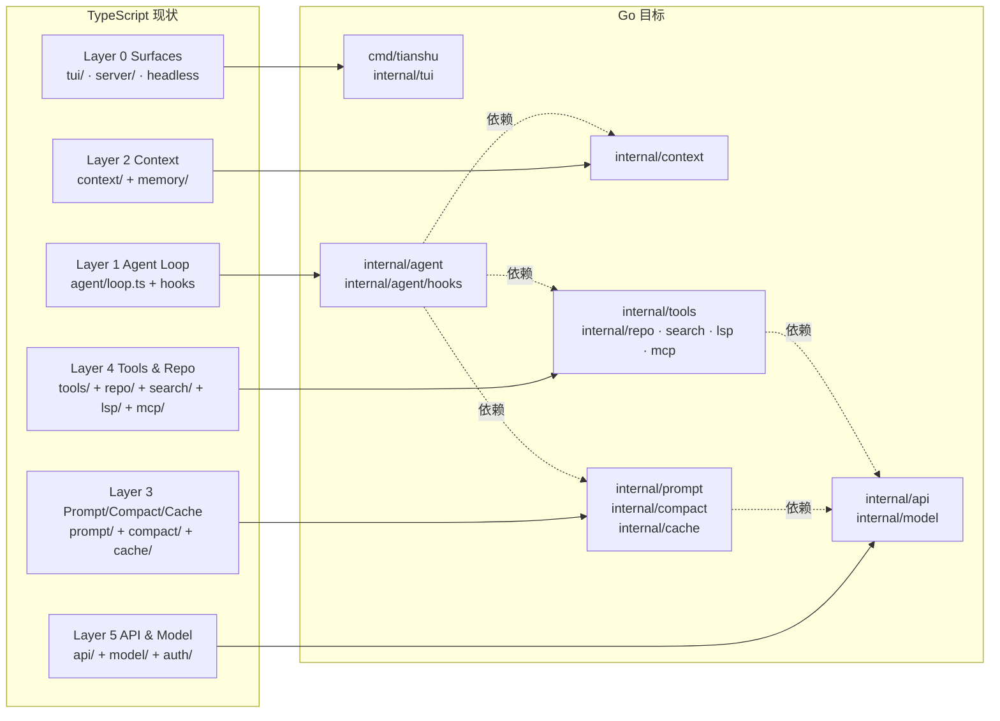

# Go 重写天枢运行时 — 分波移植计划

> 用 Go 重新实现天枢编程智能体运行时内核，以 TS 版为行为 oracle 逐层对账移植。

## 需求提炼

用户原话：「我计划使用 go 语言实现相同的编程 agent 运行时，帮我生成计划文档，要详细」。

提炼为两条可验证的目标：

1. **行为等价**：Go 版在相同输入下产出与 TS 版**字节一致**的模型请求（system prompt + messages + tool definitions）与等价的工具结果；否则「相同运行时」不成立。
2. **可独立运行**：Go 版能作为 CLI 跑通「读文件 → 改代码 → 跑测试 → 交付」的完整闭环，不依赖 Node 进程。

**非目标**（防范围蔓延）：

- 第一波不搬 74 个 hook、44 个工具、桌面端（Tauri/React）、office 套件、computer_use、vscode 扩展。
- 不重写提示词内容——提示词是认知资产，Go/TS 复用同一份文本文件，不翻译不改写。
- 不改变对外协议：会话 JSONL 落盘格式、OpenAI 兼容请求体、`.rivet/` 目录布局保持兼容（可被 TS 版读取）。
- 不追求性能超越；Go 的收益是单二进制分发与并发可控，不是吞吐。

## 背景与依据

### 实测规模（本轮工具输出，非记忆）

| 模块 | 纯源码文件 | 行数 | 角色 |
|------|-----------|------|------|
| `src/agent/` | 461 | 101,889 | 心脏（含 74 个 hook、coordinator 3,530 行） |
| `src/tools/` | 164 | 37,038 | 动作面 |
| `src/tui/` | 152 | 43,796 | 终端表面 |
| `src/server/` | 66 | 23,013 | 桌面 sidecar |
| `src/config/` | 35 | 9,728 | 配置层 |
| `src/api/` | 36 | 8,478 | 模型接入 |
| `src/context/` | 31 | 5,911 | 认知状态 |
| `src/prompt/` | 22 | 5,753 | 提示词与缓存锚 |
| `src/repo/` | 19 | 4,287 | Meridian 图 |
| `src/memory/` | 17 | 3,221 | 统一记忆 |
| `src/compact/` | 14 | 2,455 | 上下文压缩 |
| `src/mcp/` | 15 | 2,372 | MCP 客户端 |
| `src/lsp/` | 8 | 1,891 | 诊断回流 |
| `src/cache/` | 13 | 1,224 | 前缀缓存 |
| `src/plan/` | 4 | 1,155 | Plan Mode |
| **合计 `src/`** | **1,144** | **270,340** | 不含测试 |

关键单文件体量：`src/agent/loop.ts` 3,126 行、`src/agent/coordinator.ts` 3,530 行、`src/agent/tool-pipeline.ts` 2,235 行、`src/prompt/engine.ts` 1,711 行、`src/api/openai-client.ts` 1,642 行、`src/agent/turn-orchestrator.ts` 1,530 行。

**这条数字本身是计划的第一结论**：270k 行不能一次性重写，必须按「契约冻结 → 逐层移植 → 逐层对账」分波推进，每波有独立可验证的出口。

### 契约锚点（工作树实测，供逐波核对）

| 契约 | 位置 | 内容 |
|------|------|------|
| Hook 五阶段类型 | `src/agent/runtime-hooks.ts:8` | `preTurn \| afterPerception \| postTool \| postTurn \| postSession` |
| Hook 接口 | `src/agent/runtime-hooks.ts:97` | `PreTurnRuntimeHook`（其余四阶段同构，仅 postTool 多 `tool` 参数） |
| Hook 管线 | `src/agent/runtime-hooks.ts:233` | `RuntimeHookPipeline`（超时 / 慢 hook / 统计 / 热更禁用集） |
| 装配入口 | `src/agent/create-runtime-hooks.ts:339` | `createDefaultRuntimeHooks(deps)` 返回 `RuntimeHook[]` |
| 装配依赖 | `src/agent/create-runtime-hooks.ts:93` | `RuntimeHookDeps`（~80 个可选字段，全部是 getter/回调注入） |
| 工具接口 | `src/tools/types.ts:437` | `Tool { definition, execute, requiresApproval, isConcurrencySafe, isEnabled, timeoutMs? }` |
| 工具参数 | `src/tools/types.ts:184` | `ToolCallParams`（~40 个可选注入字段） |
| 工具结果 | `src/tools/types.ts:372` | `ToolResult`（含 `lossiness` / `errorKind` / `verification`） |
| 工具注册表 | `src/tools/registry.ts:19` | `ToolRegistry`（含外来别名重映射 `task→delegate_task`） |
| 装配注册表 | `src/tools/default-registry.ts` | `createDefaultToolRegistry`（preset 三档） |
| 主循环 | `src/agent/loop.ts:183` | `class AgentLoop` |
| 星域数据 | `src/agent/star-domain-data.ts:22` | `StarDomain` 结构（16 域，`toolWhitelist` 交集过滤） |
| 提供商能力 | `src/api/provider.ts` | `ProviderCapabilities` + `resolveCapabilities` 三层合并 |

## 技术方案要点

### 六层 → Go 包映射



依赖方向自上而下单向：`agent → {context, prompt, tools} → api`。TS 版里大量 `import type` 的跨层引用（如 `src/tools/types.ts` 反向引用 `src/agent/delivery-gate-v2.ts`）在 Go 中必须消除——Go 不允许循环 import。处理方式：把这些「反向类型依赖」下沉为**中立契约包** `internal/contract`，两层各自依赖它。

### 目标目录结构

> **绿地声明**：以下 `tianshu/` 树中**全部路径均为新增**（当前仓库无 `go.mod`，Go 侧从零建立）。TS 侧对照文件路径以 `src/` 为根。


```
tianshu/
├── go.mod                          # module github.com/kalandramo/tianshu
├── cmd/tianshu/main.go             # CLI 入口（对应 src/main.ts）
├── cmd/tianshu-headless/main.go    # rivet -p 等价物
├── internal/
│   ├── contract/                   # 中立契约：ToolResult / Definition / Usage / Message
│   ├── agent/
│   │   ├── loop.go                 # AgentLoop（对应 loop.ts:183）
│   │   ├── turn.go                 # 回合编排（对应 turn-orchestrator.ts）
│   │   ├── toolexec.go             # 工具执行（对应 tool-execution.ts）
│   │   ├── pipeline.go             # 门禁链（对应 tool-pipeline.ts）
│   │   ├── hooks.go                # RuntimeHookPipeline（对应 runtime-hooks.ts:233）
│   │   └── hooks/                  # 各 hook 实现
│   ├── context/                    # ledger / claims / stigmergy / pressure
│   ├── prompt/                     # engine / static / volatile / appendix
│   ├── compact/  cache/
│   ├── tools/                      # registry.go + 各工具
│   ├── repo/  search/  lsp/  mcp/
│   ├── api/                        # client / provider / stream / retry
│   ├── model/  auth/  config/  session/
│   ├── plan/                       # plan / team / council
│   └── tui/  server/
├── testdata/
│   ├── fixtures/                   # 从 TS 侧导出的输入夹具（JSON）
│   └── golden/                     # TS 侧产出的期望输出（字节级）
└── scripts/
    └── export-fixtures.ts          # 从 TS 版导出夹具与 golden
```

### 核心接口 Go 骨架

**Hook（五阶段）**——TS 用 discriminated union，Go 用基础接口 + 阶段专用扩展：

```go
type Phase int

const (
	PhasePreTurn Phase = iota
	PhaseAfterPerception
	PhasePostTool
	PhasePostTurn
	PhasePostSession
)

type Hook interface {
	Name() string
	Phase() Phase
	Budget() time.Duration // 0 = 用全局默认
	Run(ctx context.Context, hc *HookContext) error
}

// postTool 阶段额外接收工具事件（对应 TS 的 run(ctx, tool)）
type PostToolHook interface {
	Hook
	RunPostTool(ctx context.Context, hc *HookContext, ev ToolEvent) error
}
```

**Hook 上下文与副作用**——TS 的 `RuntimeHookEffects` 是可变对象；Go 用接口方法表达，snapshot 通过指针共享：

```go
type HookContext struct {
	Snapshot *Snapshot        // 可变：setSensorium 等直接改它
	Effects  Effects          // 副作用出口（注入 / 上报 / 标记）
}

type Effects interface {
	SetSensorium(Sensorium)
	SetStrategy(StrategyProfile)
	SetVigor(VigorState)
	InjectUserMessage(msg string)
	EmitControlSignal(sig ControlSignal)
	AddSystemReminder(content string, cls ReminderClass)
	MarkClaimStale(claimID string)
}
```

**管线**——保留 TS 的超时/慢 hook/统计语义，`context` 承载取消：

```go
type Pipeline struct {
	preTurn, afterPerception, postTool, postTurn, postSession []Hook
	stats     map[string]*HookStats
	disabled  map[string]struct{}
	timeout   time.Duration
	slowAfter time.Duration
}

func (p *Pipeline) RunPreTurn(ctx context.Context, hc *HookContext) error
func (p *Pipeline) RunPostTool(ctx context.Context, hc *HookContext, ev ToolEvent) error
```

**Tool**：

```go
type Tool interface {
	Definition() contract.Definition
	Execute(ctx context.Context, p contract.CallParams) (contract.Result, error)
	RequiresApproval(p contract.CallParams) bool
	ConcurrencySafe() bool
	Enabled() bool
	Timeout(p contract.CallParams) time.Duration
}
```

**ToolResult 的可选字段**——TS 靠 `?:` 表达「缺席」，Go 用指针保持三态（缺席 / 零值 / 显式值），这是字节等价的必要条件：

```go
type Result struct {
	Content    string
	UIContent  string
	RawPath    string
	IsError    bool
	ExitCode   *int          // 缺席 ≠ 0
	Lossiness  *Lossiness    // 缺席 ≠ lossless 的显式声明
	ErrorKind  *FailureClass
	RawBytes   *int64
	ChangedRanges []Range
	EndTurn    bool
	Verification  *Verification
}
```

**Provider 能力**——保留三层合并（well-known → provider 覆盖 → model 覆盖）：

```go
type Capabilities struct {
	SupportsThinking  bool
	ThinkingBlockType string // enabled | adaptive | none
	EffortFormat      string // reasoning_effort | output_config | none
	PrefixCacheStrategy string // deepseek-native | anthropic-cache-control | none
	StripParams       []string
	HasToolJSONInContentBug bool
	MapUsage          func(raw map[string]any) Usage
}

func ResolveCapabilities(name string, providerOv, modelOv *Overrides) Capabilities
```

### 三个高危差异点（必须在 Wave 1 就解决，否则返工）

1. **JSON 字节稳定性**。前缀缓存依赖请求体字节一致。Go 的 `encoding/json` 默认把 `&` `<` `>` 转义成 `\u0026` 等，且 float 格式化与 TS 的 `JSON.stringify` 不完全一致——这会**直接击穿缓存**（缓存碎裂的表现是 `cache_read_input_tokens` 长期为 0）。对策：`internal/api/stablejson` 用 `json.Encoder` + `SetEscapeHTML(false)`，并对数字走 `json.Number` 保原文，全量对账 TS 的 `src/api/stable-json.ts`。
2. **并发模型**。TS 单线程事件循环天然串行；Go 的 goroutine 会让共享状态（snapshot / session state / hook 副作用）出现数据竞争。对策：主循环**单 goroutine 串行**执行 hook 与工具调度，仅在明确标注 `ConcurrencySafe` 的工具上并发，且共享状态一律走 `sync.Mutex` 或 channel 交接；所有代码在 `-race` 下跑测试。
3. **超时后的迟到收尾**。TS 的 `Promise.race` 超时后 pending 仍会 settle，管线显式捕获迟到 rejection 防 unhandledRejection（见 `runtime-hooks.ts` 的 late failure 分支）。Go 的 `context` 取消不会阻止 goroutine 继续跑完——需要同样的「迟到结果记账」逻辑，否则出现「副作用落地但零记账」的静默失效。

## 等价性验证策略

**核心思路：TS 版作 oracle，夹具与 golden 共享。**

```
TS 版（oracle）                          Go 版（被测）
─────────────                            ─────────────
export-fixtures.ts                       读同一份 fixtures/
  ├─ 构造会话状态 ──────┐                 ├─ 构造相同状态
  ├─ 渲染 system prompt │                 ├─ 渲染 system prompt
  ├─ 序列化请求体       ├─→ testdata/ ──→ ├─ 序列化请求体
  └─ 记录 hook effects  │   fixtures/     ├─ 跑相同 hook
                        │   golden/       └─ 比对 effects 序列
                        └─ 写 golden
                                              ↓
                                       字节级 diff（不是语义比较）
```

四类判据，按强度排序：

| 判据 | 方法 | 强度 |
|------|------|------|
| 请求体字节等价 | 同状态渲染请求，`bytes.Equal` | 最强——缓存正确性的充要条件 |
| Hook effects 序列等价 | fixture 驱动，比对 effects 调用序列 | 强 |
| ToolResult 等价 | 每工具构造输入 fixture，比对结构化结果 | 强 |
| 端到端会话等价 | 录制 TS 真实会话 JSONL，Go 回放比对 | 中（含模型非确定性，只比对本地侧产物） |

**反证测试表**（哪条测试会打红错误实现）：

| 错误实现 | 会红的测试 |
|---------|-----------|
| Go JSON 转义 `&` 为 `\u0026` | `TestStableJSONBytes`（字节比对） |
| 可选字段用零值而非指针 | `TestToolResultAbsentVsZero`（`ExitCode` 缺席被当成 0） |
| hook 超时后迟到结果不记账 | `TestHookLateFailureAccounting` |
| 并发访问 snapshot 无锁 | `go test -race` |
| 别名重映射在门禁之后 | `TestAliasCannotBypassDenyRule`（`task` 绕过 `delegate_task` 的 deny 规则） |
| provider 覆盖层空数组被当成「显式清空」 | `TestStripParamsEmptyIsNoOpinion` |

## 任务分解

> **路径约定**：本章所有 `internal/**`、`cmd/**`、`testdata/**`、`scripts/export-fixtures.ts` 均为**新增**（绿地）。所有 `src/**` 为现有 TS 源（对照物 / oracle，本计划不修改，唯 Wave 0 的导出脚本除外）。


### Wave 0 — 契约冻结与夹具导出（TS 侧，不改运行时）

- [ ] `scripts/export-fixtures.ts`：从 TS 运行时导出 `testdata/fixtures/*.json` 与 `testdata/golden/*.bin`
  - 会话状态快照（system prompt 渲染输入）
  - 每个内核工具的输入/输出对
  - 每个 hook 的 (snapshot, toolEvent) → effects 序列
  - 真实会话 JSONL 样本（脱敏）
- [ ] `go.mod` + `cmd/tianshu/main.go` 骨架 + `internal/contract/` 类型定义
- [ ] 提示词资产外置：把 `src/prompt/static.ts` 的提示词文本抽为 `assets/prompt/*.txt`，TS/Go 共读
- 验证：`npm exec -- tsx scripts/export-fixtures.ts && ls testdata/fixtures | wc -l`（夹具非空）；`go build ./... && go vet ./...`

### Wave 1 — API 层与字节稳定序列化（先啃最硬的骨头）

- [ ] `internal/api/stablejson`：字节稳定序列化，对账 `src/api/stable-json.ts`
- [ ] `internal/api/provider.go`：`Capabilities` + 三层 `ResolveCapabilities`（对账 `src/api/provider.ts`）
- [ ] `internal/api/openai_client.go`：请求构造 / 流式解析 / usage 归一化
- [ ] `internal/api/stream.go` + `retry.go`：SSE 解析、重试引擎
- [ ] `internal/model/`：能力卡与路由
- 验证：
  - `go test ./internal/api/... -race`
  - `go test ./internal/api -run TestStableJSONBytes`（与 golden 字节比对）
  - `golangci-lint run ./internal/api/...`
  - 真实端点冒烟：`DEEPSEEK_API_KEY=... go run ./cmd/tianshu-headless -p "say hi"`，检查 `cache_read_input_tokens > 0`（证明缓存 key 未被 Go 序列化破坏）

### Wave 2 — 工具内核

- [ ] `internal/tools/registry.go`：`ToolRegistry` + 别名重映射（含「别名解析先于门禁」不变量）
- [ ] 文件工具：`read_file` / `write_file` / `edit_file` / `hash_edit` / `apply_patch`
- [ ] 检索工具：`grep` / `glob` / `ast_grep`
- [ ] 执行工具：`bash`（含超时 / 后台 job / 进程树清理）/ `run_tests` / `job`
- [ ] `internal/tools/path_validate.go`：路径逃逸拦截（fail-closed）
- 验证：
  - `go test ./internal/tools/... -race`
  - 逐工具对账：`go test ./internal/tools -run TestToolEquivalence`（读 `testdata/fixtures/tools/`）
  - 路径逃逸反证：`go test ./internal/tools -run TestPathEscapeRejected`

### Wave 3 — Prompt 引擎 / 压缩 / 缓存

- [ ] `internal/prompt/engine.go`：static(frozen) + volatile + appendixDelta 三段拼接
- [ ] `internal/prompt/static.go`：从 `assets/prompt/` 读冻结锚
- [ ] `internal/compact/`：边界压缩（仅 `turn==0` 重写历史）
- [ ] `internal/cache/`：命中率统计、advisor、审计
- 验证：
  - `go test ./internal/prompt/... -race`
  - **字节等价主判据**：`go test ./internal/prompt -run TestPromptByteEquivalence`——同一会话状态下 Go 渲染的 system prompt 与 TS golden 逐字节相同
  - 缓存回归：`go test ./internal/cache -run TestPrefixStability`（多轮不碎裂）

### Wave 4 — Agent 循环与认知层

- [ ] `internal/agent/hooks.go`：`Pipeline`（五阶段 + 超时 + 迟到收尾记账 + 统计）
- [ ] `internal/agent/loop.go` + `turn.go` + `toolexec.go` + `pipeline.go`
- [ ] 首批 hook 移植（**选常驻基线，非全量 74 个**）：perception / signal-consumer / kick / vigor / theta / stigmergy / radio / self-verify / context-pressure / lossy-observation
- [ ] `internal/context/`：CognitiveLedger / ClaimStore / Stigmergy / PressureMonitor
- [ ] `internal/session/`：JSONL 落盘（格式兼容 TS 版）
- [ ] `internal/plan/`：Plan Mode 审批门禁
- 验证：
  - `go test ./internal/agent/... -race`
  - hook 等价：`go test ./internal/agent -run TestHookEquivalence`
  - 迟到收尾反证：`go test ./internal/agent -run TestHookLateFailureAccounting`
  - 别名绕过反证：`go test ./internal/agent -run TestAliasCannotBypassDenyRule`

### Wave 5 — 表面层与端到端对账

- [ ] `cmd/tianshu/main.go`：交互式 TUI（纯 ANSI，对应 `src/tui/engine/`）
- [ ] `cmd/tianshu-headless`：`-p` 单次提示 / JSON 输出
- [ ] `internal/config/`：多层配置（默认 → `~/.rivet` → 项目）+ provider presets
- [ ] 端到端：Go 版跑通「读文件 → 改代码 → 跑测试 → 交付」闭环
- 验证：
  - `go build ./... && go test ./... -race`
  - `golangci-lint run ./...`
  - 端到端冒烟：`go run ./cmd/tianshu --dangerously-skip-permissions` 在测试仓库完成一次真实改动
  - 跨版本兼容：Go 版写的会话 JSONL 能被 TS 版读取（反之亦然）

## 反证/复现

本计划的每个关键结论都有对应的打红方式，避免「checklist 打勾」式假验证：

1. **「字节等价」不是语义等价**——若把比对从 `bytes.Equal` 降级为「JSON 解析后深比较」，上面列出的 `&` 转义缺陷会漏网（解析后两者相等）。因此 `TestStableJSONBytes` 必须比对原始字节。
2. **hook 等价测试必须能打红「少跑一个 hook」**——fixture 里记录 effects 的**有序序列**，若 Go 版漏装某 hook，序列长度或内容即不匹配。
3. **缓存命中率是端到端判据，不能只靠单测**——即使字节测试全绿，仍需真实端点冒烟确认 `cache_read_input_tokens > 0`，因为缓存 key 可能受 TS 侧未见因素影响。
4. **Wave 0 的夹具必须来自真实运行而非手工构造**——手工构造的 fixture 会编码「我以为的」输入分布，掩盖真实路径。导出脚本从实际 `AgentLoop` 运行中捕获。

**本计划自身可被推翻的方式**：若 Wave 1 的字节对账发现 Go 与 TS 的 JSON 序列化存在无法弥合的差异（如浮点格式化），则「字节等价」目标需降级为「缓存 key 等价」——即只保证影响缓存 key 的字段字节稳定，其余字段允许格式化差异。这个决策点必须在 Wave 1 出口前给出结论，不能拖到 Wave 4。

## 风险与依赖

| 风险 | 影响 | 缓解 |
|------|------|------|
| JSON 字节差异击穿前缀缓存 | 成本翻倍，缓存命中率归零 | Wave 1 前置解决 + 真实端点冒烟验证 |
| Go 并发引入数据竞争 | 随机崩溃 / 状态污染 | 主循环单 goroutine 串行；`-race` 全量跑 |
| 循环 import（TS 的跨层 type import） | 无法编译 | 下沉 `internal/contract` 中立包 |
| 270k 行规模导致计划失控 | 半成品 | 严格分波，每波独立可验证出口；非目标明确排除 |
| 提示词资产在 TS/Go 间漂移 | 行为不等价 | Wave 0 外置为共享文本文件，单一事实来源 |
| hook 全量移植成本 | 无限延期 | 首批只搬常驻基线 10 个，其余按需 |

**外部依赖**：Go 1.27.1（已装）、golangci-lint（已装）、`DEEPSEEK_API_KEY`（端到端冒烟需要）、TS 版可运行（作 oracle，导出夹具时需 `tsx`）。

## 建议的第一刀

先做 Wave 0 + Wave 1，且 **Wave 1 的字节对账是本计划的 Go/No-Go 门**——它决定「行为等价」这个目标是否可达。若字节等价被证伪，整个计划的目标需要重写，此时只损失约两周而非半年。
